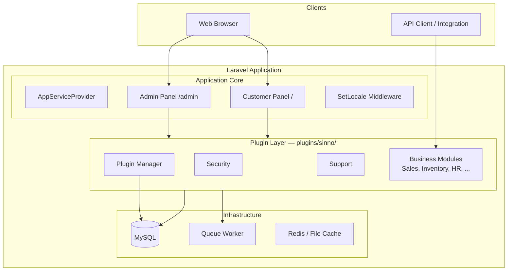
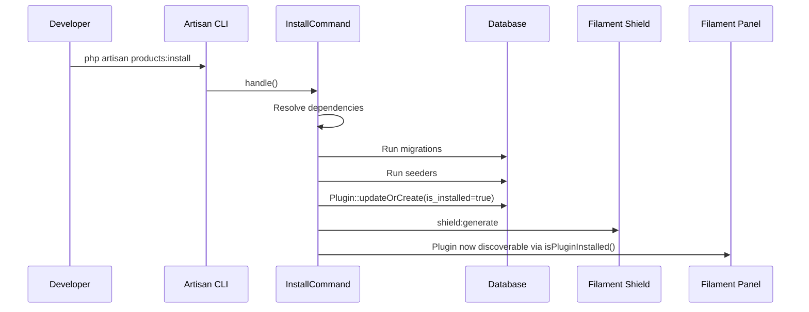
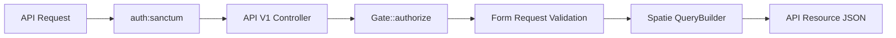

# SinnoERP — Architecture Documentation

Dokumen ini menjelaskan arsitektur teknis [SinnoERP](https://github.com/sinnoerp/sinnoerp): sistem ERP open-source berbasis Laravel dengan arsitektur **plugin modular**. Semua modul bisnis hidup di `plugins/sinno/`; folder `app/` sengaja dibuat tipis sebagai shell aplikasi.

---

## Daftar Isi

1. [Ringkasan](#1-ringkasan)
2. [Technology Stack](#2-technology-stack)
3. [Diagram Arsitektur](#3-diagram-arsitektur)
4. [Struktur Direktori](#4-struktur-direktori)
5. [Sistem Plugin](#5-sistem-plugin)
6. [Application Core](#6-application-core)
7. [Lapisan UI — Filament](#7-lapisan-ui--filament)
8. [Lapisan API](#8-lapisan-api)
9. [Autentikasi & Otorisasi](#9-autentikasi--otorisasi)
10. [Database & Instalasi](#10-database--instalasi)
11. [Internasionalisasi (i18n)](#11-internasionalisasi-i18n)
12. [Frontend](#12-frontend)
13. [Events & Business Logic](#13-events--business-logic)
14. [Arsitektur Testing](#14-arsitektur-testing)
15. [Deployment — Docker](#15-deployment--docker)
16. [CI/CD](#16-cicd)
17. [Keputusan Desain Penting](#17-keputusan-desain-penting)
18. [Katalog Plugin](#18-katalog-plugin)
19. [Dokumentasi Terkait](#19-dokumentasi-terkait)

---

## Dokumentasi Terkait

| Dokumen | Isi |
|---------|-----|
| [docs/README.md](./README.md) | Index semua dokumentasi |
| [docs/context-pack/README.md](./context-pack/README.md) | **Context Pack** — source of truth ringkas untuk AI (struktur, modul, konvensi) |
| [docs/MODULAR-ARCHITECTURE.md](./MODULAR-ARCHITECTURE.md) | MAD — definisi modul, bounded context, kontrak layanan |
| [docs/SYSTEM-DESIGN.md](./SYSTEM-DESIGN.md) | SDD — modul, services, dependency, alur data |
| [docs/DATABASE-ERD.md](./DATABASE-ERD.md) | Indeks ERD |
| [docs/erd/](./erd/README.md) | ERD per plugin (file terpisah per modul) |
| [docs/BUSINESS-FLOWS.md](./BUSINESS-FLOWS.md) | 25+ sequence diagram per modul + integrasi lintas modul |

## 1. Ringkasan

SinnoERP mengadopsi pola **modular monolith**:

| Prinsip | Implementasi |
|---------|--------------|
| Separation of concerns | Core tipis di `app/`, bisnis di plugin |
| Plug-and-play modules | Install/uninstall plugin tanpa rebuild aplikasi |
| Single codebase | Monorepo dengan Composer merge plugin |
| Dual interface | Admin panel (`/admin`) + Customer portal (`/`) |
| API-first ready | REST API versioned dengan Sanctum + Scribe docs |

Setiap plugin adalah paket Laravel mandiri dengan migrasi, seeders, Filament resources, policies, API routes, dan terjemahan sendiri. Plugin Manager mengkoordinasikan lifecycle instalasi, dependensi, dan metadata di database.

---

## 2. Technology Stack

| Layer | Teknologi | Versi |
|-------|-----------|-------|
| Runtime | PHP | 8.3+ |
| Framework | Laravel | 13.x |
| Admin UI | Filament | 5.x |
| Reactivity | Livewire | 4.x |
| Styling | Tailwind CSS | 4.x |
| Build tool | Vite | — |
| API auth | Laravel Sanctum | 4.x |
| RBAC | Filament Shield + Spatie Permission | 4.x |
| API docs | Knuckles Scribe | 5.x |
| Query API | Spatie Query Builder | 7.x |
| Settings | Spatie Laravel Settings (via Filament plugin) | — |
| Testing | Pest | 4.x |
| E2E | Playwright | 1.57+ |
| Dev containers | Laravel Sail | PHP 8.4 |
| Production | Docker (Nginx + PHP-FPM + MySQL + Supervisor) | — |

---

## 3. Diagram Arsitektur

### 3.1 High-Level System



### 3.2 Plugin Lifecycle



### 3.3 Request Flow — Admin Panel

```mermaid
flowchart LR
    Request[HTTP Request] --> WebMiddleware[Web Middleware Stack]
    WebMiddleware --> SetLocale[SetLocale]
    SetLocale --> FilamentMW[Filament Middleware]
    FilamentMW --> Auth[Authenticate]
    Auth --> Shield[Shield Authorization]
    Shield --> Resource[Filament Resource / Page]
    Resource --> Policy[Policy Check]
    Policy --> Eloquent[Eloquent Model]
    Eloquent --> DB[(MySQL)]
```



### 3.4 Request Flow — REST API



---

## 4. Struktur Direktori

```
SinnoERP/
├── app/                          # Core minimal (6 file utama)
│   ├── Http/Middleware/SetLocale.php
│   ├── Models/User.php           # Stub — auth produksi di plugin Security
│   └── Providers/
│       ├── AppServiceProvider.php
│       └── Filament/
│           ├── AdminPanelProvider.php
│           └── CustomerPanelProvider.php
│
├── bootstrap/
│   ├── app.php                   # Routing, middleware, JSON API exceptions
│   └── providers.php             # Daftar semua ServiceProvider plugin
│
├── config/                       # Konfigurasi Laravel + Scribe, Shield, Sanctum
│
├── database/                     # Migrasi/seeders inti (imports, dll.)
│   └── seeders/DatabaseSeeder.php
│
├── plugins/sinno/               # ★ Semua modul ERP (30+ plugin)
│   ├── plugin-manager/           # Sistem plugin, InstallERP, Plugin model
│   ├── security/                 # Users, roles, API auth
│   ├── support/                  # Company, currency, shared utilities
│   ├── products/                 # Contoh plugin bisnis
│   ├── sales/
│   ├── inventories/
│   └── .../
│
├── resources/
│   ├── css/app.css               # Tailwind v4 entry
│   └── js/app.js                 # Vite entry
│
├── routes/
│   ├── web.php
│   ├── api.php                   # Kosong — route API di plugin
│   └── console.php
│
├── tests/
│   ├── Pest.php                  # Konfigurasi Pest global
│   └── e2e-pw/                   # Playwright E2E
│
├── docker/
│   └── production/               # Image produksi single-container
│
├── docker-compose.yml            # Laravel Sail (development)
│
└── .github/workflows/            # CI/CD pipelines
```

### Filosofi pemisahan

| Lokasi | Isi | Contoh |
|--------|-----|--------|
| `app/` | Shell aplikasi, panel providers, locale | `AdminPanelProvider` |
| `plugins/sinno/{name}/` | Seluruh domain bisnis | Models, Filament, API, Policies |
| `config/` | Konfigurasi global | `supported_locales`, Scribe |
| `database/` | Skema inti non-plugin | Import tables |

---

## 5. Sistem Plugin

Sistem plugin adalah fondasi arsitektur SinnoERP. Setiap modul bisnis adalah paket Laravel independen yang diregistrasi melalui Composer dan bootstrap.

### 5.1 Registrasi Plugin

Plugin diregistrasi melalui **dua mekanisme**:

**1. Composer Merge Plugin** (`composer.json`):

```json
"merge-plugin": {
    "include": ["plugins/*/*/composer.json"]
}
```

Setiap plugin memiliki `composer.json` dengan autoload PSR-4 dan `extra.laravel.providers`.

**2. Bootstrap Providers** (`bootstrap/providers.php`):

Semua `*ServiceProvider` plugin didaftarkan eksplisit — total 26 provider bisnis + 3 core app providers.

### 5.2 Anatomy Plugin

```
plugins/sinno/{name}/
├── composer.json
├── config/
│   └── filament-shield.php       # Exclude/manage permissions per plugin
├── database/
│   ├── migrations/
│   ├── seeders/
│   ├── factories/
│   └── settings/                 # Spatie settings migrations
├── resources/
│   ├── lang/{locale}/            # Terjemahan (en canonical)
│   └── views/
├── routes/
│   └── api.php                   # REST API routes
├── src/
│   ├── {Name}ServiceProvider.php # Extends PackageServiceProvider
│   ├── {Name}Plugin.php          # Implements Filament\Contracts\Plugin
│   ├── Models/
│   ├── Filament/
│   │   ├── Resources/
│   │   ├── Pages/
│   │   ├── Clusters/             # Modul besar (accounting, inventories)
│   │   └── Widgets/
│   ├── Policies/
│   ├── Http/
│   │   ├── Controllers/API/V1/
│   │   ├── Requests/
│   │   └── Resources/V1/
│   ├── Events/
│   └── Enums/
└── tests/Feature/
```

### 5.3 PackageServiceProvider

Kelas dasar: `Sinno\PluginManager\PackageServiceProvider`

Memperluas Spatie Laravel Package Tools dengan perilaku khusus SinnoERP:

| Fitur | Perilaku |
|-------|----------|
| `mergeShieldConfig()` | Merge config Shield per plugin ke config global |
| Conditional migrations | Load migrasi hanya jika plugin **core** atau **terinstall** |
| Conditional routes | Load routes API hanya jika core atau terinstall |
| Install/uninstall commands | Registrasi otomatis `{name}:install` / `{name}:uninstall` |

### 5.4 Kelas Package & Model Plugin

**`Sinno\PluginManager\Package`** — konfigurasi deklaratif plugin:

- `isCore()` — plugin sistem (selalu aktif)
- `hasDependencies(['products', 'partners'])` — dependensi antar plugin
- `hasMigrations()`, `hasSeeder()`, `hasSettings()`
- `isInstalled()` — cek tabel `plugins` + flag `is_installed`

**`Sinno\PluginManager\Models\Plugin`** — metadata di database:

| Kolom | Fungsi |
|-------|--------|
| `name` | Identifier plugin (`products`, `sales`, ...) |
| `is_installed` | Apakah plugin sudah diinstall |
| `is_active` | Apakah plugin aktif |
| `sort` | Urutan tampilan (Spatie Sortable) |

Relasi: `dependencies()` / `dependents()` via pivot `plugin_dependencies`.

### 5.5 Core vs Installable Plugins

**Core plugins** (`->isCore()`) — selalu aktif, migrasi dan routes dimuat tanpa instalasi:

| Plugin | Peran |
|--------|-------|
| `plugin-manager` | Lifecycle plugin, InstallERP |
| `security` | Users, roles, API authentication |
| `support` | Company, currency, shared traits |
| `fields` | Custom fields framework |
| `chatter` | Internal messaging |
| `analytics` | Reporting widgets |
| `partners` | Partner/contact foundation |
| `full-calendar` | Calendar component |
| `table-views` | Custom table views |

**Installable plugins** — dimuat setelah `php artisan {name}:install`:

Accounting, Accounts, Invoices, Payments, Products, Sales, Purchases, Inventories, Manufacturing, Employees, Projects, Website, Blogs, dan lainnya.

### 5.6 Install / Uninstall Flow

#### `erp:install` — Setup awal sistem

Command: `Sinno\PluginManager\Console\Commands\InstallERP`

```
1. migrate                    → Semua migrasi core + plugin core
2. shield:generate            → Generate permissions Filament Shield
3. sync permissions → roles   → Assign ke default roles
4. storage:link               → Symlink storage
5. db:seed                    → Security, Support, PluginSeeder
6. createAdminUser()          → Admin + default Company + settings
7. storage/installed          → Marker file instalasi selesai
8. Event: sinno.installed    → Listener PluginManager
```

#### `{plugin}:install` — Install plugin individual

Command: `Sinno\PluginManager\Console\Commands\InstallCommand`

```
1. Resolve & install dependencies (recursive)
2. Publish config/assets (jika ada)
3. Run plugin migrations
4. Run plugin seeders
5. Plugin::updateOrCreate(is_installed=true)
6. shield:generate            → Permissions baru
7. Sync plugin_dependencies pivot
```

#### `{plugin}:uninstall` — Uninstall plugin

Command: `Sinno\PluginManager\Console\Commands\UninstallCommand`

```
1. Check dependents            → Tolak jika plugin lain bergantung
2. Drop tables (reverse migrations)
3. Delete plugin record
4. shield:generate             → Bersihkan permissions
```

### 5.7 Filament Plugin Registration

Setiap plugin mendaftarkan UI via kelas `*Plugin implements Filament\Contracts\Plugin`:

```php
// plugins/sinno/products/src/ProductPlugin.php
public function register(Panel $panel): void
{
    if (! Package::isPluginInstalled($this->getId())) {
        return;  // Guard: hanya jika terinstall
    }

    $panel->when($panel->getId() == 'admin', function (Panel $panel) {
        $panel
            ->discoverResources(in: __DIR__.'/Filament/Resources', for: 'Sinno\\Product\\Filament\\Resources')
            ->discoverPages(...)
            ->discoverClusters(...)
            ->discoverWidgets(...);
    });
}
```

Registrasi ke panel via `Panel::configureUsing()` di `ProductServiceProvider::packageRegistered()`.

---

## 6. Application Core

Folder `app/` berisi **hanya shell aplikasi** — 6 file PHP utama:

| File | Tanggung Jawab |
|------|----------------|
| `Providers/AppServiceProvider.php` | Bind `Authenticatable` → `Sinno\Security\Models\User`; force HTTPS di production |
| `Providers/Filament/AdminPanelProvider.php` | Panel admin: login, MFA, Shield, navigation groups, global search |
| `Providers/Filament/CustomerPanelProvider.php` | Panel customer: guard `customer`, path `/` |
| `Http/Middleware/SetLocale.php` | Resolusi locale dari user/query/session |
| `Models/User.php` | Stub model dengan `HasApiTokens` |
| `Http/Controllers/Controller.php` | Base controller |

Semua model bisnis, policies, dan logic ada di plugin.

### Bootstrap (`bootstrap/app.php`)

- Routing: web + api + console + health `/up`
- Middleware web: append `SetLocale`
- Trust proxies: `*`
- **JSON API exception rendering** terpusat untuk semua route `api/*`:
  - 422 Validation, 401 Unauthenticated, 403 Forbidden, 404 Not Found, 500 Server Error

---

## 7. Lapisan UI — Filament

SinnoERP menggunakan Filament 5 sebagai **Server-Driven UI framework**. UI didefinisikan di PHP, dirender via Livewire + Alpine.js + Tailwind.

### 7.1 Dual Panel Architecture

| Panel | ID | Path | Guard | Pengguna |
|-------|----|------|-------|----------|
| Admin | `admin` | `/admin` | `web` | Staff internal, ERP operators |
| Customer | `customer` | `/` | `customer` | Pelanggan, vendor portal |

**Admin Panel** (`AdminPanelProvider`):

- Default panel, top navigation, full-width content
- Login + password reset + email verification + MFA (App Authentication)
- Filament Shield plugin, database notifications
- Navigation groups: Dashboard, Contact, Sales, Purchase, Inventory, Accounting, HR, Website, Plugin Manager, ...
- Global search via `Sinno\Support\GlobalSearchProvider`
- Middleware: `SetLocale` + standard Filament stack

**Customer Panel** (`CustomerPanelProvider`):

- Guard `customer`, model `Sinno\Website\Models\Partner`
- Plugin Website, Blogs, Purchases mendaftarkan pages/resources saat terinstall
- Login/register pages dari plugin Website

### 7.2 Organisasi UI per Plugin

| Komponen | Lokasi | Kegunaan |
|----------|--------|----------|
| Resources | `Filament/Resources/` | CRUD interface |
| Clusters | `Filament/Clusters/` | Grouping modul besar (Accounting, Inventories) |
| Pages | `Filament/Pages/` | Custom pages (settings, reports) |
| Widgets | `Filament/Widgets/` | Dashboard widgets |
| Actions | `Filament/Actions/` | Custom table/form actions |
| RelationManagers | `Resources/{Name}/RelationManagers/` | Relasi inline |

Modul besar seperti **Accounting** dan **Inventories** menggunakan **Clusters** untuk mengorganisir puluhan resources.

### 7.3 Shared UI Traits

| Trait | Plugin | Fungsi |
|-------|--------|--------|
| `HasFilamentDefaults` | support | Default columnSpanFull untuk Grid/Section/Fieldset |
| `HasRtlSupport` | support | Language switcher + RTL direction |
| `HasTableViews` | table-views | Custom saved table views |

---

## 8. Lapisan API

### 8.1 Routing Convention

Route API didefinisikan per plugin di `plugins/sinno/{name}/routes/api.php`:

```
Prefix:  admin/api/v1/{module}
Name:    admin.api.v1.{module}.{action}
Auth:    middleware auth:sanctum
```

Contoh (Products):

```
GET    /admin/api/v1/products          → index
POST   /admin/api/v1/products          → store
GET    /admin/api/v1/products/{id}     → show
PUT    /admin/api/v1/products/{id}     → update
DELETE /admin/api/v1/products/{id}     → destroy
```

Root `routes/api.php` kosong — semua route API berasal dari plugin.

### 8.2 Controller Pattern

Setiap endpoint API mengikuti pola:

```
Controller (API/V1/)
  ├── Scribe attributes (#[Group], #[Endpoint], #[ResponseFromApiResource])
  ├── Gate::authorize() per action
  ├── Form Request untuk validasi
  ├── Spatie QueryBuilder (filters, sorts, includes)
  └── API Resource untuk response JSON
```

Referensi: `plugins/sinno/support/src/Http/Controllers/API/V1/StateController.php`

### 8.3 Authentication

| Endpoint | Method | Auth |
|----------|--------|------|
| `POST /admin/api/v1/login` | Email + password → Bearer token | Public |
| `POST /admin/api/v1/logout` | Revoke token | Sanctum |
| Semua endpoint lain | — | `auth:sanctum` |

Controller: `Sinno\Security\Http\Controllers\API\V1\AuthController`

Token dibuat via `$user->createToken('api-token')`.

### 8.4 API Documentation (Scribe)

| Setting | Value |
|---------|-------|
| Config | `config/scribe.php` |
| Docs URL | `/api/docs` |
| Theme | Scalar (`external_laravel`) |
| Route match | `admin/api/*` |
| OpenAPI generator | `Sinno\Support\ScalarOpenApiGenerator` |
| Regenerate | `php artisan scribe:generate` |

---

## 9. Autentikasi & Otorisasi

### 9.1 Multi-Guard Architecture

| Guard | Provider | Model | Panel |
|-------|----------|-------|-------|
| `web` | `users` | `Sinno\Security\Models\User` | Admin |
| `customer` | `customers` | `Sinno\Website\Models\Partner` | Customer |

`AppServiceProvider` bind `Illuminate\Contracts\Auth\Authenticatable` → `Sinno\Security\Models\User`.

### 9.2 RBAC — Filament Shield

```
User → Role → Permission
         ↓
    Policy (per Model/Resource)
         ↓
    Gate::authorize() / Filament can*()
```

| Komponen | Lokasi |
|----------|--------|
| Shield config | `config/filament-shield.php` |
| Per-plugin Shield config | `plugins/sinno/{name}/config/filament-shield.php` |
| Policies | `plugins/sinno/{name}/src/Policies/` |
| Permission generation | `shield:generate` (saat install ERP/plugin) |
| Business authorization | `Sinno\Security\Bouncer` + `bouncer()` helper |

Setiap Filament Resource wajib memiliki Policy. Shield auto-generate permissions saat `shield:generate --all --panel=admin`.

### 9.3 MFA

Admin panel mendukung Multi-Factor Authentication via Filament App Authentication (`AppAuthentication`).

---

## 10. Database & Instalasi

### 10.1 Skema Database

| Sumber migrasi | Kapan dimuat |
|----------------|--------------|
| `database/migrations/` | Selalu (core app) |
| `plugins/sinno/{name}/database/migrations/` | Core plugin: selalu; lainnya: jika terinstall |
| `plugins/sinno/{name}/database/settings/` | Spatie settings migrations |

### 10.2 Tabel Sistem Penting

| Tabel | Plugin | Fungsi |
|-------|--------|--------|
| `plugins` | plugin-manager | Metadata & status instalasi |
| `plugin_dependencies` | plugin-manager | Pivot dependensi |
| `users` | security | Admin users |
| `roles`, `permissions` | security (Spatie) | RBAC |
| `companies` | support | Multi-company |
| `currencies` | support | Multi-currency |

### 10.3 Seeding

Root seeder (`database/seeders/DatabaseSeeder.php`):

1. `SecurityDatabaseSeeder` — roles, permissions dasar
2. `SupportDatabaseSeeder` — company, currency default
3. `PluginSeeder` — katalog plugin dari `Plugin::getAllPluginPackages()` (semua `is_installed=false` awalnya)

Data bisnis di-seed saat `{plugin}:install`.

### 10.4 Marker Instalasi

File `storage/installed` ditulis setelah `erp:install` berhasil. Dicek oleh `InstallERP::isAlreadyInstalled()`.

---

## 11. Internasionalisasi (i18n)

### 11.1 Locale Configuration

Single source of truth: `config/app.php` → `supported_locales`

```php
'en' => ['label' => 'English', 'native' => 'English', 'flag' => 'us', 'rtl' => false],
'ar' => ['label' => 'Arabic',  'native' => 'العربية', 'flag' => 'sa', 'rtl' => true],
```

Menambah locale di sini otomatis mendaftarkannya di: admin panel, user profile, language switcher, translation tooling.

### 11.2 Struktur File Terjemahan

```
plugins/sinno/{name}/resources/lang/
├── en/                           # ★ Canonical (wajib lengkap)
│   ├── filament/resources/{resource}.php
│   ├── enums/{enum}.php
│   └── mails/{template}.php
└── ar/                           # Mirror struktur EN persis
    └── ...
```

Key pattern: `{plugin}::filament/resources/{resource}.form.sections.{section}.fields.{field}`

### 11.3 Locale Resolution

Middleware `SetLocale` (`app/Http/Middleware/SetLocale.php`):

| User | Prioritas |
|------|-----------|
| Authenticated | `?lang=` query → `$user->language` → fallback |
| Guest | `?lang=` query → session → fallback |

### 11.4 Consistency Tooling

```bash
php artisan translations:check --details    # CI enforced
php artisan translations:check --locale=ar --plugin=products
```

Command: `Sinno\PluginManager\Console\Commands\FindMissingTranslations`

---

## 12. Frontend

### 12.1 Build Pipeline

```
resources/css/app.css  ─┐
resources/js/app.js   ──┤── Vite ──→ public/build/
Plugin CSS/JS         ─┘
```

Dev: `npm run dev` atau `composer run dev` (serve + queue + pail + vite)

### 12.2 Tailwind CSS v4

- Root entry: `@import "tailwindcss"` di `resources/css/app.css`
- Beberapa plugin punya Tailwind config sendiri (accounting, chatter, plugin-manager)
- Dark mode: ikuti konvensi existing components

### 12.3 Livewire 4

Semua interaktivitas Filament (forms, tables, modals, notifications) berjalan via Livewire. Tidak ada SPA framework terpisah untuk admin panel.

### 12.4 Plugin Assets

Plugin dapat mendaftarkan CSS/JS via `FilamentAsset` (contoh: `plugin-manager` register `plugin.css`).

---

## 13. Events & Business Logic

### 13.1 Domain Events

Plugin menggunakan Laravel Events untuk side effects bisnis:

| Plugin | Events (contoh) |
|--------|-----------------|
| accounts | `MoveConfirmed`, `MovePaid`, `MoveCancelled` |
| inventories | `OperationDone`, `OperationConfirmed`, `OperationBackOrdered` |
| sales | `OrderConfirmed`, `OrderCanceled` |

Events dipanggil dari **Manager classes** (contoh: `InventoryManager`, `AccountManager`).

### 13.2 Application Events

| Event | Listener | Trigger |
|-------|----------|---------|
| `sinno.installed` | `PluginManager\Listeners\Installer` | Setelah `erp:install` |

### 13.3 Queue

| Environment | Worker |
|-------------|--------|
| Development | `composer run dev` → `queue:listen` |
| Production Docker | Supervisor → `queue:work` |

Tidak ada custom Job classes yang dominan — pola utama synchronous + Livewire events.

---

## 14. Arsitektur Testing

### 14.1 Pest (Unit & Feature)

```
tests/Pest.php                          # Global config, DatabaseTransactions
plugins/sinno/{name}/tests/Feature/
├── API/V1/{Model}Test.php              # REST API tests
└── Locale/                             # i18n tests

Helpers:
├── TestBootstrapHelper                 # erp:install + ensurePluginInstalled()
└── SecurityHelper                      # Auth + permissions
```

CI: `erp:install --force` → `vendor/bin/pest`

### 14.2 Playwright (E2E)

```
tests/e2e-pw/
├── playwright.config.ts
├── setup.ts                            # adminPage fixture, auth cache
├── locator/erp_locator.ts              # Shared Filament locators
├── pages/                              # Page Object Models
└── tests/
    ├── 01_plugins/
    ├── 02_companies/
    ├── 04_sales/
    ├── 05_purchases/
    └── 06_website/
```

CI: 4-shard parallel → merge HTML report

### 14.3 Testing Pyramid

```
        ┌───────────┐
        │ Playwright │  UI flows (admin panel E2E)
        ├───────────┤
        │   Pest    │  API + Filament Livewire + Locale
        ├───────────┤
        │  Policies │  Authorization logic (via Pest)
        └───────────┘
```

---

## 15. Deployment — Docker

### 15.1 Development — Laravel Sail

`docker-compose.yml`:

| Service | Image | Port |
|---------|-------|------|
| `laravel.test` | PHP 8.4 (Sail) | 80, 5173 (Vite) |
| `mysql` | MySQL 8.0 | 3306 |
| `redis` | Redis Alpine | 6379 |
| `mailpit` | Mailpit | 1025, 8025 |

```bash
./vendor/bin/sail up -d
./vendor/bin/sail artisan erp:install
composer run dev
```

### 15.2 Production — Single Container

Image: `sinno/sinnoerp` (Docker Hub)

```
docker/production/
├── Dockerfile              # Ubuntu 24.04 base
├── build-install.sh        # erp:install at build time, bake MySQL data
├── entrypoint.sh           # Runtime env, cache config/views, start Supervisor
├── nginx.conf
├── php-fpm.conf
├── php.ini
└── supervisord.conf        # mysql, php-fpm, nginx, queue, scheduler
```

| Mode | DB_HOST | Perilaku |
|------|---------|----------|
| Internal MySQL (default) | `127.0.0.1` | MySQL inside container, data baked |
| External MySQL | non-local address | Connect to external DB, no internal MySQL |

**Constraints produksi:**

- **Jangan `route:cache`** — plugin routes register dari database
- Cache config + views di entrypoint; routes tetap dynamic
- Health check: `GET /health`
- Recommended volumes: `sinno-mysql`, `sinno-storage`

---

## 16. CI/CD

| Workflow | Trigger | Pipeline |
|----------|---------|----------|
| `pest_tests.yml` | push, PR | PHP 8.3 + MySQL 8 → `erp:install` → Pest |
| `playwright_tests.yml` | push, PR, merge_group | 4-shard Playwright E2E + merge report |
| `translations_check.yml` | push, PR | `translations:check --details` |
| `docker_publish.yml` | tag `v*` / manual | Multi-arch (amd64 + arm64) → Docker Hub |

### Docker Publish Flow

```
git tag v1.2.3
  → GitHub Actions docker_publish.yml
  → Build from docker/production/ with APP_REF=v1.2.3
  → Push sinno/sinnoerp:1.2.3 (+ :latest if stable on default branch)
```

---

## 17. Keputusan Desain Penting

| Keputusan | Alasan |
|-----------|--------|
| Plugin modular monolith | Install hanya modul yang dibutuhkan; single deploy unit |
| Core tipis di `app/` | Semua bisnis terisolasi per plugin, mudah maintain |
| Conditional route/migration loading | Plugin belum install tidak membebani sistem |
| No route caching | Plugin routes depend on DB installation state |
| EN sebagai canonical locale | Konsistensi terjemahan via `translations:check` |
| Dual Filament panels | Admin internal vs customer portal terpisah |
| Sanctum Bearer tokens | API auth sederhana untuk integrasi pihak ketiga |
| Scribe attributes di controller | Dokumentasi API selalu sync dengan kode |
| Spatie QueryBuilder | Filtering/sorting/include konsisten di semua API |
| Manager + Events pattern | Business logic terpusat, side effects decoupled |
| DatabaseTransactions di tests | Isolasi data antar test tanpa full reset |
| Playwright POM | Maintainability E2E tests admin panel |

---

## 18. Katalog Plugin

### Core (selalu aktif)

| Plugin | Namespace | Peran |
|--------|-----------|-------|
| plugin-manager | `Sinno\PluginManager` | Lifecycle plugin, InstallERP |
| security | `Sinno\Security` | Users, RBAC, API auth |
| support | `Sinno\Support` | Company, currency, shared UI traits |
| fields | `Sinno\Field` | Custom fields |
| chatter | `Sinno\Chatter` | Internal messaging |
| analytics | `Sinno\Analytic` | BI widgets |
| partners | `Sinno\Partner` | Partner foundation |
| full-calendar | `Sinno\FullCalendar` | Calendar component |
| table-views | `Sinno\TableViews` | Saved table views |

### Financial

| Plugin | Peran |
|--------|-------|
| accounting | Financial accounting & reporting (Clusters) |
| accounts | Core accounting operations |
| invoices | Invoice management |
| payments | Payment processing |

### Operations

| Plugin | Peran |
|--------|-------|
| products | Product catalog |
| sales | Sales pipeline & orders |
| purchases | Procurement |
| inventories | Warehouse & stock (Clusters) |
| manufacturing | BOM, work orders |

### Human Resources

| Plugin | Peran |
|--------|-------|
| employees | Employee management |
| recruitments | Applicant tracking |
| time-off | Leave management |
| timesheets | Work hour tracking |

### Customer & Content

| Plugin | Peran |
|--------|-------|
| contacts | Contact management |
| projects | Project management |
| blogs | Content management |
| website | Customer-facing portal |
| maintenance | Equipment maintenance |

---

## Referensi

| Resource | URL |
|----------|-----|
| Repository | https://github.com/sinnoerp/sinnoerp |
| Developer Docs | https://devdocs.sinnoerp.com |
| Forum | https://forums.sinnoerp.com |
| Docker Hub | https://hub.docker.com/r/sinno/sinnoerp |
| Filament Docs | https://filamentphp.com/docs |
| Scribe Docs | https://scribe.knuckles.wtf/laravel |

### Dokumentasi Internal

| Dokumen | Isi |
|---------|-----|
| [Database ERD](./DATABASE-ERD.md) | Skema database & relasi antar modul |
| [Business Flows](./BUSINESS-FLOWS.md) | Sequence diagram alur bisnis |
| [Docs Index](./README.md) | Daftar semua dokumentasi |

---

*Terakhir diperbarui: Juni 2026 — berdasarkan SinnoERP (Laravel 13, Filament 5, Livewire 4)*
