# SinnoERP — Business Flows

Sequence diagram alur bisnis antar modul. Setiap flow merujuk ke **Manager class** yang mengorkestrasi logika bisnis dan **Events** yang memicu side effects.

---

## Daftar Isi

1. [Sales Order — Konfirmasi ke Delivery](#1-sales-order--konfirmasi-ke-delivery)
2. [Delivery Selesai — Update Sales Order](#2-delivery-selesai--update-sales-order)
3. [Sales Order — Pembuatan Invoice](#3-sales-order--pembuatan-invoice)
4. [Purchase Order — Konfirmasi ke Receipt](#4-purchase-order--konfirmasi-ke-receipt)
5. [Inventory Procurement Rules (MTO)](#5-inventory-procurement-rules-mto)
6. [Sales Order — Pembatalan](#6-sales-order--pembatalan)
7. [Plugin Install Lifecycle](#7-plugin-install-lifecycle)
8. [API Authentication Flow](#8-api-authentication-flow)
9. [Indeks Flow per Plugin](#9-indeks-flow-per-plugin)
10. [Accounts — Posting & Reconciliation](#10-accounts--posting--reconciliation)
11. [Payments — Register Payment on Invoice](#11-payments--register-payment-on-invoice)
12. [Manufacturing Order Lifecycle](#12-manufacturing-order-lifecycle)
13. [Purchase Requisition → Purchase Order](#13-purchase-requisition--purchase-order)
14. [Recruitment — Applicant Pipeline](#14-recruitment--applicant-pipeline)
15. [Time-off — Leave Request](#15-time-off--leave-request)
16. [Projects — Task & Timesheet](#16-projects--task--timesheet)
17. [Maintenance Request](#17-maintenance-request)
18. [Products — Catalog Setup](#18-products--catalog-setup)
19. [Partners & Contacts](#19-partners--contacts)
20. [Website & Blogs — Publish Content](#20-website--blogs--publish-content)
21. [Chatter — Message on Record](#21-chatter--message-on-record)
22. [Custom Fields — Dynamic Attributes](#22-custom-fields--dynamic-attributes)
23. [Plugin Dependency Install Order](#23-plugin-dependency-install-order)
24. [Analytics — Cost Tracking](#24-analytics--cost-tracking)
25. [Table Views — Saved Filters](#25-table-views--saved-filters)

---

## 1. Sales Order — Konfirmasi ke Delivery

Alur saat admin mengkonfirmasi Sales Order (Quotation → Sale). Modul Sales memicu procurement di Inventory.

**Entry point:** `SaleManager::confirmSaleOrder()`  
**File:** `plugins/sinno/sales/src/SaleManager.php`

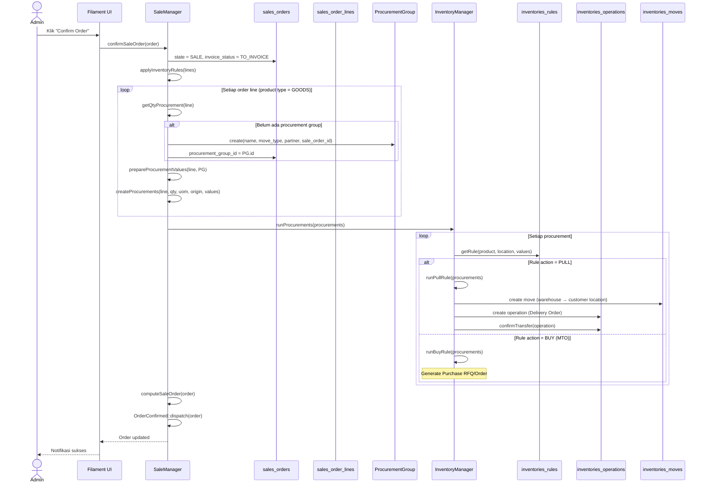

### State Transitions — Sales Order

```
DRAFT → SENT (email quotation)
DRAFT/SENT → SALE (confirm)
SALE → CANCEL (cancel)
SALE → DRAFT (back to quotation)
```

### State Transitions — Delivery Operation

```
DRAFT → CONFIRMED (confirmTransfer)
CONFIRMED → ASSIGNED (assignTransfer / check availability)
ASSIGNED → DONE (doneTransfer)
any → CANCELED (cancelTransfer)
```

---

## 2. Delivery Selesai — Update Sales Order

Saat delivery order di-mark done, Inventory memicu recomputasi qty_delivered di Sales via event listener.

**Entry point:** `InventoryManager::doneTransfer()`  
**Listener:** `Sinno\Sale\Listeners\ComputeSaleOrderListener`

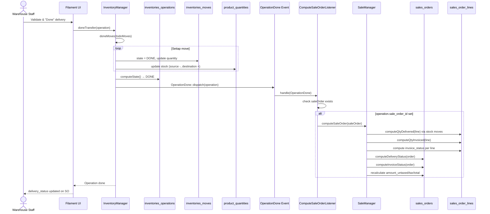

### Registrasi Listener

```php
// plugins/sinno/sales/src/SaleServiceProvider.php
Event::listen(OperationDone::class, ComputeSaleOrderListener::class);
```

---

## 3. Sales Order — Pembuatan Invoice

Alur pembuatan customer invoice dari Sales Order ke modul Accounts.

**Entry point:** `SaleManager::createInvoice()` → `createAccountMove()`

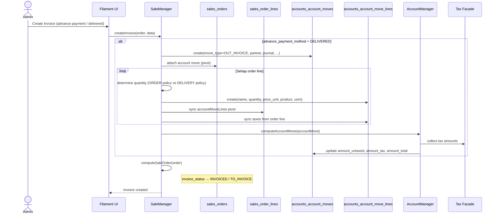

### Invoice Policy

| Policy | Quantity di Invoice |
|--------|---------------------|
| `ORDER` | `product_uom_qty` (full order qty) |
| `DELIVERY` | `qty_to_invoice` (= qty_delivered - qty_invoiced) |

---

## 4. Purchase Order — Konfirmasi ke Receipt

Alur saat Purchase Order dikonfirmasi — Inventory membuat receipt operation.

**Entry point:** `PurchaseOrder::confirmPurchaseOrder()`  
**File:** `plugins/sinno/purchases/src/PurchaseOrder.php`

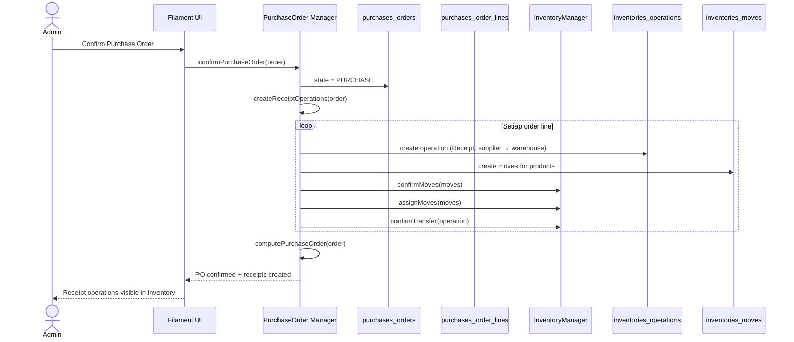

### Receipt Completion

Saat receipt di-mark done (mirroring delivery flow):

```
Warehouse Staff → doneTransfer(receipt)
  → stock increased at warehouse location
  → purchases_order_lines.qty_received updated
  → purchases_orders receipt status updated
```

---

## 5. Inventory Procurement Rules (MTO)

Detail internal `InventoryManager::runProcurements()` — bagaimana rule menentukan aksi.

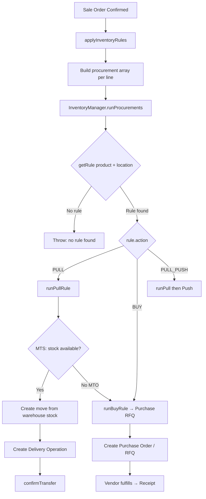

### Procure Methods

| Method | Perilaku |
|--------|----------|
| `make_to_stock` (MTS) | Ambil dari stok gudang |
| `make_to_order` (MTO) | Trigger purchase/manufacturing |
| `mts_else_mto` | Coba MTS dulu, fallback MTO jika stok kurang |

---

## 6. Sales Order — Pembatalan

```mermaid
sequenceDiagram
    actor Admin
    participant SM as SaleManager
    participant SO as sales_orders
    participant IM as InventoryManager
    participant Op as inventories_operations

    Admin->>SM: cancelSaleOrder(order, emailData)
    SM->>SO: state = CANCEL, invoice_status = NO
    SM->>SM: cancelAndSendEmail (optional)
    SM->>SM: computeSaleOrder(order)
    SM->>SM: cancelInventoryOperation(order)

    loop Setiap operation linked to order
        SM->>IM: cancelTransfer(operation)
        IM->>Op: state = CANCELED
        IM->>IM: cancel related moves
    end

    SM->>SM: OrderCanceled::dispatch(order)
```

---

## 7. Plugin Install Lifecycle

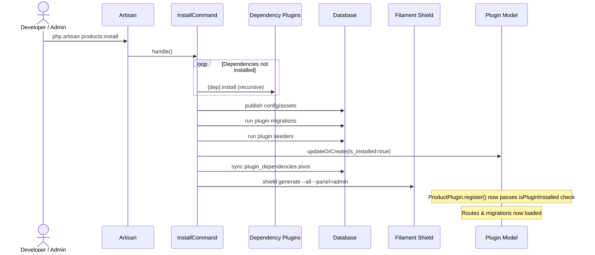

---

## 8. API Authentication Flow

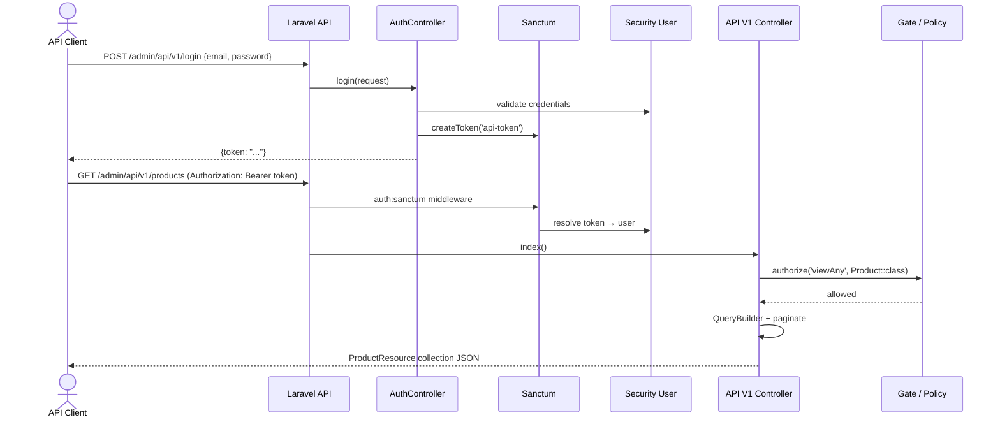

---

## Manager Classes Reference

| Manager | Plugin | Path | Tanggung Jawab |
|---------|--------|------|----------------|
| `SaleManager` | sales | `plugins/sinno/sales/src/SaleManager.php` | SO lifecycle, procurement trigger, invoice |
| `InventoryManager` | inventories | `plugins/sinno/inventories/src/InventoryManager.php` | Transfers, moves, stock, procurement rules |
| `PurchaseOrder` | purchases | `plugins/sinno/purchases/src/PurchaseOrder.php` | PO lifecycle, receipt creation |
| `AccountManager` | accounts | via `AccountFacade` | Journal entries, move computation, posting |

## Events Reference

| Event | Dispatched By | Listened By |
|-------|---------------|-------------|
| `OrderConfirmed` | SaleManager | (extensible) |
| `OrderCanceled` | SaleManager | (extensible) |
| `OperationDone` | InventoryManager | `ComputeSaleOrderListener` (sales) |
| `OperationConfirmed` | InventoryManager | (extensible) |
| `OperationCanceled` | InventoryManager | (extensible) |
| `MoveConfirmed` | AccountManager | (accounts) |
| `sinno.installed` | InstallERP | `PluginManager\Listeners\Installer` |
| `MovePaid` | AccountManager | (extensible) |
| `MoveCancelled` | AccountManager | (extensible) |
| `OperationConfirmed` | InventoryManager | (extensible) |
| `OperationAssigned` | InventoryManager | (extensible) |

---

## 9. Indeks Flow per Plugin

| Plugin | Flow Section | Manager / Entry Point | Ada Event? |
|--------|--------------|----------------------|------------|
| plugin-manager | §7, §23 | `InstallERP`, `InstallCommand` | `sinno.installed` |
| security | §8 | `AuthController` | — |
| support | — | Company/Currency seeders | — |
| products | §18 | Filament CRUD | — |
| partners | §19 | Filament CRUD | — |
| contacts | §19 | extends partners | — |
| accounts | §10 | `AccountManager` | `MoveConfirmed`, `MovePaid` |
| accounting | §10 | Reporting pages | — |
| invoices | §3, §10 | extends accounts | — |
| payments | §11 | `Payment` model + register | — |
| sales | §1–3, §6 | `SaleManager` | `OrderConfirmed`, `OrderCanceled` |
| purchases | §4, §13 | `PurchaseOrder` | — |
| inventories | §1–2, §5 | `InventoryManager` | `OperationDone`, `OperationConfirmed` |
| manufacturing | §12 | `ManufacturingManager` | — |
| employees | — | Filament CRUD | — |
| recruitments | §14 | Filament + stage actions | — |
| time-off | §15 | Filament leave actions | — |
| projects | §16 | Task updates → timesheet sum | — |
| timesheets | §16 | `analytic_records` create | — |
| website | §20 | Page publish | — |
| blogs | §20 | Post publish | — |
| maintenance | §17 | Calendar widget / CRUD | — |
| chatter | §21 | `addMessage()` trait | — |
| fields | §22 | `HasCustomFields` | — |
| analytics | §24 | `analytic_records` | — |
| table-views | §25 | User saved views | — |
| full-calendar | — | Widget render hook | — |

---

## 10. Accounts — Posting & Reconciliation

**Entry point:** `AccountManager::confirmMove()`  
**File:** `plugins/sinno/accounts/src/AccountManager.php`

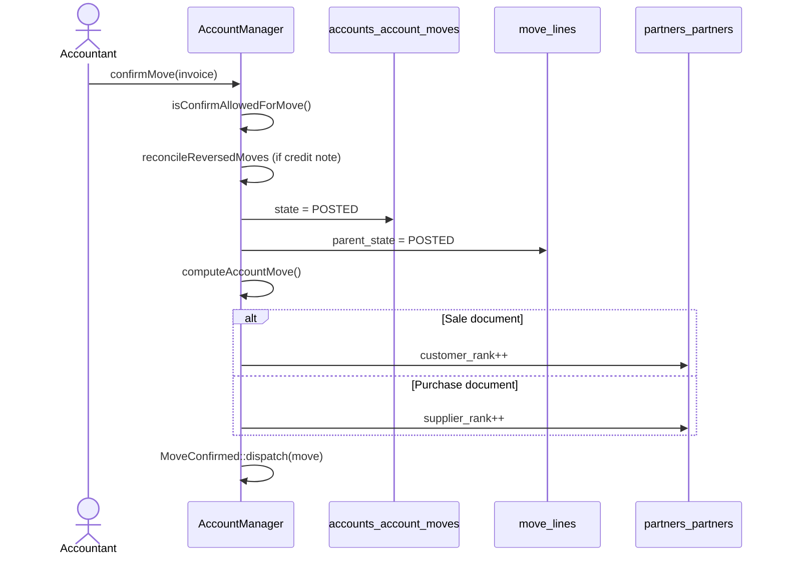

**Reset to draft:** `resetToDraftMove()` → un-reconcile partial matches → `MoveDrafted::dispatch`

**Payment:** `registerPayment()` → creates `accounts_account_payments` → reconcile with move lines → `MovePaid::dispatch`

---

## 11. Payments — Register Payment on Invoice

Modul **payments** menangani metode pembayaran gateway; registrasi pembayaran invoice utama ada di **accounts** (`PaymentRegister`).

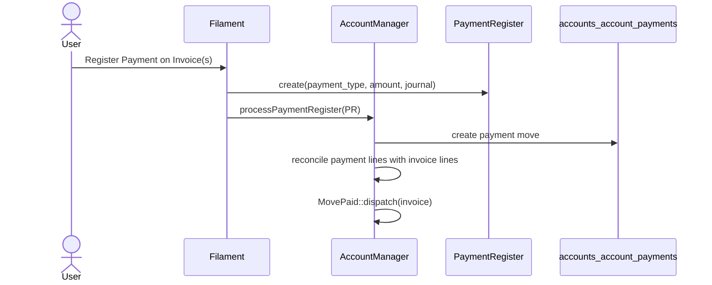

Plugin **payments** terpisah: `payments_payment_tokens` untuk penyimpanan token kartu pelanggan.

---

## 12. Manufacturing Order Lifecycle

**Entry point:** `ManufacturingManager::confirmManufacturingOrder()`  
**File:** `plugins/sinno/manufacturing/src/ManufacturingManager.php`

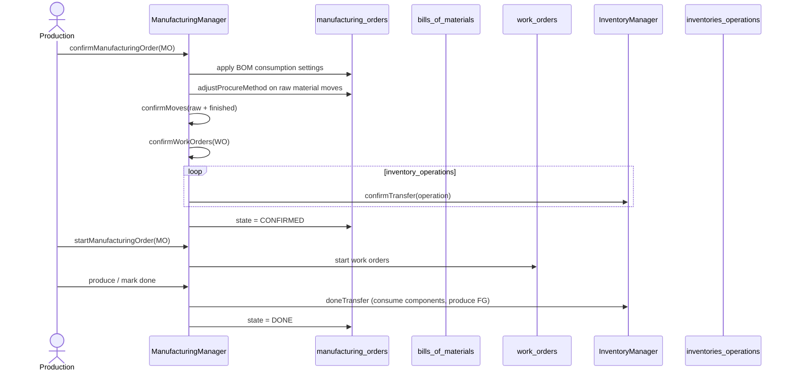

**Unbuild:** `manufacturing_unbuild_orders` — reverse production flow.

---

## 13. Purchase Requisition → Purchase Order

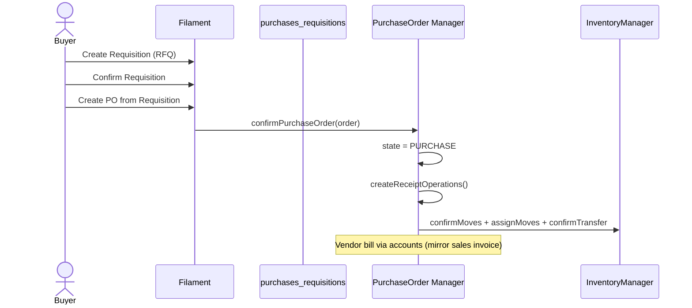

**Vendor bill:** PO linked to `accounts_account_moves` via `purchases_order_account_moves` pivot.

---

## 14. Recruitment — Applicant Pipeline

Tidak ada Manager class — alur via Filament Actions pada `ApplicantResource`.

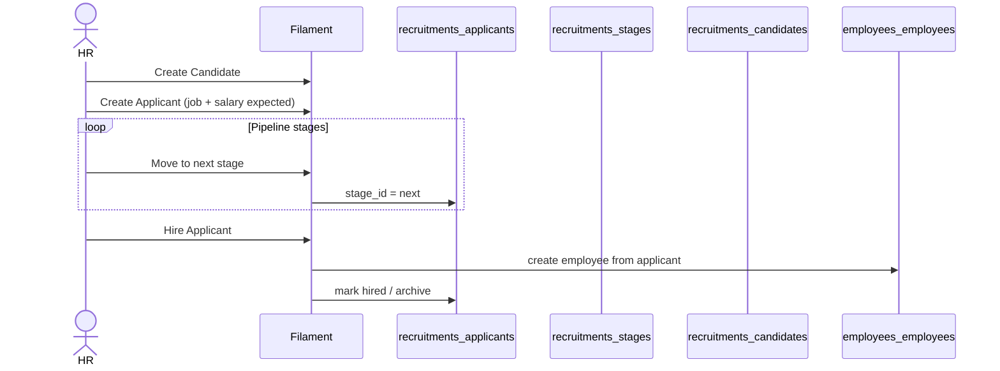

Field gaji (`salary_proposed`, `salary_expected`) hanya untuk negosiasi rekrutmen — bukan payroll.

---

## 15. Time-off — Leave Request

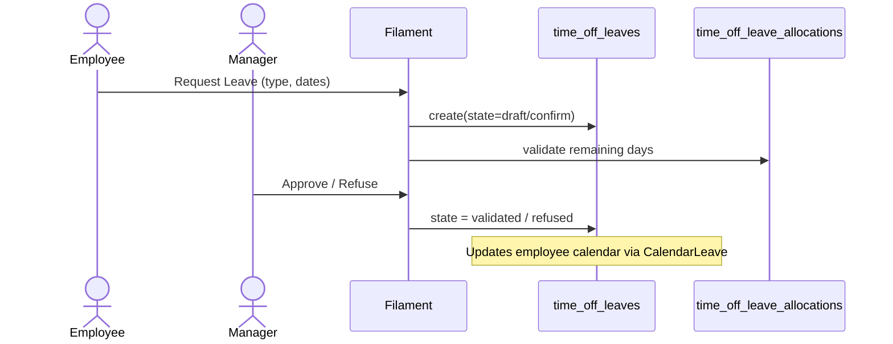

Dependensi: plugin **employees** (data karyawan & kalender kerja).

---

## 16. Projects — Task & Timesheet

Tidak ada ProjectManager — timesheet update via model events.

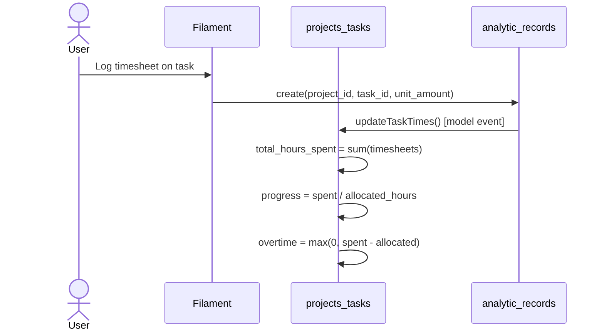

Plugin **timesheets** menyediakan UI terpusat untuk `ManageTimesheets` page.

---

## 17. Maintenance Request

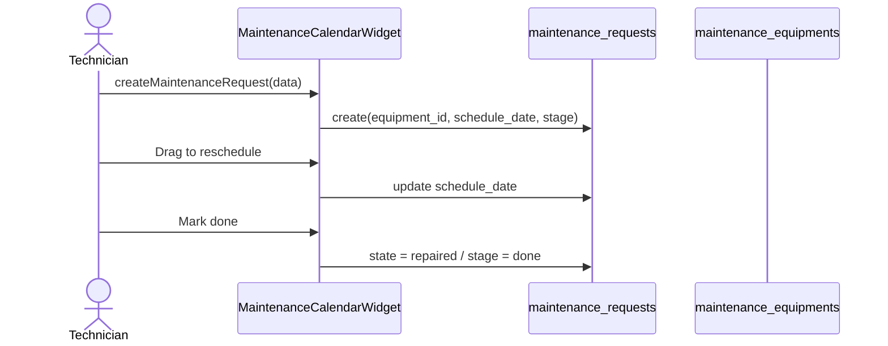

---

## 18. Products — Catalog Setup

Alur setup master data produk (prasyarat banyak modul).

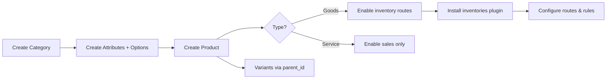

**Dependensi:** `products` → required by `accounts`, `inventories`, `sales` (transitively).

---

## 19. Partners & Contacts

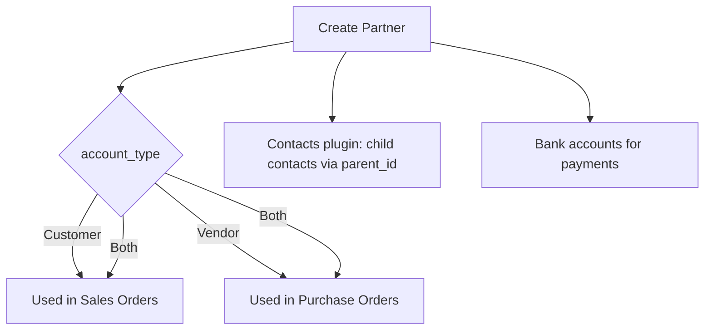

---

## 20. Website & Blogs — Publish Content

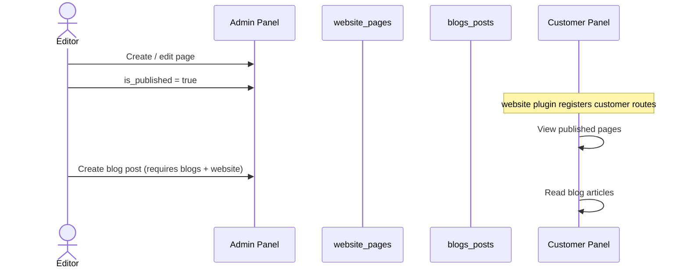

Install order: `website:install` → `blogs:install`

---

## 21. Chatter — Message on Record

Trait `HasChatter` pada model bisnis.

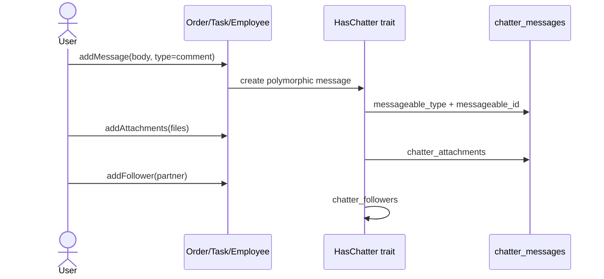

---

## 22. Custom Fields — Dynamic Attributes

```mermaid
flowchart LR
    A[Admin defines custom_fields] --> B[Attach to model type e.g. Order]
    B --> C[Filament form renders dynamic fields]
    C --> D[Values stored in custom_field_values JSON/pivot]
```

Trait: `Sinno\Field\Traits\HasCustomFields`

---

## 23. Plugin Dependency Install Order

Urutan instalasi otomatis saat `InstallCommand` resolve dependencies:

```mermaid
flowchart TD
    ERP[erp:install] --> Core[Core plugins always active]
    
    subgraph sales_chain [Sales chain]
        P[products] --> A[accounts]
        A --> I[invoices]
        A --> Pay[payments]
        I --> S[sales]
        Pay --> S
    end
    
    subgraph purchase_chain [Purchase chain]
        P --> A
        A --> I
        I --> Pur[purchases]
    end
    
    subgraph mfg_chain [Manufacturing chain]
        P --> Inv[inventories]
        P --> Inv
        Inv --> Mfg[manufacturing]
    end
    
    subgraph hr_chain [HR chain]
        E[employees] --> R[recruitments]
        E --> TO[time-off]
    end
    
    subgraph content_chain [Content chain]
        W[website] --> B[blogs]
    end
    
    Proj[projects] --> TS[timesheets]
```

---

## 24. Analytics — Cost Tracking

```mermaid
flowchart LR
    TS[Timesheet entry] --> AR[analytic_records]
    AR --> R[Reporting / dashboards]
    AR --> P[Project profitability]
```

Tabel `analytic_records` shared; plugin **analytics** menyediakan widget/report infrastructure.

---

## 25. Table Views — Saved Filters

```mermaid
sequenceDiagram
    actor User
    participant Filament Table
    participant TV as table_view_favorites

    User->>Filament Table: Apply filters + column layout
    User->>Filament Table: Save as favorite view
    Filament Table->>TV: store(resource, filters, columns, user_id)
    User->>Filament Table: Load saved view
    Filament Table->>TV: restore state
```

---

## Diagram Integrasi Lintas Modul (Ringkas)

```mermaid
flowchart TB
    subgraph sell [Sell]
        SO[Sales Order] --> DEL[Delivery]
        SO --> INV_C[Customer Invoice]
    end
    subgraph buy [Buy]
        PO[Purchase Order] --> REC[Receipt]
        PO --> INV_V[Vendor Bill]
    end
    subgraph make [Make]
        MO[Manufacturing Order] --> CONS[Consume RM]
        MO --> PROD[Produce FG]
    end
    subgraph stock [Stock]
        DEL --> STK[Stock Moves]
        REC --> STK
        CONS --> STK
        PROD --> STK
    end
    subgraph finance [Finance]
        INV_C --> ACC[Account Moves POSTED]
        INV_V --> ACC
        ACC --> PAY[Payments / Reconcile]
    end
```

---

[Lihat Database ERD →](./DATABASE-ERD.md) · [Kembali ke Architecture →](./ARCHITECTURE.md)
