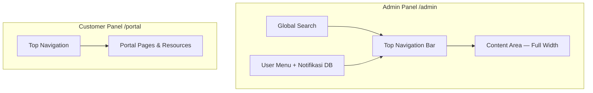
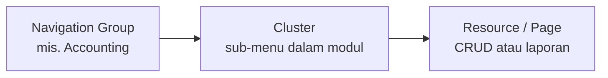
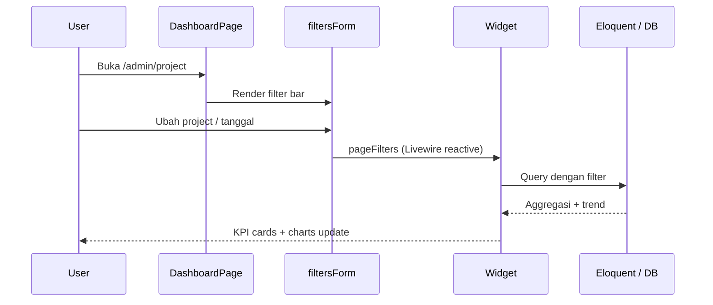

# SinnoERP — Panduan Desain Dashboard & UI

Dokumen ini menjelaskan **pola desain dashboard** SinnoERP. Untuk standar UI/UX menyeluruh (form, tabel, status, aksi, i18n), lihat **[UI-UX-STANDARDS.md](./UI-UX-STANDARDS.md)**.

Untuk arsitektur teknis Filament secara umum, lihat juga [ARCHITECTURE.md §7 — Lapisan UI](./ARCHITECTURE.md#7-lapisan-ui--filament).

---

## Daftar Isi

1. [Ringkasan Stack UI](#1-ringkasan-stack-ui)
2. [Layout Shell — Dua Panel](#2-layout-shell--dua-panel)
3. [Navigasi & Hierarki Informasi](#3-navigasi--hierarki-informasi)
4. [Pola Halaman Dashboard](#4-pola-halaman-dashboard)
5. [Jenis Widget & Komposisi](#5-jenis-widget--komposisi)
6. [Pola Halaman CRUD & Record View](#6-pola-halaman-crud--record-view)
7. [Design Tokens & Branding](#7-design-tokens--branding)
8. [Ikon & Ilustrasi](#8-ikon--ilustrasi)
9. [Responsif, RTL & Aksesibilitas](#9-responsif-rtl--aksesibilitas)
10. [Otorisasi UI (Filament Shield)](#10-otorisasi-ui-filament-shield)
11. [Referensi Implementasi di Repo](#11-referensi-implementasi-di-repo)
12. [Checklist Mendesain Aplikasi Serupa](#12-checklist-mendesain-aplikasi-serupa)

---

## 1. Ringkasan Stack UI

| Lapisan | Teknologi | Peran |
|---------|-----------|-------|
| Admin framework | Filament 5 | Server-driven UI — form, tabel, widget didefinisikan di PHP |
| Interaktivitas | Livewire 4 + Alpine.js | Update tanpa reload penuh |
| Styling | Tailwind CSS 4 | Utility classes, `@theme`, variant `dark` |
| Chart | Filament `ChartWidget` (Chart.js) + `flowframe/trend` | Grafik dashboard & sparkline di stat card |
| Ikon navigasi modul | SVG kustom (`resources/svg/`) via Blade Icons | Prefix `icon-{nama}` |
| Ikon aksi & field | Heroicons (`heroicon-o-*`, `heroicon-m-*`, `heroicon-s-*`) | Konsisten dengan ekosistem Filament |
| RBAC UI | Filament Shield | Permission per resource, page, widget |
| i18n | Laravel `__()` per plugin | `{plugin}::filament/...` — tidak ada string hardcoded |

**Prinsip desain:** ERP padat informasi, navigasi horizontal di atas, konten lebar penuh, modul dikelompokkan per domain bisnis, dashboard per modul dengan filter + KPI + chart.

---

## 2. Layout Shell — Dua Panel

SinnoERP memisahkan **operator internal** dan **portal pelanggan** dalam dua panel Filament terpisah.



### Admin Panel (`AdminPanelProvider`)

| Aspek | Nilai | File referensi |
|-------|-------|----------------|
| Path | `/admin` | `app/Providers/Filament/AdminPanelProvider.php` |
| Navigasi | **Top navigation** (bukan sidebar) | `->topNavigation()` |
| Lebar konten | **Full width** | `->maxContentWidth(Width::Full)` |
| Warna primer | Biru Filament | `Color::Blue` |
| Logo | `public/images/logo-landscape.webp`, tinggi `2rem` (HRIS); SinnoERP full stack: `logo.svg` | `->brandLogo()`, `->brandLogoHeight('2rem')` |
| Auth | Login, reset password, verifikasi email, **MFA** | `->multiFactorAuthentication()` |
| Notifikasi | Database notifications | `->databaseNotifications()` |
| Peringatan | Unsaved changes alert | `->unsavedChangesAlerts()` |

### Customer Panel (`CustomerPanelProvider`)

| Aspek | Nilai |
|-------|-------|
| Path | `/portal` (HRIS Admin); SinnoERP full stack: `/` (root) |
| Guard | `customer` — model `Partner` / employee portal |
| Dark mode | Dinonaktifkan (`->darkMode(false)`) |
| Navigasi | Top navigation, primary blue |
| Fitur tambahan | Language switcher di render hook |

**Implikasi untuk desain mockup:** gunakan **header horizontal** dengan grup menu dropdown, bukan sidebar vertikal permanen seperti admin panel Laravel klasik.

---

## 3. Navigasi & Hierarki Informasi

### Grup navigasi admin

Grup didefinisikan sekali di `AdminPanelProvider` dan diisi oleh setiap plugin saat mendaftarkan resource/page:

| Grup | Ikon kustom | Domain |
|------|-------------|--------|
| Dashboard | `icon-dashboard` | Ringkasan modul (website, project, time-off, …) |
| Contact | `icon-contacts` | Partner, kontak |
| Sale | `icon-sales` | Penjualan |
| Purchase | `icon-purchases` | Pembelian |
| Maintenance | `icon-maintenance` | Maintenance |
| Manufacturing | `icon-manufacturing` | Produksi |
| Inventory | `icon-inventories` | Gudang & stok |
| Invoice | `icon-invoices` | Faktur |
| Accounting | `icon-accounting` | Akuntansi |
| Project | `icon-projects` | Proyek & task |
| Employee | `icon-employees` | SDM |
| Time-off | `icon-time-offs` | Cuti |
| Recruitment | `icon-recruitments` | Rekrutmen |
| Website | `icon-website` | Konten & portal |
| Plugin | `icon-plugin` | Manajemen plugin |
| Setting | `icon-settings` | Konfigurasi sistem |

### Tiga tingkat organisasi modul besar



- **Navigation Group** — kategori horizontal di top bar (Sales, Inventory, …).
- **Cluster** — sub-navigasi untuk modul dengan banyak halaman (Accounting, Inventories, Recruitments). Contoh: `plugins/Sinno/accounting/src/Filament/Clusters/`.
- **Resource** — daftar + form CRUD standar Filament.
- **Custom Page** — dashboard, settings, laporan khusus.

### Global search

`Sinno\Support\GlobalSearchProvider` mengindeks resource terpasang — penting untuk UX ERP dengan puluhan entitas.

---

## 4. Pola Halaman Dashboard

Setiap modul yang membutuhkan ringkasan bisnis mendefinisikan halaman dashboard sendiri dengan memperluas `Filament\Pages\Dashboard`.

### Anatomi halaman dashboard

```
┌─────────────────────────────────────────────────────────────┐
│  Page title (navigation label)                              │
├─────────────────────────────────────────────────────────────┤
│  Filter bar (opsional) — Select, DatePicker, multi-filter   │
├─────────────────────────────────────────────────────────────┤
│  Header widgets (opsional) — KPI ringkas di atas            │
├─────────────────────────────────────────────────────────────┤
│  ┌──────────┐ ┌──────────┐ ┌──────────┐                     │
│  │ Stat KPI │ │ Stat KPI │ │ Stat KPI │  ← StatsOverview    │
│  └──────────┘ └──────────┘ └──────────┘                     │
│  ┌─────────────────────┐ ┌─────────────────────┐            │
│  │ Chart (bar/line/pie)│ │ Chart / Table       │            │
│  └─────────────────────┘ └─────────────────────┘            │
│  ┌─────────────────────────────────────────────┐            │
│  │ Table widget (recent records)               │            │
│  └─────────────────────────────────────────────┘            │
└─────────────────────────────────────────────────────────────┘
```

### Konvensi kode

| Elemen | Pola | Contoh |
|--------|------|--------|
| Class | `extends Dashboard` + `HasFiltersForm` + `HasPageShield` | `plugins/Sinno/projects/src/Filament/Pages/Dashboard.php` |
| Route | `protected static string $routePath = '{modul}'` | `/admin/project`, `/admin/website` |
| Widget | Override `getWidgets(): array` | Daftar class widget |
| Filter | `filtersForm(Schema $schema)` | Grid responsif 1→2→3→6 kolom |
| Permission | `getPagePermission()` | `page_project_dashboard` |
| Registrasi | `discoverPages` di `{Name}Plugin.php` | Hanya jika plugin terinstall |

### Filter form — grid responsif (Projects)

Pola standar untuk filter dashboard:

```php
Section::make()
    ->columns([
        'default' => 1,
        'sm'      => 2,
        'md'      => 3,
        'xl'      => 6,
    ])
    ->schema([
        Select::make('selectedProjects')->multiple()->searchable()->preload(),
        DatePicker::make('startDate')->native(false),
        DatePicker::make('endDate')->native(false),
    ])
    ->columnSpanFull();
```

Widget membaca filter via trait `InteractsWithPageFilters` dan properti `$this->pageFilters`.

---

## 5. Jenis Widget & Komposisi

### 5.1 Stats Overview (KPI cards)

**Kelas dasar:** `Filament\Widgets\StatsOverviewWidget`

| Fitur UI | Implementasi |
|----------|--------------|
| Nilai utama | `Stat::make($label, $value)` |
| Perubahan periode | `->description('12.5% increase')` |
| Indikator tren | `->descriptionIcon('heroicon-m-arrow-trending-up')` |
| Warna tren | `->color('success' \| 'danger')` |
| Mini chart | `->chart($sparklineData)` — array numerik harian |
| Auto-refresh | `protected ?string $pollingInterval = '15s'` |
| Filter halaman | `use InteractsWithPageFilters` |

Referensi lengkap: `plugins/Sinno/projects/src/Filament/Widgets/StatsOverviewWidget.php`

### 5.2 Chart widgets

**Kelas dasar:** `Filament\Widgets\ChartWidget`

- Tipe: bar, line, pie (override `getType()`)
- Tinggi maks: `protected ?string $maxHeight = '250px'`
- Data dari Eloquent + filter halaman
- Contoh: `TaskByStageChart`, `BlogStatusPieChart`, `ApplicantChartWidget`

### 5.3 Table widgets

Widget berisi tabel ringkas (bukan full resource), misalnya:
- `TopProjectsWidget`, `RecentBlogsTable`, `TopCategoriesTable`

### 5.4 Calendar widgets

Plugin `full-calendar` menyediakan `FullCalendarWidget` — dipakai modul Time-off dan Maintenance untuk tampilan kalender penuh lebar.

### 5.5 Custom Blade widgets

Untuk UI yang tidak tercakup komponen Filament standar:

| Widget | View | Penggunaan |
|--------|------|------------|
| `RecordNavigationTabs` | `support::filament.widgets.record-navigation-tabs` | Tab segmented di header record |
| `JournalChartsWidget` | `accounting::filament.widgets.journal-charts-widget` | Tab jurnal + chart kustom |
| `ChatterWidget` | `chatter::filament.widgets.chatter` | Thread diskusi di footer record |

### 5.6 Urutan & lebar kolom widget

```php
protected static ?int $sort = 1;           // urutan tampil
protected int|string|array $columnSpan = 'full';  // lebar grid (1, 2, 'full')
```

Dashboard Filament menggunakan grid responsif — atur `columnSpan` agar chart berdampingan di layar lebar.

---

## 6. Pola Halaman CRUD & Record View

### Form & layout schema

Gunakan komponen Filament 5 Schemas:

- `Grid`, `Section`, `Fieldset`, `Tabs`, `Wizard`
- Trait `HasFilamentDefaults` (plugin support) mengatur **semua Section/Grid/Fieldset = `columnSpanFull()`** secara global

### Record view — tab navigasi horizontal

Trait `HasRecordNavigationTabs` menampilkan sub-navigasi record sebagai **segmented tabs** di header (bukan sidebar):

- Komponen: `fi-tabs fi-tabs-rounded fi-tabs-segmented fi-tabs-primary`
- Mendukung ikon, label, badge count
- File view: `plugins/Sinno/support/resources/views/filament/widgets/record-navigation-tabs.blade.php`

### Chatter (kolaborasi)

Widget `ChatterWidget` di footer halaman view/edit record — pola mirip Odoo chatter (pesan, followers, aktivitas).

### Table views

Plugin `table-views` — pengguna menyimpan filter dan konfigurasi kolom tabel per user. Trait `HasTableViews` di resource.

### Clusters untuk modul besar

Accounting dan Inventories memecah puluhan halaman ke dalam cluster dengan sub-navigasi sendiri — hindari satu daftar rata yang terlalu panjang.

---

## 7. Design Tokens & Branding

### Warna

| Token | Nilai | Penggunaan |
|-------|-------|------------|
| Primary | Filament `Color::Blue` | Tombol utama, tab aktif, link |
| Success / Danger / Warning | Filament semantic colors | Tren KPI, status record |
| Gray scale | Tailwind gray + custom di `colors.css` | Background, border, teks sekunder |

File tema plugin support: `plugins/Sinno/support/resources/css/colors.css` — memetakan `--color-primary-*`, `--color-danger-*`, dll. ke Tailwind 4 `@theme inline`.

### Tipografi & spacing

- Mengikuti default Filament 5 (Inter / sistem)
- Font Arab/RTL: `'Cairo', 'Noto Sans Arabic'` — lihat `resources/css/app.css`
- Konten ERP: density sedang-tinggi; gunakan `Section` untuk mengelompokkan field panjang

### Branding

| Aset | Lokasi |
|------|--------|
| Logo panel | `public/images/logo-landscape.webp` (HRIS); `logo.svg` (SinnoERP) |
| Favicon | `public/images/favicon.ico` |
| Logo versi (user menu) | `cache/logo.png` via `ImageCacheController` |

Untuk rebrand: ganti file di atas + ubah `->colors(['primary' => ...])` di panel provider.

### CSS per plugin

Setiap plugin dapat mendaftarkan asset Filament:

```php
FilamentAsset::register([
    Css::make('support', __DIR__.'/../resources/dist/support.css'),
], 'support');
```

Build CSS plugin terpisah dari `resources/css/app.css` root (RTL global).

---

## 8. Ikon & Ilustrasi

### Ikon navigasi modul (kustom)

- **Lokasi:** `resources/svg/*.svg`
- **Konfigurasi:** `config/blade-icons.php` → path `resources/svg`
- **Cara pakai:** `->icon('icon-dashboard')` — prefix `icon-` + nama file tanpa `.svg`
- **Gaya:** SVG 64×64, rounded rect, warna brand (biru `#0070F2`, aksen oranye `#FDB421`) — lihat `resources/svg/dashboard.svg`

Daftar lengkap: `dashboard`, `sales`, `purchases`, `inventories`, `accounting`, `invoices`, `employees`, `projects`, `contacts`, `website`, `manufacturing`, `maintenance`, `recruitments`, `time-offs`, `plugin`, `settings`, `menu`, `pin`, `un-pin`.

### Ikon aksi & field

Gunakan **Heroicons** konsisten dengan Filament:

- Outline: `heroicon-o-plus-circle`, `heroicon-o-document-text`
- Mini: `heroicon-m-arrow-trending-up`
- Solid: `heroicon-s-star`

Activity types juga mendukung Font Awesome Solid via icon picker (`guava/filament-icon-picker`).

---

## 9. Responsif, RTL & Aksesibilitas

### RTL (Arabic)

`resources/css/app.css` berisi override lengkap untuk:

- Arah teks dan flex (`[dir="rtl"]`)
- Filament components: sidebar, topbar, tabel, form, modal, breadcrumb, stats, widget
- Input khusus (email, tel, number) tetap LTR

Trait `HasRtlSupport` di plugin support mengatur language switcher dan arah dokumen.

### Dark mode

- Admin: mengikuti preferensi Filament (support CSS punya `@variant dark`)
- Customer panel: dark mode dimatikan

### Responsif

- Filter dashboard: breakpoint `default → sm → md → xl`
- Top navigation: collapse ke mobile menu Filament
- Widget grid: otomatis stack di layar kecil

---

## 10. Otorisasi UI (Filament Shield)

Setiap elemen UI dapat disembunyikan per role:

| Level | Trait / method | Contoh permission |
|-------|----------------|-------------------|
| Resource | Policy + Shield | `view_any_product` |
| Page | `HasPageShield` | `page_project_dashboard` |
| Widget | `HasWidgetShield` | `widget_project_stats_overview_widget` |

Saat mendesain mockup, asumsikan **pengguna berbeda melihat menu dan widget berbeda** — jangan tampilkan semua modul untuk semua role.

---

## 11. Referensi Implementasi di Repo

### Dashboard per modul

| Modul | File | Widget utama |
|-------|------|--------------|
| **HRIS Admin** | `app/Filament/Admin/Pages/Dashboard.php` | KPI employee + leave; chart proyek + attendance analog; summary + recent attendance; filter department & tanggal |
| **Projects** | `plugins/Sinno/projects/src/Filament/Pages/Dashboard.php` | Stats KPI + 2 chart + 2 tabel ranking; filter 6 field |
| **Website** | `plugins/Sinno/website/src/Filament/Admin/Pages/WebsiteDashboard.php` | Stats + 4 chart + 2 tabel; filter tanggal & author |
| **Time-off** | `plugins/Sinno/time-off/src/Filament/Pages/Dashboard.php` | Header `MyTimeOffWidget` + `CalendarWidget` penuh |
| **Accounting** | `plugins/Sinno/accounting/src/Filament/Widgets/JournalChartsWidget.php` | Chart jurnal kustom dengan tab tipe |

### File konfigurasi shell UI

| File | Isi |
|------|-----|
| `app/Providers/Filament/AdminPanelProvider.php` | Panel admin, grup nav, Shield, MFA |
| `app/Providers/Filament/CustomerPanelProvider.php` | Portal pelanggan |
| `plugins/Sinno/support/src/Traits/HasFilamentDefaults.php` | Default layout form |
| `plugins/Sinno/support/src/Traits/HasRecordNavigationTabs.php` | Tab record |
| `modules/Dashboard/Services/AdminDashboardStatsService.php` | Agregasi data dashboard HRIS |
| `public/css/filament/admin-layout.css` | Override layout widget HRIS (equal height) |
| `resources/css/app.css` | RTL global |
| `config/blade-icons.php` | Ikon SVG modul |

---

## 12. Checklist Mendesain Aplikasi Serupa

Gunakan checklist ini saat membuat desain Figma atau membangun ERP lain:

- [ ] **Top navigation** dengan 10–15 grup domain bisnis, bukan sidebar tunggal
- [ ] **Konten full width** untuk tabel dan dashboard padat data
- [ ] **Dashboard per modul** dengan filter bar di atas (tanggal, entitas, multi-select)
- [ ] **Baris KPI** (3–4 kartu) dengan angka besar, % perubahan, ikon tren, sparkline opsional
- [ ] **Grid chart 2 kolom** di desktop (bar/line + pie/doughnut)
- [ ] **Tabel ringkas** untuk “top N” atau “recent items” di bawah chart
- [ ] **Primary blue** + semantic green/red untuk tren
- [ ] **Ikon modul kustom** (rounded square SVG) + Heroicons untuk aksi
- [ ] **Record view**: tab horizontal segmented + area chatter/aktivitas di bawah
- [ ] **Cluster/sub-menu** untuk modul dengan >8 halaman
- [ ] **Global search** di header
- [ ] **Notifikasi** dan menu user (profil, MFA, bahasa)
- [ ] **RBAC**: wireframe variasi untuk Admin vs Staff vs Read-only
- [ ] **RTL variant** jika target pasar Timur Tengah
- [ ] Semua label melalui **i18n** — siap multi-bahasa

---

## Diagram Alur — Dari Data ke Dashboard



---

*Dokumen ini melengkapi [ARCHITECTURE.md](./ARCHITECTURE.md), [SYSTEM-DESIGN.md](./SYSTEM-DESIGN.md), dan [context-pack/04-coding-conventions.md](./context-pack/04-coding-conventions.md). Jika perilaku UI di kode berbeda dari dokumen ini, **kode menjadi sumber kebenaran** — perbarui dokumen setelah perubahan arsitektur UI.*
