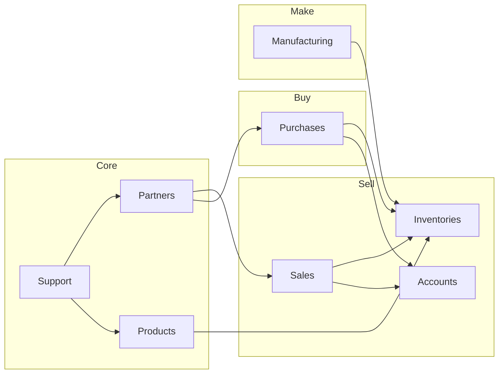

# SinnoERP — Database ERD (Indeks)

Dokumentasi ERD dipisah per plugin di folder **[`docs/erd/`](./erd/README.md)**.

---

## Navigasi Cepat

### Core
- [Plugin Manager](./erd/plugin-manager.md) · [Security](./erd/security.md) · [Support](./erd/support.md)
- [Fields](./erd/fields.md) · [Chatter](./erd/chatter.md) · [Analytics](./erd/analytics.md)
- [Partners](./erd/partners.md) · [Table Views](./erd/table-views.md) · [Full Calendar](./erd/full-calendar.md)

### Financial
- [Products](./erd/products.md) · [Accounts](./erd/accounts.md) · [Accounting](./erd/accounting.md)
- [Invoices](./erd/invoices.md) · [Payments](./erd/payments.md)

### Operations
- [Sales](./erd/sales.md) · [Purchases](./erd/purchases.md)
- [Inventories](./erd/inventories.md) · [Manufacturing](./erd/manufacturing.md)

### Human Resources
- [Employees](./erd/employees.md) · [Recruitments](./erd/recruitments.md)
- [Time-off](./erd/time-off.md) · [Timesheets](./erd/timesheets.md)

### Other
- [Projects](./erd/projects.md) · [Contacts](./erd/contacts.md)
- [Website](./erd/website.md) · [Blogs](./erd/blogs.md) · [Maintenance](./erd/maintenance.md)

### Lintas Modul
- [**Cross-Plugin Relations**](./erd/cross-plugin.md)

---

## Konvensi Penamaan

| Pola | Contoh |
|------|--------|
| `{prefix}_{entity}` | `sales_orders` |
| `{prefix}_{entity}_{sub}` | `sales_order_lines` |
| Pivot | `sales_order_tags` |
| Spatie RBAC | `roles`, `permissions`, `model_has_roles` |

---

## Diagram Integrasi (Ringkas)

Detail lengkap: [cross-plugin.md](./erd/cross-plugin.md)

---

[Lihat semua ERD →](./erd/README.md) · [Business Flows →](./BUSINESS-FLOWS.md)
