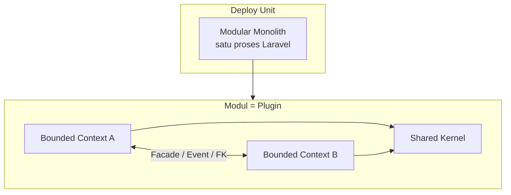
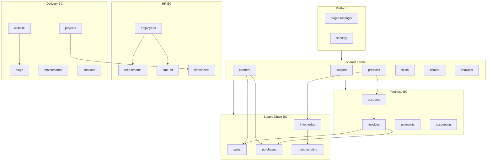
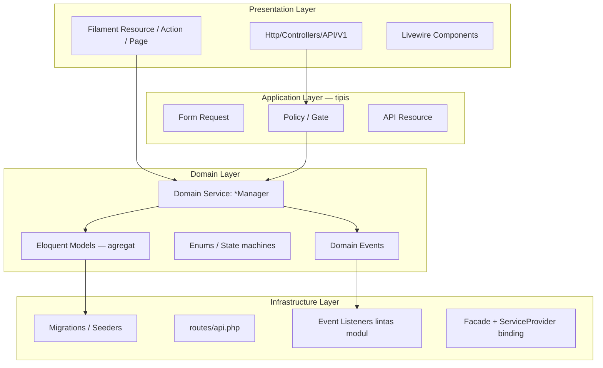
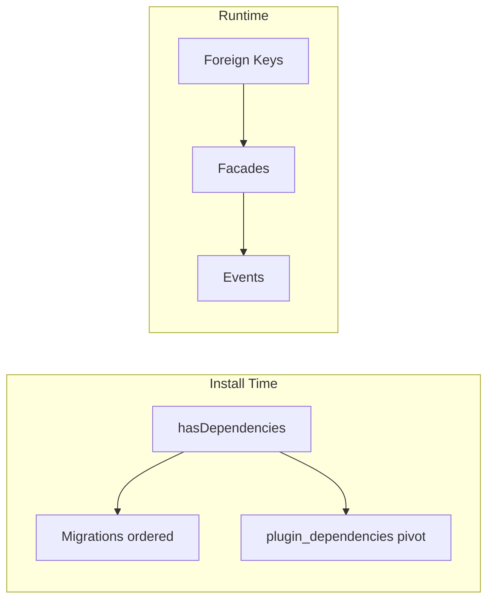
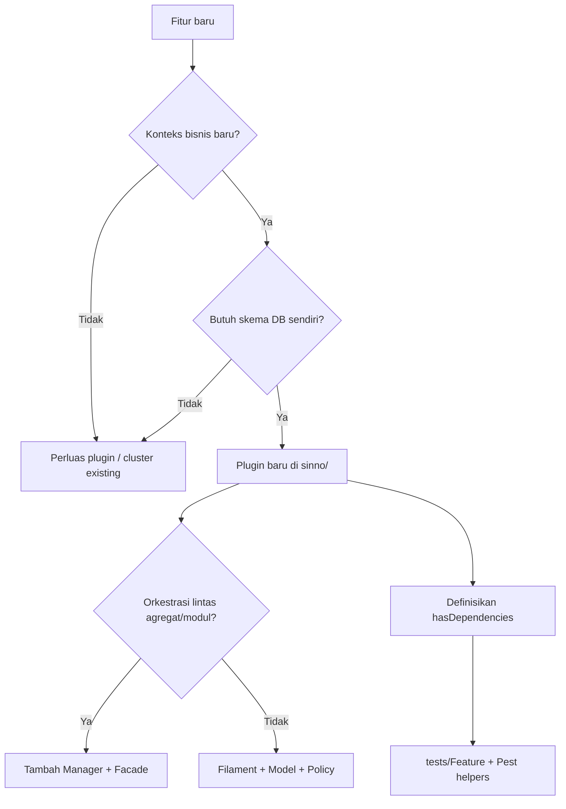

# SinnoERP — Modular Architecture Definition (MAD)

Dokumen ini mendefinisikan **pembagian modul** dalam SinnoERP dari sudut pandang **domain-driven** dan **service-based**: apa yang dianggap sebagai modul, batas domain (bounded context), layanan domain yang diekspos, dan aturan integrasi antar modul.

Dokumen ini melengkapi:

| Dokumen | Fokus |
|---------|-------|
| [MODULAR-ARCHITECTURE.md](./MODULAR-ARCHITECTURE.md) | **Definisi modul**, bounded context, kontrak layanan, aturan coupling |
| [SYSTEM-DESIGN.md](./SYSTEM-DESIGN.md) | SDD operasional — dependency, alur data, daftar Manager |
| [ARCHITECTURE.md](./ARCHITECTURE.md) | Arsitektur teknis — stack, Filament, API, deploy |
| [BUSINESS-FLOWS.md](./BUSINESS-FLOWS.md) | Sequence diagram alur bisnis |
| [erd/](./erd/README.md) | Skema data per modul |

---

## Daftar Isi

1. [Definisi & Prinsip](#1-definisi--prinsip)
2. [Taksonomi Modul](#2-taksonomi-modul)
3. [Bounded Context & Domain Map](#3-bounded-context--domain-map)
4. [Lapisan dalam Modul (Service-Based)](#4-lapisan-dalam-modul-service-based)
5. [Kontrak Integrasi Antar Modul](#5-kontrak-integrasi-antar-modul)
6. [Shared Kernel & Supporting Subdomains](#6-shared-kernel--supporting-subdomains)
7. [Aturan Pembagian Modul Baru](#7-aturan-pembagian-modul-baru)
8. [Anti-Pattern & Batasan](#8-anti-pattern--batasan)
9. [Referensi](#9-referensi)

---

## 1. Definisi & Prinsip

### 1.1 Unit Modul

Dalam SinnoERP, **satu modul = satu plugin** di `plugins/sinno/{id}/`.

| Aspek | Definisi |
|-------|----------|
| Identitas | `Package::$name` / ID plugin (contoh: `sales`, `inventories`) |
| Namespace | `Sinno\{ModuleName}\` |
| Ownership data | Prefix tabel migrasi modul (contoh: `sales_orders`, `inventories_moves`) |
| Ownership UI | Filament Resources/Pages/Clusters terdaftar via `{Name}Plugin` |
| Lifecycle | `php artisan {id}:install` / `uninstall` + metadata tabel `plugins` |
| Aktivasi UI | `Package::isPluginInstalled('{id}')` — route/migrasi non-core hanya jika terinstall |

**Application Core** (`app/`) **bukan modul bisnis** — hanya host panel Filament, locale, dan stub auth. Semua domain ERP hidup di plugin.

### 1.2 Gaya Arsitektur



| Prinsip | Arti di SinnoERP |
|---------|-------------------|
| **Domain-driven** | Setiap plugin memetakan satu atau lebih **bounded context** bisnis ERP (Sales, Inventory, Accounting, …) |
| **Service-based** | Orkestrasi lintas agregat dipusatkan di **Domain Service** (`*Manager`), bukan di controller Filament |
| **Modular monolith** | Modul terpisah di kode & skema, tetapi di-deploy sebagai satu aplikasi |
| **Plug-and-play** | Modul bisnis dapat diinstall/uninstall; core tidak |
| **Explicit dependencies** | `hasDependencies()` untuk instalasi; Facade/Event untuk runtime |

### 1.3 Hubungan dengan DDD

| Konsep DDD | Implementasi SinnoERP |
|------------|------------------------|
| Bounded Context | Plugin (atau cluster Filament dalam satu plugin untuk sub-UI) |
| Ubiquitous Language | Prefix tabel, enum, translation key `{plugin}::` |
| Aggregate Root | Model Eloquent utama (Order, Operation, Move, Employee, …) |
| Domain Service | `SaleManager`, `InventoryManager`, `AccountManager`, … |
| Application Service | Filament Actions, API V1 Controllers (tipis, delegasi ke Manager) |
| Domain Event | `OrderConfirmed`, `OperationDone`, `MovePaid`, … |
| Shared Kernel | Plugin core: `support`, `partners`, `security`, `products` (master data) |
| Anti-Corruption | Facade antar modul (`InventoryFacade`, `AccountFacade`) — tidak import langsung ke internal class lawan modul kecuali model/FK yang sudah kontrak |

---

## 2. Taksonomi Modul

Modul dikelompokkan berdasarkan **peran arsitektural**, bukan hanya menu Filament.

### 2.1 Platform & Orchestration

| ID | Peran | `isCore()` | Dapat uninstall? |
|----|-------|------------|------------------|
| `plugin-manager` | Registry plugin, install/uninstall, `erp:install`, Shield generate | Ya | Tidak |
| `security` | Identity, RBAC, API auth (Sanctum) | Ya | Tidak |

### 2.2 Shared Kernel (Master & Cross-Cutting)

Selalu aktif; menyediakan data dan kemampuan yang dipakai banyak bounded context.

| ID | Domain responsibility | Konsumen tipikal |
|----|----------------------|------------------|
| `support` | Company, currency, UOM, UTM, activity types | Semua modul operasi & keuangan |
| `partners` | Partner, alamat, kontak (CRM foundation) | sales, purchases, accounts, employees, projects |
| `products` | Katalog produk, kategori, packaging | accounts, inventories, sales, purchases, manufacturing |
| `fields` | Custom fields dinamis | Filament resources yang pakai `HasCustomFields` |
| `chatter` | Messaging & followers (polymorphic) | Order, task, employee, move, … |
| `analytics` | `analytic_records`, pelaporan biaya | projects, timesheets |
| `table-views` | Saved filter/kolom tabel | Resources Filament |
| `full-calendar` | Komponen kalender UI | employees, time-off, dll. |

### 2.3 Domain Modules — Keuangan (Financial Context)

| ID | Bounded context | Bergantung instalasi |
|----|-----------------|---------------------|
| `accounts` | Jurnal, move, pajak, rekonsiliasi | `products` |
| `invoices` | UI invoice customer/vendor di atas accounts | `accounts` |
| `payments` | Registrasi pembayaran | `accounts` |
| `accounting` | Laporan & cluster akuntansi | `accounts` |

**Catatan pembagian:** `accounts` adalah **core financial engine**; `invoices` / `accounting` adalah **presentation & workflow layers** di atas engine yang sama.

### 2.4 Domain Modules — Operasi (Supply Chain Context)

| ID | Bounded context | Bergantung instalasi |
|----|-----------------|---------------------|
| `inventories` | Gudang, stok, operasi logistik | `products` |
| `sales` | Quotation, sales order, delivery trigger | `invoices`, `payments` |
| `purchases` | RFQ, purchase order, receipt | `invoices` |
| `manufacturing` | BOM, manufacturing order | `products`, `inventories` |

### 2.5 Domain Modules — SDM (HR Context)

| ID | Bounded context | Bergantung instalasi |
|----|-----------------|---------------------|
| `employees` | Karyawan, departemen, jabatan | — |
| `recruitments` | ATS, kandidat, applicant | `employees` |
| `time-off` | Cuti, accrual, approval | `employees` |
| `timesheets` | Jam kerja | `projects` |

### 2.6 Domain Modules — Proyek, Konten, Lainnya

| ID | Bounded context | Bergantung instalasi |
|----|-----------------|---------------------|
| `projects` | Proyek, task, milestone | — |
| `contacts` | Kontak (di atas partners) | — |
| `website` | Portal pelanggan (panel `customer`) | — |
| `blogs` | Konten blog | `website` |
| `maintenance` | Permintaan & aset maintenance | — |

### 2.7 Modul Mandiri vs Rantai

| Kategori | Contoh | Implikasi |
|----------|--------|-----------|
| **Standalone** | `employees`, `projects`, `website` | Bisa diinstall tanpa rantai sales/accounting |
| **Rantai panjang** | `sales` → … → `products` | Install rekursif via `InstallCommand` |
| **Horizontal hub** | `products`, `partners`, `support` | Banyak modul bergantung; perubahan skema berdampak luas |

---

## 3. Bounded Context & Domain Map

### 3.1 Peta Konteks (Context Map)



### 3.2 Hubungan Antar Konteks (Integration Style)

| Dari → Ke | Pola | Contoh |
|-----------|------|--------|
| Sales → Inventories | **Orchestration** (sync) | `SaleManager` → `InventoryFacade::runProcurements()` |
| Inventories → Sales | **Event-driven** (async dalam proses) | `OperationDone` → `ComputeSaleOrderListener` |
| Sales → Accounts | **Orchestration** | `AccountFacade::createInvoiceFromSaleOrder()` |
| Accounts → Sales | **Event-driven** | `MovePaid` → SMS listener di sales |
| Semua → Support | **Shared data** (FK) | `company_id`, `currency_id` |
| Semua → Partners | **Shared data** (FK) | `partner_id` |
| Banyak → Chatter/Fields | **Supporting subdomain** (trait) | `HasChatter`, `HasCustomFields` |

### 3.3 Agregat Utama per Konteks

| Bounded context | Aggregate roots (contoh) | Domain service |
|-----------------|--------------------------|----------------|
| Sales | `Order`, `OrderLine`, `Quotation` | `SaleManager` |
| Inventories | `Operation`, `Move`, `Quant`, `Warehouse` | `InventoryManager` |
| Accounts | `Move`, `MoveLine`, `Payment`, `Reconcile` | `AccountManager`, `TaxManager` |
| Manufacturing | `ManufacturingOrder`, `Bom` | `ManufacturingManager` |
| Purchases | `Order` (PO) | — (orchestrasi via Filament + Inventory + events) |
| Products | `Product`, `Category` | — (master data) |
| Partners | `Partner` | — (master data) |
| Employees | `Employee`, `Department` | — |
| Projects | `Project`, `Task` | — |

Purchases sengaja **tidak** memiliki `PurchaseManager` terpusat — pola yang disarankan untuk modul baru hanya jika orkestrasi lintas agregat/modul kompleks; untuk PO, logika tersebar di actions + `InventoryManager` + listener.

---

## 4. Lapisan dalam Modul (Service-Based)

Setiap modul bisnis mengikuti pembagian lapisan berikut. **Larangan:** menaruh aturan bisnis kompleks di Filament Resource atau API Controller.



### 4.1 Domain Services (Kontrak Internal Modul)

| Service key | Kelas | Modul | Tanggung jawab |
|-------------|-------|-------|----------------|
| `sale` | `SaleManager` | sales | Konfirmasi/cancel SO, procurement, invoice, qty |
| `inventory` | `InventoryManager` | inventories | Operasi stok, rules, assign, done, cancel |
| `account` | `AccountManager` | accounts | Posting move, payment, reconcile, reverse |
| `tax` | `TaxManager` | accounts | Distribusi & perhitungan pajak |
| `manufacturing` | `ManufacturingManager` | manufacturing | MO lifecycle, consume/produce moves |

Registrasi (singleton di container):

```php
$this->app->singleton('sale', SaleManager::class);
```

Akses dari modul lain: **Facade** (`InventoryFacade`, `AccountFacade`), bukan `new SaleManager()` di plugin lain.

### 4.2 Application Layer

| Komponen | Peran | Boleh mengandung logika bisnis? |
|----------|-------|--------------------------------|
| Filament Action | Trigger use case, validasi UI | Hanya validasi presentasi; delegasi ke Manager |
| API V1 Controller | CRUD + Scribe docs | Tidak; gunakan QueryBuilder + Policy |
| Form Request | Validasi input HTTP | Ya (format/range), bukan posting jurnal |
| Policy | Otorisasi | Ya |

### 4.3 Presentation khusus: Cluster vs Modul

Beberapa bounded context **dibagi UI** tanpa memecah plugin:

| Plugin | Sub-pembagian UI | Alasan |
|--------|------------------|--------|
| `accounting` | Filament Clusters | Laporan & menu akuntansi di atas `accounts` |
| `invoices` | Clusters Customers/Vendors | Workflow invoice terpisah dari engine `accounts` |
| `inventories` | Clusters Products/Configurations | Kompleksitas UI gudang |

**Aturan:** cluster **bukan** modul terpisah — tidak punya migrasi/sendiri kecuali dipindah ke plugin baru dengan `hasDependencies`.

---

## 5. Kontrak Integrasi Antar Modul

Integrasi hanya melalui mekanisme yang diizinkan berikut (urutan preferensi).

### 5.1 Matriks Mekanisme

| # | Mekanisme | Kapan dipakai | Coupling |
|---|-----------|---------------|----------|
| 1 | **FK + Eloquent relasi** | Entitas stabil antar konteks (partner, product, company) | Data — tinggi |
| 2 | **Domain Facade** | Perintah sinkron lintas konteks (procurement, create invoice) | Runtime — sedang |
| 3 | **Domain Event + Listener** | Side effect setelah state change (update qty delivered) | Runtime — rendah |
| 4 | **Pivot table** | Many-to-many lintas agregat (SO ↔ invoice) | Data — sedang |
| 5 | **Polymorphic** | Chatter, custom fields, attachments | Data — rendah (kontrak trait) |
| 6 | **Import class langsung** | Hanya model/enum kontrak publik | Kode — hindari service internal |

### 5.2 Dependency Instalasi vs Runtime



| Lapisan | Sumber kebenaran | Gagal jika |
|---------|------------------|------------|
| Instalasi | `{Plugin}ServiceProvider::hasDependencies()` | Migrasi/UI dipanggil tanpa prasyarat |
| Runtime | Kode + DB constraint | Modul di-uninstall padahal ada dependents |

Graf instalasi lengkap: [SYSTEM-DESIGN.md §4](./SYSTEM-DESIGN.md#4-dependency-antar-modul) dan [erd/cross-plugin.md](./erd/cross-plugin.md).

### 5.3 Kontrak Publik Modul

Yang dianggap **API publik** modul (boleh dipanggil modul lain):

| Jenis | Lokasi tipikal | Contoh |
|-------|----------------|--------|
| Facade | `src/Facades/` | `InventoryFacade`, `AccountFacade` |
| Domain events | `src/Events/` | `OperationDone` |
| Model root | `src/Models/` | `Order`, `Move` (untuk FK & relasi) |
| Enum state | `src/Enums/` | `OrderState`, `MoveState` |
| Trait | `src/Traits/` atau support | `HasChatter` |

Yang **bukan** API publik: method private Manager, Filament Resource, internal listener kecuali didokumentasikan.

---

## 6. Shared Kernel & Supporting Subdomains

### 6.1 Shared Kernel (`support`, `partners`, `products`, `security`)

| Prinsip | Implementasi |
|---------|--------------|
| Perubahan jarang & hati-hati | Migrasi backward-compatible; hindari rename kolom sembarangan |
| Tidak ada uninstall | `isCore()` atau dianggap prasyarat seluruh ERP |
| Tidak ada Manager wajib | CRUD master data via Filament/API; logika ringan di model |

`products` meski **bukan** `isCore()`, berperan sebagai **de facto kernel** karena `accounts` dan `inventories` mensyaratkannya.

### 6.2 Supporting Subdomains

| Modul | Peran DDD | Integrasi |
|-------|-----------|-----------|
| `chatter` | Supporting | Trait `HasChatter` + polymorphic |
| `fields` | Supporting | `HasCustomFields`, `FieldsColumnManager` |
| `analytics` | Supporting | `analytic_records` ← timesheets/projects |
| `table-views` | Generic subdomain | State UI tabel |
| `plugin-manager` | Platform | Bukan domain bisnis |

### 6.3 Context yang Saling Tumpang Tindih (Sengaja)

| Area | Plugin terlibat | Pembagian tanggung jawab |
|------|-----------------|-------------------------|
| Invoice | `accounts` + `invoices` | Engine di accounts; workflow/UI di invoices |
| Vendor/Customer master | `partners` + `accounts` | Partner di partners; role accounting di accounts |
| Stok vs penjualan | `inventories` + `sales` | Stok di inventories; komitmen penjualan di sales |

Duplikasi UI (mis. Tax di `accounts` dan `invoices`) adalah **varian presentasi**, bukan duplikasi domain engine.

---

## 7. Aturan Pembagian Modul Baru

Gunakan checklist berikut sebelum menambah plugin `plugins/sinno/{id}/`.

### 7.1 Kapan membuat modul baru?

| Kriteria | Buat modul baru | Perluas modul existing |
|----------|-----------------|------------------------|
| Vocabulary bisnis berbeda | Ya | — |
| Skema DB independen (≥5 tabel domain) | Ya | — |
| Hanya fitur UI pada domain sama | — | Cluster/Filament Page |
| Hanya laporan atas data existing | — | Cluster di `accounting` / widget |
| Integrasi opsional | Ya + `hasDependencies` | — |

### 7.2 Struktur wajib modul

```
plugins/sinno/{id}/
├── src/{Name}ServiceProvider.php    # hasDependencies, install/uninstall
├── src/{Name}Plugin.php             # isPluginInstalled guard
├── src/Models/ Policies/
├── src/Filament/                    # Resources, Clusters
├── src/Http/Controllers/API/V1/     # jika expose API
├── src/Events/                      # jika publish domain events
├── src/{Name}Manager.php            # jika orkestrasi kompleks
├── src/Facades/                     # jika diekspos ke modul lain
├── database/migrations/ seeders/ factories/
├── routes/api.php
├── resources/lang/
└── tests/Feature/
```

### 7.3 Keputusan desain modul

| Keputusan | Rekomendasi |
|-----------|-------------|
| Domain service | Tambah `*Manager` + singleton jika ≥2 agregat atau integrasi lintas modul |
| Dependensi | Deklarasikan minimal di `hasDependencies()`; jangan andalkan urutan manual |
| Integrasi keluar | Facade + event; hindari query raw ke tabel modul lain |
| Data shared | Referensi `partner_id`, `product_id`, `company_id` — jangan duplikasi master |
| API | Version `V1`, Form Request, Policy, API Resource — ikuti plugin `products` / `accounts` |
| i18n | Canonical EN; key `{id}::file.key` |

### 7.4 Diagram keputusan



---

## 8. Anti-Pattern & Batasan

| Anti-pattern | Mengapa dilarang | Alternatif |
|--------------|------------------|------------|
| Logika bisnis di Filament Resource `mutateFormDataBeforeSave` kompleks | Sulit di-test & di-reuse API | `SaleManager::confirm()` |
| `DB::` query ke tabel modul lain | Melanggar ownership data | Eloquent relasi atau Facade |
| `env()` di plugin | Melanggar Laravel config | `config()` |
| Bisnis di `app/` | Melanggar pemisahan modular | Plugin baru / existing |
| Modul tanpa Policy | Shield/RBAC tidak konsisten | Policy per model/resource |
| Uninstall modul dengan dependents | Korupsi referensi | Cek `Plugin::dependents()` |
| `route:cache` | Route plugin dinamis dari DB | Tetap dynamic (lihat ARCHITECTURE) |
| Duplikasi master partner/product | Inkonsistensi data | FK ke shared kernel |

### 8.1 Tingkat Coupling yang Diterima

| Tingkat | Contoh | Status |
|---------|--------|--------|
| Rendah | Event `OperationDone` → listener | Diperbolehkan |
| Sedang | Facade create invoice | Diperbolehkan — dokumentasikan |
| Tinggi | FK langsung + eager load lintas 4 modul | Diterima untuk ERP terintegrasi; minimalkan di read path (N+1) |
| Tidak diterima | Circular dependency install A→B→A | Hindari di `hasDependencies` |

---

## 9. Referensi

### 9.1 Dokumentasi Internal

| Dokumen | Isi |
|---------|-----|
| [SYSTEM-DESIGN.md](./SYSTEM-DESIGN.md) | Dependency graph, alur data, daftar event |
| [ARCHITECTURE.md](./ARCHITECTURE.md) | Stack, CI/CD, testing, Docker |
| [BUSINESS-FLOWS.md](./BUSINESS-FLOWS.md) | Sequence diagram use case |
| [DATABASE-ERD.md](./DATABASE-ERD.md) | Indeks ERD |
| [erd/cross-plugin.md](./erd/cross-plugin.md) | FK lintas modul |

### 9.2 Konvensi Kode

| Sumber | Lokasi |
|--------|--------|
| Plugin structure | `.cursor/rules/plugin-architecture.mdc` |
| Core rules | `.cursor/rules/sinnoerp-core.mdc` |
| Contoh ServiceProvider | `plugins/sinno/sales/src/SaleServiceProvider.php` |

### 9.3 Ringkasan Satu Halaman

```
Modul = Plugin (plugins/sinno/{id})
Core app = host saja (app/)
Domain = Bounded context per plugin
Orkestrasi = *Manager (domain service) + Facade + Event
Shared kernel = support, partners, products (+ security/platform)
Install deps = hasDependencies() → plugin_dependencies
Integrasi = FK > Facade > Event > pivot > trait
```

---

*Terakhir diperbarui: Juni 2026 — SinnoERP (Laravel 13, Filament 5, 27 plugin)*
