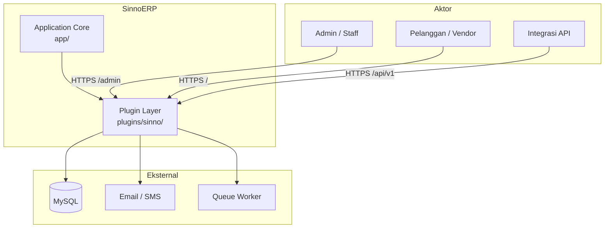
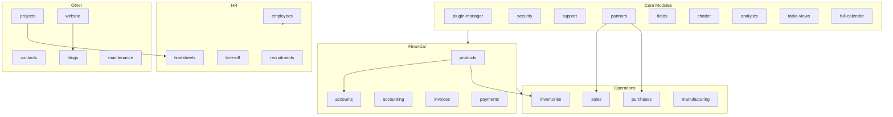
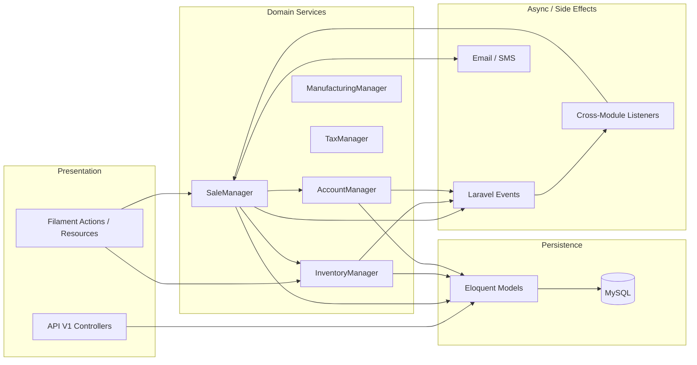
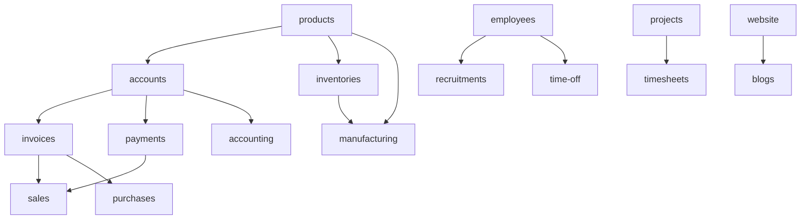
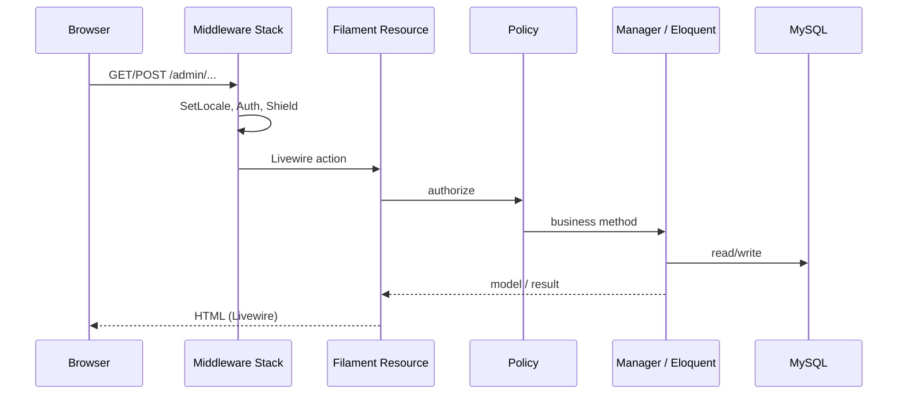
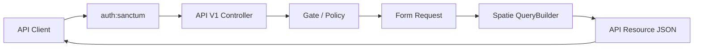
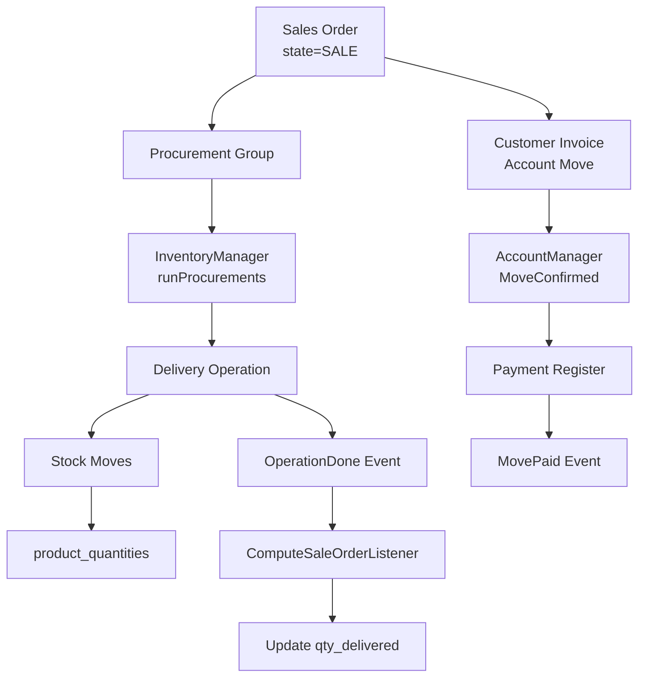
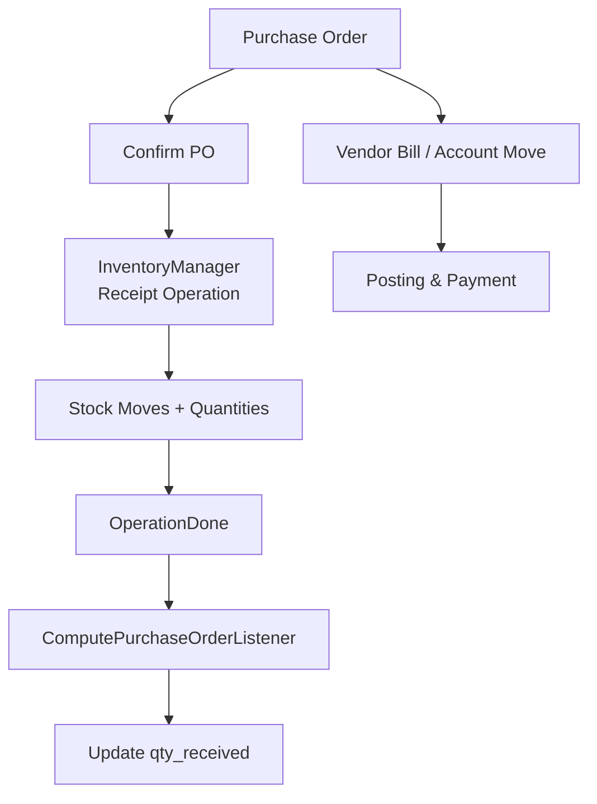
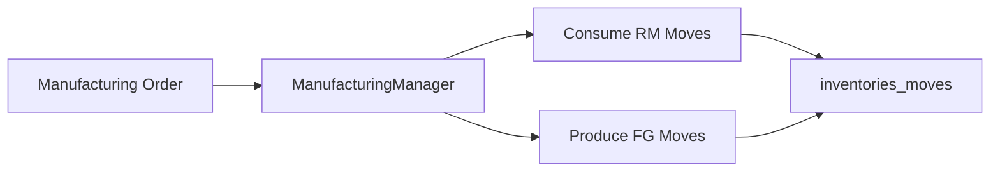
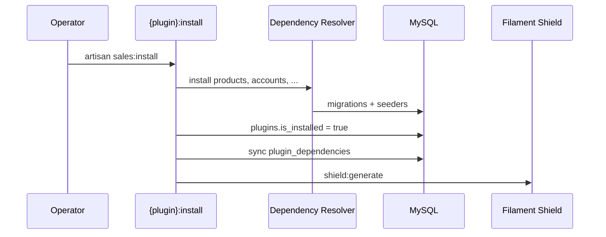

# SinnoERP — System Design Document (SDD)

Dokumen ini menjelaskan desain sistem SinnoERP dari sudut pandang arsitektur aplikasi: **modul**, **layanan (services)**, **dependensi antar modul**, dan **alur data**. Dokumen ini melengkapi [MODULAR-ARCHITECTURE.md](./MODULAR-ARCHITECTURE.md) (definisi pembagian modul & bounded context), [ARCHITECTURE.md](./ARCHITECTURE.md) (arsitektur teknis), [BUSINESS-FLOWS.md](./BUSINESS-FLOWS.md) (sequence diagram bisnis), dan [DATABASE-ERD.md](./DATABASE-ERD.md) (skema data).

---

## Daftar Isi

1. [Ringkasan & Konteks Sistem](#1-ringkasan--konteks-sistem)
2. [Modul Aplikasi](#2-modul-aplikasi)
3. [Services](#3-services)
4. [Dependency Antar Modul](#4-dependency-antar-modul)
5. [Alur Data](#5-alur-data)
6. [Referensi](#6-referensi)

---

## 1. Ringkasan & Konteks Sistem

### 1.1 Tujuan Sistem

SinnoERP adalah **ERP open-source modular** berbasis Laravel. Sistem menyediakan:

- **Admin panel** (`/admin`) — operasi internal (penjualan, gudang, akuntansi, HR, dll.)
- **Customer portal** (`/`) — akses pelanggan/vendor (plugin website)
- **REST API** (`/api/v1/...`) — integrasi pihak ketiga (Sanctum Bearer token)

### 1.2 Pola Arsitektur

| Aspek | Keputusan |
|-------|-----------|
| Gaya deploy | **Modular monolith** — satu codebase, satu proses aplikasi |
| Pemisahan domain | Setiap modul bisnis = **plugin** di `plugins/sinno/{name}/` |
| Core aplikasi | Folder `app/` tipis (panel Filament, locale, stub User) |
| Orkestrasi bisnis | **Manager classes** + **Laravel Events** + **Eloquent FK** |
| Aktivasi modul | `php artisan erp:install` (core) + `php artisan {plugin}:install` (opsional) |

### 1.3 Diagram Konteks



---

## 2. Modul Aplikasi

Dalam SinnoERP, **modul = plugin**. Setiap plugin adalah paket Laravel mandiri dengan migrasi, model, Filament UI, policies, API (opsional), dan terjemahan sendiri.

### 2.1 Application Core (bukan plugin)

| Komponen | Lokasi | Peran |
|----------|--------|-------|
| Admin Panel Provider | `app/Providers/Filament/AdminPanelProvider.php` | Panel `/admin`, Shield, MFA |
| Customer Panel Provider | `app/Providers/Filament/CustomerPanelProvider.php` | Panel `/`, guard `customer` |
| App Service Provider | `app/Providers/AppServiceProvider.php` | Binding auth, HTTPS production |
| SetLocale Middleware | `app/Http/Middleware/SetLocale.php` | i18n per request |
| Bootstrap | `bootstrap/app.php`, `bootstrap/providers.php` | Routing, middleware, daftar 26+ ServiceProvider plugin |

Core **tidak** berisi logika bisnis ERP; hanya shell hosting plugin.

### 2.2 Modul Core (selalu aktif — `isCore()`)

Plugin ini dimuat tanpa instalasi terpisah. Migrasi dan route-nya selalu tersedia.

| ID Plugin | Namespace | Peran Utama |
|-----------|-----------|-------------|
| `plugin-manager` | `Sinno\PluginManager` | Lifecycle install/uninstall, metadata `plugins`, `erp:install` |
| `security` | `Sinno\Security` | User, tim, RBAC (Shield + Spatie), API auth |
| `support` | `Sinno\Support` | Company, currency, UOM, UTM, activity types, shared traits |
| `partners` | `Sinno\Partner` | Partner, alamat, kontak — fondasi CRM |
| `fields` | `Sinno\Field` | Custom fields dinamis (`HasCustomFields`) |
| `chatter` | `Sinno\Chatter` | Pesan internal, followers (polymorphic) |
| `analytics` | `Sinno\Analytic` | `analytic_records`, widget BI |
| `table-views` | `Sinno\TableViews` | Filter/kolom tersimpan per user |
| `full-calendar` | `Sinno\FullCalendar` | Komponen kalender Filament |

### 2.3 Modul Bisnis — Keuangan

| ID Plugin | Peran | UI / API |
|-----------|-------|----------|
| `products` | Katalog produk, kategori, UOM, packaging | Filament + API V1 |
| `accounts` | Jurnal, move, pajak, fiscal position, rekonsiliasi | Filament + API V1 |
| `accounting` | Laporan & cluster akuntansi (lapisan UI di atas accounts) | Filament clusters |
| `invoices` | Invoice customer/vendor (UI khusus di atas accounts) | Filament clusters |
| `payments` | Registrasi pembayaran, rekonsiliasi dengan move | Filament + API |

### 2.4 Modul Bisnis — Operasi

| ID Plugin | Peran |
|-----------|-------|
| `sales` | Quotation, sales order, delivery trigger, invoice dari SO |
| `purchases` | RFQ, purchase order, receipt trigger, vendor bill |
| `inventories` | Gudang, stok, operasi (delivery/receipt/internal), rules procurement |
| `manufacturing` | BOM, manufacturing order, konsumsi/produksi stok |

### 2.5 Modul Bisnis — SDM

| ID Plugin | Peran |
|-----------|-------|
| `employees` | Karyawan, departemen, jabatan, skill |
| `recruitments` | Lowongan, kandidat, applicant pipeline |
| `time-off` | Cuti, accrual plan, approval |
| `timesheets` | Entri jam kerja (bergantung projects) |

### 2.6 Modul Bisnis — Proyek, Konten, Lainnya

| ID Plugin | Peran |
|-----------|-------|
| `projects` | Proyek, task, milestone |
| `contacts` | Manajemen kontak (di atas partners) |
| `website` | Portal pelanggan (panel `customer`) |
| `blogs` | Artikel blog (bergantung website) |
| `maintenance` | Permintaan & peralatan maintenance |

### 2.7 Struktur Internal per Modul

Setiap plugin mengikuti konvensi yang sama:

```
plugins/sinno/{name}/
├── src/{Name}ServiceProvider.php   # Package + dependencies + install command
├── src/{Name}Plugin.php            # Registrasi Filament (guard isPluginInstalled)
├── src/Models/ Policies/ Filament/ Http/ Events/ Enums/
├── database/migrations/ seeders/ factories/
├── routes/api.php                  # REST (jika ada)
└── resources/lang/ views/
```

### 2.8 Peta Modul (Logical View)



---

## 3. Services

Dalam konteks SDD ini, **service** mencakup: (A) **domain services** (Manager), (B) **infrastructure Laravel**, dan (C) **layanan pendukung** di plugin core.

### 3.1 Domain Services (Manager Pattern)

Logika bisnis kompleks dipusatkan di kelas **Manager**, didaftarkan sebagai **singleton** di container Laravel dan diakses via **Facade**.

| Service Key | Kelas | Plugin | Tanggung Jawab |
|-------------|-------|--------|----------------|
| `sale` | `Sinno\Sale\SaleManager` | sales | Konfirmasi SO, procurement, invoice, cancel, compute qty |
| `inventory` | `Sinno\Inventory\InventoryManager` | inventories | Operasi stok: confirm, assign, done, cancel, rules pull/buy |
| `account` | `Sinno\Account\AccountManager` | accounts | Posting move, pembayaran, rekonsiliasi, reverse |
| `manufacturing` | `Sinno\Manufacturing\ManufacturingManager` | manufacturing | MO lifecycle, konsumsi Bahan, produksi FG |
| `tax` | `Sinno\Account\TaxManager` | accounts | Perhitungan dan distribusi pajak |

**Contoh registrasi** (`SaleServiceProvider`):

```php
$this->app->singleton('sale', SaleManager::class);
```

**Contoh konsumsi lintas modul** (`SaleManager` memanggil inventory & account):

```php
InventoryFacade::runProcurements($procurements);
AccountFacade::createInvoiceFromSaleOrder($order);
```

Modul **purchases** tidak memiliki Manager terpusat setara; logika purchase order diorkestrasi dari Filament actions + `InventoryManager` + listener event.

### 3.2 Application & Infrastructure Services

| Layanan | Teknologi | Peran dalam sistem |
|---------|-----------|-------------------|
| HTTP / Routing | Laravel 13 | Web + API; **route tidak di-cache** (plugin routes dinamis dari DB) |
| ORM | Eloquent | Persistensi; relasi FK lintas plugin |
| Auth (web) | Session + Filament | Panel admin & customer |
| Auth (API) | Laravel Sanctum | Bearer token, abilities |
| Authorization | Filament Shield + Policies | RBAC per resource |
| Queue | Laravel Queue | Background job (dev: `queue:listen`, prod: Supervisor) |
| Cache | Redis / file | Config, views (bukan routes) |
| Mail / Notification | Laravel Mail + custom listeners | Quotation email, SMS on `MovePaid` |
| Settings | Spatie Laravel Settings | Per-plugin settings migrations |
| API filtering | Spatie Query Builder | Filter/sort/include konsisten di API V1 |
| API docs | Knuckles Scribe | Dokumentasi OpenAPI dari controller |

### 3.3 Cross-Cutting Services (Plugin Core)

| Modul | “Service” / Capability | Integrasi |
|-------|------------------------|-----------|
| `support` | `EmailService`, company/currency helpers | Dipakai Sales, Accounts, dll. |
| `chatter` | Polymorphic messaging | Trait `HasChatter` pada model bisnis |
| `fields` | `FieldsColumnManager`, `HasCustomFields` | Kolom dinamis di Filament tables/forms |
| `analytics` | `analytic_records` | Timesheets, projects → pelaporan biaya |
| `table-views` | Saved filter state | Semua Filament Resource yang mendukung |
| `plugin-manager` | `PermissionManager`, `InstallCommand` | Install recursive + Shield generate |

### 3.4 Event Bus (Decoupling Antar Modul)

Domain events dipublish dari Manager; modul lain subscribe via `Event::listen` di ServiceProvider.

| Event (publisher) | Listener (subscriber) | Efek |
|-------------------|----------------------|------|
| `OperationDone` (inventories) | `ComputeSaleOrderListener` (sales) | Update `qty_delivered` pada SO |
| `OperationDone`, `OperationBackOrdered` (inventories) | `ComputePurchaseOrderListener` (purchases) | Update qty received pada PO |
| `MovePaid` (accounts) | `SendSMSNotificationListener` (sales) | Notifikasi SMS terkait penjualan |
| `sinno.installed` (plugin-manager) | `Installer` listener | Post-install setup |

Events utama per domain:

| Plugin | Events |
|--------|--------|
| sales | `OrderConfirmed`, `OrderCanceled`, `OrderDrafted` |
| inventories | `OperationConfirmed`, `OperationDone`, `OperationCanceled`, `OperationBackOrdered`, ... |
| accounts | `MoveConfirmed`, `MovePaid`, `MoveCancelled`, `MoveReversed`, ... |

### 3.5 Diagram Layanan Domain



---

## 4. Dependency Antar Modul

Dependensi ada pada **dua lapisan**: (1) **instalasi plugin** — deklaratif di `Package::hasDependencies()`, dan (2) **runtime** — import class, FK database, event listener.

### 4.1 Dependency Instalasi (Deklaratif)

Didefinisikan di `{Plugin}ServiceProvider::configureCustomPackage()`:

| Plugin | Bergantung pada (`hasDependencies`) |
|--------|--------------------------------------|
| `accounts` | `products` |
| `invoices` | `accounts` |
| `payments` | `accounts` |
| `accounting` | `accounts` |
| `inventories` | `products` |
| `sales` | `invoices`, `payments` |
| `purchases` | `invoices` |
| `manufacturing` | `products`, `inventories` |
| `recruitments` | `employees` |
| `time-off` | `employees` |
| `timesheets` | `projects` |
| `blogs` | `website` |

Plugin tanpa `hasDependencies` (contoh: `products`, `employees`, `projects`, `website`, `maintenance`, `contacts`) dapat diinstall mandiri setelah core.

Metadata disimpan di pivot **`plugin_dependencies`** (model `Plugin::dependencies()`).

### 4.2 Graf Dependensi Instalasi



**Urutan instalasi tipikal rantai penjualan:**

```
products → accounts → invoices → payments → sales
                └→ inventories (paralel) → manufacturing
```

Saat `php artisan sales:install`, `InstallCommand` secara **rekursif** menginstall semua dependensi terlebih dahulu.

### 4.3 Dependency Runtime (Kode & Data)

| Sumber | Target | Mekanisme |
|--------|--------|-----------|
| sales | inventories | `InventoryFacade::runProcurements()` saat konfirmasi SO |
| sales | accounts | `AccountFacade` — pembuatan invoice / move |
| inventories | sales | FK `sale_order_id`, event `OperationDone` → listener sales |
| inventories | purchases | Event → `ComputePurchaseOrderListener` |
| purchases | inventories | Receipt operations, rules BUY (MTO) |
| manufacturing | inventories | Stock moves konsumsi/produksi |
| accounts | partners | FK `partner_id` pada moves |
| employees | partners | FK `partner_id` pada employee |
| Semua modul bisnis | support | FK `company_id`, currency, UOM |
| Semua modul bisnis | security | `users`, permissions |
| Banyak model | chatter, fields | Polymorphic traits |

Detail FK: [erd/cross-plugin.md](./erd/cross-plugin.md).

### 4.4 Aturan Coupling

| Prinsip | Implementasi |
|---------|--------------|
| Dependensi instalasi eksplisit | Mencegah migrasi/UI tanpa prasyarat |
| Coupling runtime via Facade/Event | Modul tidak di-uninstall jika ada **dependents** di DB |
| Core tidak boleh di-uninstall | `isCore()` plugins |
| Data shared | `partners`, `products`, `companies` sebagai hub entitas |

---

## 5. Alur Data

### 5.1 Alur Data — Request HTTP (Admin)



### 5.2 Alur Data — REST API



Route API didefinisikan per plugin di `routes/api.php`, dimuat hanya jika plugin terinstall (kecuali core).

### 5.3 Alur Data — Rantai Penjualan (Sell)

Alur end-to-end dari konfirmasi order hingga keuangan:



**Entitas data kunci:** `sales_orders` → `inventories_operations` / `inventories_moves` → `accounts_account_moves` → `payments`.

### 5.4 Alur Data — Rantai Pembelian (Buy)



### 5.5 Alur Data — Manufacturing



### 5.6 Alur Data — Plugin Install



### 5.7 Alur Data — Polymorphic & Shared Tables

| Alur | Tabel / Mekanisme | Modul terlibat |
|------|-------------------|----------------|
| Komentar pada record | `chatter_messages.messageable_*` | chatter + semua model `HasChatter` |
| Field kustom | `custom_field_values` | fields + resource Filament |
| Biaya analitik | `analytic_records` | analytics ← timesheets, projects |
| Pivot invoice–SO | `sales_order_invoices` | sales ↔ accounts |
| Pivot PO–bill | `purchases_order_account_moves` | purchases ↔ accounts |

### 5.8 Matriks Alur Data Lintas Modul (Ringkas)

| Trigger | Modul sumber | Data yang mengalir | Modul tujuan |
|---------|--------------|-------------------|--------------|
| Confirm SO | sales | procurement values, qty | inventories |
| Done delivery | inventories | operation, moves, stock | sales (via event) |
| Create invoice from SO | sales | move lines, taxes | accounts |
| Register payment | payments | payment lines | accounts |
| Confirm PO | purchases | receipt procurement | inventories |
| Done receipt | inventories | stock in | purchases (via event) |
| MO produce | manufacturing | BOM consumption | inventories |
| Timesheet entry | timesheets | cost hours | analytics / projects |

Sequence diagram lengkap: [BUSINESS-FLOWS.md](./BUSINESS-FLOWS.md).

---

## 6. Referensi

| Dokumen | Isi |
|---------|-----|
| [MODULAR-ARCHITECTURE.md](./MODULAR-ARCHITECTURE.md) | Definisi modul, DDD context map, lapisan service-based |
| [ARCHITECTURE.md](./ARCHITECTURE.md) | Stack, Docker, CI/CD, Filament, API, testing |
| [BUSINESS-FLOWS.md](./BUSINESS-FLOWS.md) | 25+ sequence diagram alur bisnis |
| [DATABASE-ERD.md](./DATABASE-ERD.md) | Indeks ERD per plugin |
| [erd/cross-plugin.md](./erd/cross-plugin.md) | FK dan dependency graph database |
| [README.md](./README.md) | Index dokumentasi |

| Resource Eksternal | URL |
|--------------------|-----|
| Repository | https://github.com/sinnoerp/sinnoerp |
| Developer Docs | https://devdocs.sinnoerp.com |

---

*Terakhir diperbarui: Juni 2026 — berdasarkan codebase SinnoERP (Laravel 13, Filament 5, 27 plugin di `plugins/sinno/`)*
