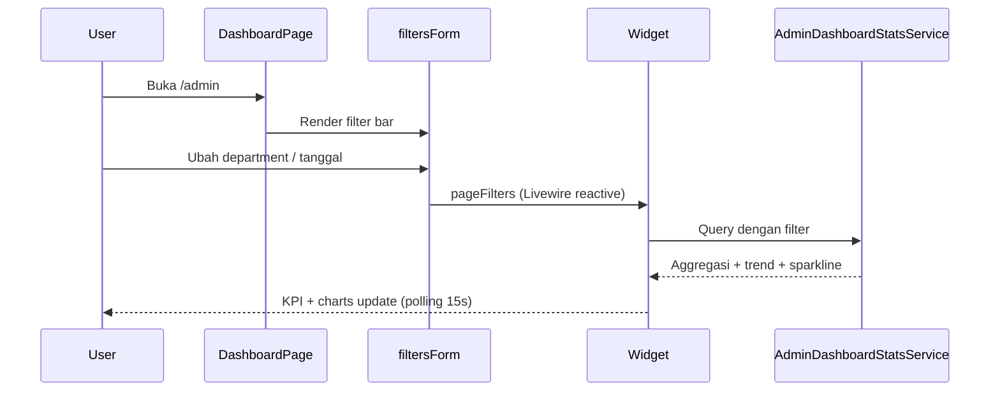
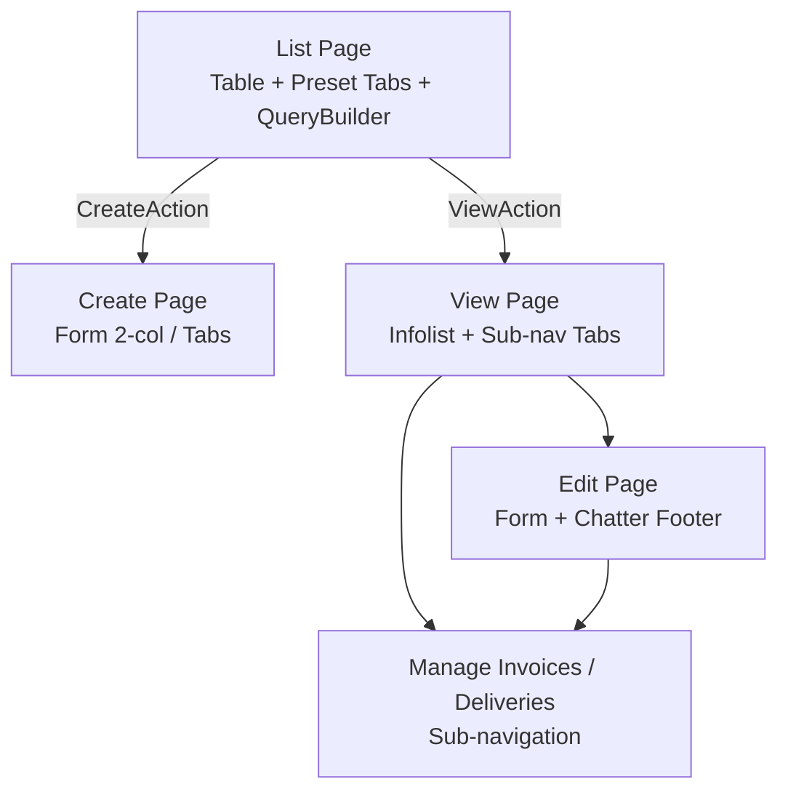

# SinnoERP — Standar Desain UI/UX

Dokumen ini merangkum **standar desain antarmuka** yang dipakai secara konsisten di SinnoERP dan HRIS Admin — diekstrak dari implementasi Filament 5 di codebase. Gunakan sebagai referensi saat membangun plugin baru, review UI, atau mendesain aplikasi ERP serupa.

**Dokumen terkait:**

| Dokumen | Fokus |
|---------|-------|
| [NAVIGATION-MENU-STANDARDS.md](./NAVIGATION-MENU-STANDARDS.md) | **Menu bar** — grup dropdown, registrasi plugin, cluster |
| [DASHBOARD-DESIGN.md](./DASHBOARD-DESIGN.md) | Layout dashboard, widget, KPI, chart |
| [ARCHITECTURE.md §7](./ARCHITECTURE.md#7-lapisan-ui--filament) | Arsitektur panel Filament |
| `.cursor/rules/filament-erp.mdc` | Aturan coding Filament untuk agent |

---

## Daftar Isi

1. [Prinsip Desain](#1-prinsip-desain)
2. [Design Tokens](#2-design-tokens)
3. [Layout & Shell](#3-layout--shell)
4. [Navigasi](#4-navigasi)
5. [Form — Standar Input & Layout](#5-form--standar-input--layout)
6. [Tabel — Standar List View](#6-tabel--standar-list-view)
7. [Status, Badge & Workflow](#7-status-badge--workflow)
8. [Record View & Sub-navigasi](#8-record-view--sub-navigasi)
9. [Line Items & Repeater](#9-line-items--repeater)
10. [Aksi & Feedback](#10-aksi--feedback)
11. [Kolaborasi (Chatter)](#11-kolaborasi-chatter)
12. [Dashboard & Widget](#12-dashboard--widget)
13. [i18n, RTL & Aksesibilitas](#13-i18n-rtl--aksesibilitas)
14. [Otorisasi UI](#14-otorisasi-ui)
15. [Komponen Shared (Support Plugin)](#15-komponen-shared-support-plugin)
16. [Anti-pola (Jangan Lakukan)](#16-anti-pola-jangan-lakukan)
17. [Referensi File](#17-referensi-file)

---

## 1. Prinsip Desain

| Prinsip | Implementasi di SinnoERP / HRIS |
|---------|---------------------------|
| **Density informatif** | ERP menampilkan banyak data; tabel padat, kolom toggleable, filter QueryBuilder |
| **Domain-first navigation** | Menu dikelompokkan per bisnis (Sales, Inventory, HR), bukan per entitas teknis |
| **Konsistensi Odoo-like** | Record multi-tab, line items tabel, status workflow, chatter di bawah |
| **Server-driven UI** | Semua UI didefinisikan PHP (Filament Schema) — bukan SPA terpisah |
| **Progressive disclosure** | Field kondisional (`->visible()`, `->live()`), kolom tersembunyi default, cluster untuk modul besar |
| **Permission-aware** | Elemen UI disembunyikan per role (Shield) — desain harus mengakomodasi variasi per user |
| **i18n-first** | Tidak ada string UI hardcoded; semua label via `__()` |
| **Accessible defaults** | Filament components + `getByRole` di E2E; RTL penuh untuk locale Arab |

---

## 2. Design Tokens

### 2.1 Warna

| Token | Nilai | Penggunaan |
|-------|-------|------------|
| **Primary** | `Filament\Support\Colors\Color::Blue` | Tombol utama, tab aktif, link, fokus |
| **Success** | Filament semantic `success` | Status selesai, tren naik, konfirmasi |
| **Warning** | `warning` | Status menunggu, draft, peringatan |
| **Danger** | `danger` | Error, cancel, tren turun, hapus |
| **Gray** | `gray` | Status netral, draft, disabled |
| **Info** | `info` | Informasi sekunder |
| **Custom/tag** | `Color::generateV3Palette($hex)` | Badge tag berwarna dinamis |

Konfigurasi panel: `app/Providers/Filament/AdminPanelProvider.php` → `->colors(['primary' => Color::Blue])`.

CSS token map (SinnoERP): `plugins/sinno/support/resources/css/colors.css`. HRIS Admin: `public/css/filament/admin-layout.css` untuk override layout dashboard.

### 2.2 Tipografi & hierarki

| Elemen | Pola |
|--------|------|
| **Judul record / nama entitas** | `TextInput` utama: `extraInputAttributes(['style' => 'font-size: 1.5rem;height: 3rem;'])`, sering `hiddenLabel()` |
| **Label field** | Via `->label(__('plugin::...'))` — tidak inline |
| **Teks tabel penting** | `->weight(FontWeight::Bold)` pada kolom nama/jumlah |
| **Teks sekunder** | `->placeholder('—')` untuk nilai kosong |
| **Font RTL** | `'Cairo', 'Noto Sans Arabic'` — `resources/css/app.css` |
| **Angka & mata uang** | `->money()`, tetap LTR di mode RTL |

### 2.3 Spacing & grid

| Pola | Nilai |
|------|-------|
| Form 2-kolom | `->columns(3)` root + `Group::columnSpan(['lg' => 2])` kiri + `columnSpan(['lg' => 1])` kanan |
| Section/Grid/Fieldset | `columnSpanFull()` via `HasFilamentDefaults` |
| Filter dashboard | `default:1 → sm:2 → md:3 → xl:6` |
| Logo tinggi | `2rem` |
| Konten lebar | `Width::Full` |

### 2.4 Branding

| Aset | Path |
|------|------|
| Logo | `public/images/logo-landscape.webp` (HRIS); SinnoERP full stack juga mendukung `logo.svg` |
| Favicon | `public/images/favicon.ico` |
| Ikon modul | `resources/svg/{nama}.svg` → `icon-{nama}` |

---

## 3. Layout & Shell

### Admin panel (`/admin`)

```
┌──────────────────────────────────────────────────────────────────┐
│ [Logo]  Dashboard ▾  Contact ▾  Sales ▾  …  [Search] [🔔] [User]│  ← topNavigation
├──────────────────────────────────────────────────────────────────┤
│  Page heading + breadcrumbs + header actions                     │
├──────────────────────────────────────────────────────────────────┤
│  [Optional: segmented tabs / table view tabs / filter bar]       │
├──────────────────────────────────────────────────────────────────┤
│                                                                  │
│  Main content (full width)                                       │
│                                                                  │
└──────────────────────────────────────────────────────────────────┘
```

| Setting | Nilai standar |
|---------|---------------|
| Navigasi | `->topNavigation()` — horizontal, bukan sidebar |
| Lebar | `->maxContentWidth(Width::Full)` |
| Notifikasi | Database notifications di header |
| Auth | Login, reset password, email verify, MFA |
| Peringatan form | `->unsavedChangesAlerts()` |

### Customer panel (`/portal` — HRIS)

| Setting | Nilai standar |
|---------|---------------|
| Provider | `app/Providers/Filament/CustomerPanelProvider.php` |
| Path | `/portal` (panel id `portal`) |
| Navigasi | Top navigation, primary blue |
| Dark mode | **Off** (`->darkMode(false)`) |
| Guard | `customer` — UI lebih sederhana, fokus portal karyawan |

SinnoERP full stack memakai path `/` (root) untuk panel pelanggan dengan pola yang sama.

Detail layout dashboard: [DASHBOARD-DESIGN.md](./DASHBOARD-DESIGN.md).

---

## 4. Navigasi

> **Panduan lengkap menu bar (dropdown di samping logo):** [NAVIGATION-MENU-STANDARDS.md](./NAVIGATION-MENU-STANDARDS.md)

### 4.1 Hierarki 3 tingkat

```
Navigation Group (top bar)
  └── Cluster (sub-menu modul besar)
        └── Resource / Page / Custom Page
```

| Tingkat | Kapan dipakai | Contoh |
|---------|---------------|--------|
| **Navigation Group** | Semua modul | Sales, Accounting, Project |
| **Cluster** | >8 halaman terkait | `Orders`, `Configurations`, `Operations` |
| **Sub-navigation record** | Multi-halaman per record | View → Edit → Invoices → Deliveries |

### 4.2 Ikon navigasi

| Konteks | Ikon | Contoh |
|---------|------|--------|
| Grup modul (top bar) | SVG kustom `icon-{nama}` | `icon-sales`, `icon-inventories` |
| Resource / cluster | Heroicon outline `heroicon-o-*` | `heroicon-o-shopping-bag`, `heroicon-o-document-text` |
| Tab preset tabel | Heroicon solid `heroicon-s-*` | `heroicon-s-archive-box` |
| Aksi create | `heroicon-o-plus-circle` | Tombol Create di list page |

### 4.3 Global search

- Provider: `Sinno\Support\GlobalSearchProvider` (SinnoERP full stack)
- Resource wajib definisikan `getGloballySearchableAttributes()` dan `getGlobalSearchResultDetails()`
- Detail search: partner name, reference, amount — bukan hanya title

### 4.4 Table views (tab filter)

Trait `HasTableViews` menambahkan **tab preset** di atas tabel:

```php
'my_orders' => PresetView::make(__('...tabs.my-orders'))
    ->icon('heroicon-s-shopping-bag')
    ->favorite()
    ->setAsDefault()
    ->modifyQueryUsing(fn ($q) => $q->where('user_id', Auth::id())),
```

Referensi: `plugins/sinno/sales/.../ListOrders.php`.

---

## 5. Form — Standar Input & Layout

### 5.1 Struktur layout form

**Pola utama — 2 kolom (konten + sidebar settings):**

```php
return $schema->components([
    Group::make()->schema([
        Section::make()->schema([/* field utama */]),
        Section::make('Images')->schema([/* upload */]),
        Section::make('Inventory')->schema([/* fieldset */]),
    ])->columnSpan(['lg' => 2]),

    Group::make()->schema([
        Section::make('Settings')->schema([/* type, reference, status */]),
        Section::make('Pricing')->schema([/* harga */]),
    ])->columnSpan(['lg' => 1]),
])->columns(3);
```

Referensi: `ProductResource::form()`.

**Pola alternatif — Tabs untuk record kompleks:**

```php
Tabs::make('tabs')->tabs([
    Tab::make('Sales & Purchase')->icon('heroicon-o-currency-dollar')->schema([...]),
    Tab::make('Accounting')->icon('heroicon-o-calculator')->schema([...]),
]);
```

Referensi: `PartnerResource::form()`.

### 5.2 Komponen layout (Filament 5 Schemas)

| Komponen | Namespace | Penggunaan |
|----------|-----------|------------|
| `Section` | `Filament\Schemas\Components\Section` | Kelompok field tematik |
| `Fieldset` | `...\Fieldset` | Sub-kelompok dalam section (alamat, logistik) |
| `Grid` | `...\Grid` | Layout kolom |
| `Group` | `...\Group` | Kolom kiri/kanan |
| `Tabs` / `Tab` | `...\Tabs` | Form multi-tab |
| `FusedGroup` | `...\FusedGroup` | Input + select menyatu (harga + UOM) |
| `Wizard` | `...\Wizard` | Alur multi-step (jarang) |

### 5.3 Konvensi field

| Aturan | Contoh |
|--------|--------|
| Relasi | `Select::make()->relationship()` — bukan `options()` manual |
| Searchable select | `->searchable()->preload()` |
| Tanggal | `DatePicker::make()->native(false)` |
| Reactive | `->live()` + `->visible(fn (Get $get) => ...)` |
| Cascade | `->afterStateUpdated(fn (Set $set) => $set('child', null))` |
| Inline create | `->createOptionForm([...])` pada Select relationship |
| Upload | `FileUpload::make()->image()->multiple()` |
| Rich text | `RichEditor` untuk deskripsi panjang |
| Placeholder | `->placeholder(__('...placeholder'))` |
| Unik | `->unique('table_name')` pada field kode |

### 5.4 Pola judul record

Field nama/judul utama entitas:

```php
TextInput::make('name')
    ->hiddenLabel()
    ->required()
    ->autofocus()
    ->extraInputAttributes(['style' => 'font-size: 1.5rem;height: 3rem;'])
    ->placeholder(__('...name-placeholder'));
```

Digunakan di Product, Partner, dan resource serupa.

### 5.5 FusedGroup (nilai + unit)

```php
FusedGroup::make([
    TextInput::make('price')->numeric()->columnSpan(2),
    Select::make('uom_id')->placeholder('UOM')->searchable(),
])->label(__('...price'))->columns(3);
```

---

## 6. Tabel — Standar List View

### 6.1 Konfigurasi tabel

| Fitur | Pola standar |
|-------|--------------|
| Kolom reorderable | `->reorderableColumns()` |
| Column manager | `->columnManagerColumns(2)` |
| Default sort | `->defaultSort('sort', 'desc')` atau kolom `created_at` |
| Row reorder | `->reorderable('sort')` (jika ada kolom sort) |
| Grouping | `->groups([Group::make('type'), ...])` |
| Soft delete | `RestoreAction`, `ForceDeleteAction` di row & bulk |
| Empty state | Placeholder `—` per kolom |

Referensi: `ProductResource::table()`.

### 6.2 Kolom

| Tipe kolom | Pola |
|------------|------|
| Teks utama | `->searchable()->sortable()` |
| Opsional | `->toggleable(isToggledHiddenByDefault: true)` |
| Tag/multi | `->badge()` |
| Status enum | `->badge()->color(fn ($state) => $state->getColor())` |
| Mata uang | `->money()->suffix(fn ($r) => ' / '.$r->uom->name)` |
| Gambar | `ImageColumn::make()->circular()->stacked()->limit(3)` |
| Ikon interaktif | `IconColumn` dengan `->action()` (favorite star) |
| Relasi | `->counts('variants')` untuk aggregate |

### 6.3 Filter

**Standar: QueryBuilder** (bukan filter sederhana terpisah):

```php
->filters([
    QueryBuilder::make()->constraints([
        TextConstraint::make('name')->icon('heroicon-o-magnifying-glass'),
        DateConstraint::make('created_at'),
        RelationshipConstraint::make('partner')->icon('heroicon-o-user'),
        SelectConstraint::make('state')->options(OrderState::class),
        BooleanConstraint::make('is_favorite')->icon('heroicon-o-star'),
        NumberConstraint::make('price')->icon('heroicon-o-banknotes'),
    ]),
])
```

- Setiap constraint punya **ikon Heroicon**
- Filter deferred by default (Filament 5) — gunakan `->deferFilters(false)` jika perlu instant filter

### 6.4 Aksi baris

| Aksi | Pola |
|------|------|
| View | `ViewAction::make()` |
| Edit | `EditAction::make()` |
| Delete | `DeleteAction::make()` |
| Activity | `ActivityTableAction::make()` (chatter) |
| Custom | `ActionGroup::make([...])` untuk aksi sekunder |
| Bulk | `BulkActionGroup` + `DeleteBulkAction` + custom bulk |

---

## 7. Status, Badge & Workflow

### 7.1 Enum sebagai sumber kebenaran UI

Semua status bisnis didefinisikan sebagai **PHP Enum** dengan kontrak Filament:

```php
enum OrderState: string implements HasColor, HasLabel
{
    case DRAFT = 'draft';
    case SALE = 'sale';

    public function getLabel(): string { /* __() */ }
    public function getColor(): ?string {
        return match ($this) {
            self::DRAFT => 'gray',
            self::SALE  => 'success',
        };
    }
    public static function options(): array { /* untuk Select */ }
}
```

### 7.2 Pemetaan warna status (konvensi)

| Status bisnis | Warna |
|---------------|-------|
| Draft / baru | `gray` |
| Menunggu / terkirim | `warning` |
| Aktif / selesai / confirmed | `success` |
| Dibatalkan / error | `danger` |
| Info / partial | `info` |

### 7.3 Progress Stepper (workflow visual)

Plugin `fields` menyediakan `ProgressStepper` untuk menampilkan tahapan dokumen:

```php
FormProgressStepper::make('state')
    ->hiddenLabel()
    ->inline()
    ->options(OrderState::options())
    ->disabled()
    ->live();
```

Digunakan di Quotation/Sales Order — state tidak diedit langsung via stepper, hanya visual.

### 7.4 Badge di tabel & infolist

```php
TextColumn::make('state')
    ->badge()
    ->color(fn (OrderState $state) => $state->getColor());

TextEntry::make('state')
    ->badge()
    ->weight(FontWeight::Bold);
```

Tag berwarna dinamis: `Color::generateV3Palette($state['color'])`.

---

## 8. Record View & Sub-navigasi

### 8.1 Multi-page record

Resource kompleks memecah record ke beberapa halaman:

```php
public static function getPages(): array
{
    return [
        'index'      => ListOrders::route('/'),
        'create'     => CreateOrder::route('/create'),
        'view'       => ViewOrder::route('/{record}'),
        'edit'       => EditOrder::route('/{record}/edit'),
        'invoices'   => ManageInvoices::route('/{record}/invoices'),
        'deliveries' => ManageDeliveries::route('/{record}/deliveries'),
    ];
}

public static function getRecordSubNavigation(Page $page): array
{
    return $page->generateNavigationItems([
        ViewOrder::class,
        EditOrder::class,
        ManageInvoices::class,
        ManageDeliveries::class,
    ]);
}
```

### 8.2 Tab navigasi segmented

Trait `HasRecordNavigationTabs` merender sub-nav sebagai **segmented tabs** di header:

- Class CSS: `fi-tabs fi-tabs-rounded fi-tabs-segmented fi-tabs-primary`
- Posisi: header widget, `columnSpan = 'full'`
- Mendukung ikon + badge count

### 8.3 Infolist (view mode)

- `TextEntry`, `ImageEntry`, `RepeatableEntry`
- Mirror struktur form: section, tabs, badge, bold untuk nilai penting
- `RepeatableEntry` + `TableColumn` untuk line items read-only

---

## 9. Line Items & Repeater

### 9.1 Repeater mode tabel

Komponen kustom `Sinno\Support\Filament\Forms\Components\Repeater`:

```php
Repeater::make('lines')
    ->table([
        TableColumn::make('product_id')->markAsRequired(),
        TableColumn::make('quantity'),
        TableColumn::make('price'),
    ])
    ->footerActions([
        Action::make('add')->icon('heroicon-o-plus-circle'),
    ]);
```

Fitur: column manager, resize, summary row, drag reorder.

### 9.2 Quotation / Order lines

Sales & Purchases menggunakan repeater tabel untuk baris produk — pola standar dokumen ERP:

- Produk + qty + UOM + harga + diskon + pajak
- Livewire summary component (`QuotationSummary`) untuk total

Referensi: `QuotationResource::form()`.

---

## 10. Aksi & Feedback

### 10.1 Ikon aksi standar

| Aksi | Ikon |
|------|------|
| Create / Add | `heroicon-o-plus-circle` |
| Edit | default Filament |
| Delete | default Filament |
| Export | `heroicon-o-arrow-down-tray` |
| Import | `heroicon-o-arrow-up-tray` |
| Trend up/down | `heroicon-m-arrow-trending-up` / `down` |

### 10.2 Notifikasi

```php
Notification::make()
    ->title(__('...success'))
    ->success()
    ->send();
```

- Toast Filament untuk aksi CRUD
- Database notifications untuk event async (header bell icon)

### 10.3 Konfirmasi & alert

- `->requiresConfirmation()` pada aksi destruktif
- `->unsavedChangesAlerts()` di panel level
- Validasi form inline via Filament — tidak popup terpisah

---

## 11. Kolaborasi (Chatter)

Widget `ChatterWidget` di **footer** halaman view/edit:

- Pesan internal, log aktivitas, followers, lampiran
- Livewire component `chatter-panel` dengan lazy load
- Activity plans terintegrasi

Pola mirip Odoo — kolaborasi kontekstual per record, bukan chat global.

---

## 12. Dashboard & Widget

Panduan lengkap pola dashboard SinnoERP: [DASHBOARD-DESIGN.md](./DASHBOARD-DESIGN.md). Bagian ini merangkum standar yang **wajib konsisten** di semua modul dan implementasi HRIS Admin.

### 12.1 Anatomi halaman dashboard

```
┌─────────────────────────────────────────────────────────────┐
│  Page title (navigation label)                              │
├─────────────────────────────────────────────────────────────┤
│  Filter bar (opsional) — Select, DatePicker, multi-filter   │
├─────────────────────────────────────────────────────────────┤
│  ┌──────────┐ ┌──────────┐ ┌──────────┐ ┌──────────┐        │
│  │ Stat KPI │ │ Stat KPI │ │ Stat KPI │ │ Stat KPI │        │
│  └──────────┘ └──────────┘ └──────────┘ └──────────┘        │
│  ┌─────────────────────┐ ┌─────────────────────┐            │
│  │ Chart (bar/line)    │ │ Chart / Custom      │            │
│  └─────────────────────┘ └─────────────────────┘            │
│  ┌─────────────────────────────────────────────┐            │
│  │ Table widget / summary (full width)         │            │
│  └─────────────────────────────────────────────┘            │
│  ┌─────────────────────────────────────────────┐            │
│  │ Table widget (recent records)               │            │
│  └─────────────────────────────────────────────┘            │
└─────────────────────────────────────────────────────────────┘
```

**Urutan vertikal:** filter → KPI (full width) → chart/custom berdampingan (2 kolom di `xl`) → ringkasan/tabel penuh lebar.

### 12.2 Konvensi halaman dashboard

| Elemen | Pola | Contoh HRIS Admin |
|--------|------|-------------------|
| Class | `extends Dashboard` + `HasFiltersForm` | `app/Filament/Admin/Pages/Dashboard.php` |
| Filter | `filtersForm(Schema $schema)` — grid `1 → 2 → 3 → 6` | Department, Start date, End date |
| Widget list | Override `getWidgets(): array` | 6 widget terurut via `$sort` |
| Grid kolom | Override `getColumns()` | `default:1, md:2, xl:4` |
| Data layer | Service + Repository di modul domain | `modules/Dashboard/Services/AdminDashboardStatsService.php` |
| Permission | `OnlyAdminCanViewWidget` / Shield | Widget hanya untuk role admin |

### 12.3 Filter form — grid responsif

```php
Section::make()
    ->columns([
        'default' => 1,
        'sm'      => 2,
        'md'      => 3,
        'xl'      => 6,
    ])
    ->schema([
        Select::make('department')->native(false),
        DatePicker::make('startDate')->native(false),
        DatePicker::make('endDate')->native(false),
    ])
    ->columnSpanFull();
```

Widget membaca filter via trait `InteractsWithPageFilters` dan properti `$this->pageFilters`.

### 12.4 Jenis widget

#### Stats Overview (KPI cards)

**Base:** `Filament\Widgets\StatsOverviewWidget`

| Fitur UI | Implementasi |
|----------|--------------|
| Nilai utama | `Stat::make($label, $value)` |
| Perubahan periode | `->description('12.5% increase')` |
| Indikator tren | `->descriptionIcon('heroicon-m-arrow-trending-up')` |
| Warna tren | `->color('success' \| 'danger')` |
| Mini chart | `->chart($sparklineData)` — array numerik harian |
| Auto-refresh | `protected ?string $pollingInterval = '15s'` |
| Filter halaman | `use InteractsWithPageFilters` |
| Lebar | `protected int\|string\|array $columnSpan = 'full'` |

HRIS: `EmployeeStatsWidget`, `LeaveStatsWidget` — helper `BuildsHrStat` untuk pola konsisten.

#### Chart widgets

**Base:** `Filament\Widgets\ChartWidget`

- Tipe: bar, line, pie (override `getType()`)
- Tinggi maks: `protected ?string $maxHeight = '250px'`
- Warna chart: primary blue (`rgb(59, 130, 246)`)
- `columnSpan`: `xl => 2` agar berdampingan dengan widget lain

HRIS: `ProjectChartWidget` — bar chart status proyek.

#### Table widgets

Widget berisi tabel ringkas (bukan full resource) — top N atau recent items.

HRIS: `RecentAttendanceTableWidget`, `ProjectSummaryWidget` (ringkasan PROJECT + PENDING PROJECT).

#### Custom Blade widgets

**Base:** `Filament\Widgets\Widget` + view Blade

Untuk UI yang tidak tercakup komponen standar: jam analog check-in, journal charts, navigation tabs.

| Widget HRIS | View | Penggunaan |
|-------------|------|------------|
| `AttendanceWidget` | `filament.admin.widgets.attendance-widget` | Jam analog SVG + tombol Check In/Out |
| `RecordNavigationTabs` (SinnoERP) | `support::filament.widgets.record-navigation-tabs` | Tab segmented di header record |

**Aturan custom widget:** gunakan CSS inline atau file panel (`admin-layout.css`) bila Tailwind arbitrary class tidak reliable di Livewire; pertahankan `wire:ignore` pada elemen yang di-update Alpine (mis. jam analog).

#### Calendar widgets

Plugin `full-calendar` — `FullCalendarWidget` untuk modul Time-off dan Maintenance (SinnoERP full stack).

### 12.5 Urutan & lebar kolom widget

```php
protected static ?int $sort = 1;                    // urutan tampil
protected int|string|array $columnSpan = 'full';    // lebar grid
protected ?string $pollingInterval = '15s';         // auto-refresh opsional
```

Grid dashboard Filament responsif — atur `columnSpan` agar chart dan widget kustom berdampingan di layar lebar (`xl: 2` masing-masing).

### 12.6 Layout HRIS Admin Dashboard (referensi)

Urutan widget di `app/Filament/Admin/Pages/Dashboard.php`:

| Sort | Widget | `columnSpan` | Peran |
|------|--------|--------------|-------|
| 1 | `EmployeeStatsWidget` | `full` | KPI SDM (4 kartu + sparkline) |
| 2 | `LeaveStatsWidget` | `full` | KPI cuti |
| 3 | `ProjectChartWidget` | `xl: 2` | Bar chart proyek |
| 4 | `AttendanceWidget` | `xl: 2` | Jam analog + check-in/out |
| 5 | `ProjectSummaryWidget` | `full` | Ringkasan PROJECT + PENDING |
| 6 | `RecentAttendanceTableWidget` | `full` | Tabel kehadiran terbaru |

CSS equal-height untuk baris chart: `public/css/filament/admin-layout.css` — class `.fi-wi-widget` di baris yang sama distretch.

### 12.7 Alur data filter → widget



### 12.8 Checklist dashboard baru

- [ ] Filter bar di atas dengan grid responsif `1 → 2 → 3 → 6`
- [ ] KPI full width dengan tren %, ikon, sparkline, polling `15s`
- [ ] Chart `maxHeight = '250px'`, warna primary blue
- [ ] Chart/custom widget `columnSpan xl: 2` untuk layout 2 kolom
- [ ] Tabel ringkas di bawah chart (full width)
- [ ] Data dari Service/Repository — bukan query langsung di widget
- [ ] Permission widget (`OnlyAdminCanViewWidget` atau Shield)
- [ ] Semua label via `__()` — tidak hardcode

---

## 13. i18n, RTL & Aksesibilitas

### 13.1 Terjemahan

| Aturan | Contoh |
|--------|--------|
| Key format | `{plugin}::filament/resources/{resource}.form.sections.general.fields.name` |
| Canonical locale | English (`resources/lang/en/`) |
| Enum label | `__('sales::enums/order-state.draft')` |
| Cek sebelum commit | `php artisan translations:check --details` |

### 13.2 RTL

- Trait `HasRtlSupport` — language switcher + direction `rtl`/`ltr`
- Override CSS Filament di `resources/css/app.css` (~300 baris)
- Input `email`, `tel`, `number`, `url` tetap LTR
- Angka/harga: class `.number`, `.price`, `.currency` → LTR

### 13.3 E2E & aksesibilitas

- Playwright: `getByRole`, `getByLabel`, `getByText` — lihat `tests/e2e-pw/locator/erp_locator.ts`
- Filament menyediakan ARIA pada komponen standar

---

## 14. Otorisasi UI

| Level | Mekanisme |
|-------|-----------|
| Resource | Policy + Filament Shield |
| Query scope | `HasResourcePermissionQuery` trait |
| Page | `HasPageShield` + `getPagePermission()` |
| Widget | `HasWidgetShield` + `getPagePermission()` |
| Navigation | `->visible(fn () => Page::canAccess())` |

**Aturan desain:** jangan asumsikan semua user melihat semua menu/widget.

---

## 15. Komponen Shared (Support Plugin)

| Komponen / Trait | Lokasi | Fungsi |
|------------------|--------|--------|
| `HasFilamentDefaults` | `support/Traits/` | Section/Grid/Fieldset full width |
| `HasRecordNavigationTabs` | `support/Traits/` | Tab segmented di record |
| `HasRtlSupport` | `support/Traits/` | RTL + language switch |
| `Repeater` (table mode) | `support/Filament/Forms/Components/` | Line items tabel |
| `RepeatableEntry` | `support/Filament/Infolists/Components/` | Line items read-only |
| `RecordNavigationTabs` | `support/Filament/Widgets/` | Widget tab navigasi |
| `GlobalSearchProvider` | `support/` | Pencarian global |
| `HasTableViews` | `table-views/Filament/Concerns/` | Tab preset tabel |
| `ProgressStepper` | `fields/Filament/Forms/Components/` | Workflow step visual |
| `ChatterWidget` | `chatter/Filament/Widgets/` | Kolaborasi record |
| `FullCalendarWidget` | `full-calendar/Filament/Widgets/` | Kalender |

---

## 16. Anti-pola (Jangan Lakukan)

| ❌ Jangan | ✅ Gunakan |
|----------|------------|
| Hardcode string UI | `__('plugin::key')` |
| Sidebar navigation untuk admin | `topNavigation()` — sudah diputuskan di core |
| `options()` manual untuk relasi | `->relationship()` |
| `DB::` untuk data UI | Eloquent + eager load |
| Filter tabel sederhana saja | `QueryBuilder` dengan constraints + ikon |
| Status sebagai string bebas | Enum `HasColor` + `HasLabel` |
| Logic bisnis di Resource | Manager + Events; Resource hanya UI |
| `env()` di komponen UI | `config()` |
| Buat komponen baru jika ada di support | Extend/reuse `Repeater`, traits, widgets |
| Dashboard tanpa permission | `HasPageShield` + `HasWidgetShield` |

---

## 17. Referensi File

### Pola emas (gold standard)

| Pola UI | File |
|---------|------|
| Form 2-kolom + sidebar | `plugins/sinno/products/src/Filament/Resources/ProductResource.php` |
| Form tabs + address fieldset | `plugins/sinno/partners/src/Filament/Resources/PartnerResource.php` |
| Tabel lengkap + QueryBuilder | `ProductResource::table()` |
| Dokumen + line items + stepper | `plugins/sinno/sales/.../QuotationResource.php` |
| Sub-nav record + invoices | `plugins/sinno/sales/.../OrderResource.php` |
| Table view tabs | `.../OrderResource/Pages/ListOrders.php` |
| Dashboard modul (SinnoERP) | `plugins/sinno/projects/src/Filament/Pages/Dashboard.php` |
| Dashboard HRIS Admin | `app/Filament/Admin/Pages/Dashboard.php` |
| Widget KPI HRIS | `app/Filament/Admin/Widgets/EmployeeStatsWidget.php` |
| Widget custom HRIS | `app/Filament/Admin/Widgets/AttendanceWidget.php` |
| Stats service HRIS | `modules/Dashboard/Services/AdminDashboardStatsService.php` |
| Layout CSS HRIS | `public/css/filament/admin-layout.css` |
| Enum status | `plugins/sinno/sales/src/Enums/OrderState.php` |
| Panel config | `app/Providers/Filament/AdminPanelProvider.php` |
| Customer panel HRIS | `app/Providers/Filament/CustomerPanelProvider.php` |
| RTL CSS | `resources/css/app.css` |
| Ikon modul | `resources/svg/` + `config/blade-icons.php` |

### Diagram — alur halaman record



---

*Standar ini diekstrak dari implementasi aktual di codebase. Jika kode berubah, perbarui dokumen ini. Untuk dashboard secara khusus, lihat [DASHBOARD-DESIGN.md](./DASHBOARD-DESIGN.md).*
