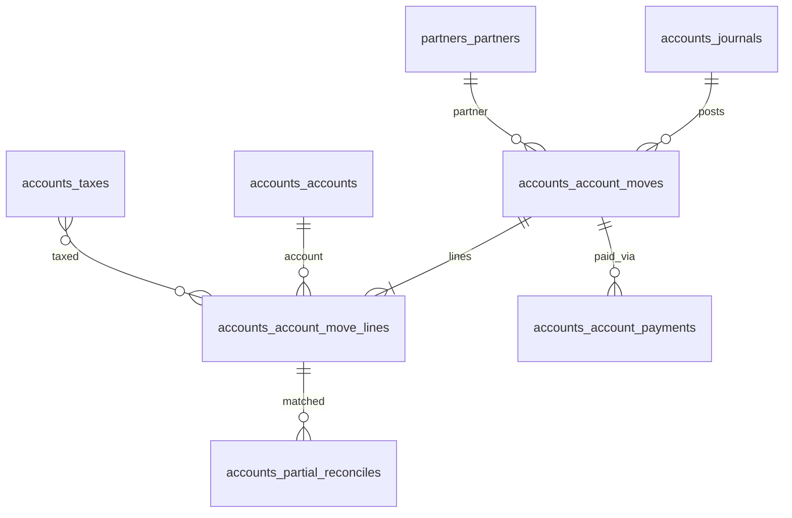

# Accounts — ERD

| | |
|---|---|
| **Plugin** | `accounts` |
| **Namespace** | `Sinno\Account` |
| **Tipe** | Installable |
| **Install** | `php artisan accounts:install` |
| **Dependensi** | products |
| **Manager** | `AccountManager` |

## Tabel (38+)

### Konfigurasi

| Tabel | Keterangan |
|-------|------------|
| `accounts_journals` | Jurnal akuntansi |
| `accounts_accounts` | Chart of accounts |
| `accounts_account_companies` | COA per company |
| `accounts_account_journals` | Pivot account ↔ journal |
| `accounts_journal_accounts` | Default accounts per journal |
| `accounts_taxes` | Pajak |
| `accounts_tax_groups` | Grup pajak |
| `accounts_tax_taxes` | Pajak nested |
| `accounts_tax_partition_lines` | Distribusi pajak |
| `accounts_payment_terms` | Term pembayaran |
| `accounts_payment_due_terms` | Jatuh tempo |
| `accounts_fiscal_positions` | Posisi fiskal |
| `accounts_fiscal_position_taxes` | Mapping pajak |
| `accounts_fiscal_position_accounts` | Mapping akun |
| `accounts_incoterms` | Incoterms |
| `accounts_cash_roundings` | Pembulatan |
| `accounts_account_tags` | Tag akun |
| `accounts_payment_methods` | Metode bayar jurnal |

### Transaksi

| Tabel | Keterangan |
|-------|------------|
| `accounts_account_moves` | Invoice, bill, entry |
| `accounts_account_move_lines` | Baris jurnal |
| `accounts_accounts_move_line_taxes` | Pajak per line |
| `accounts_account_payments` | Pembayaran |
| `accounts_payment_registers` | Wizard register payment |
| `accounts_account_payment_register_move_lines` | Lines register |

### Rekonsiliasi & Bank

| Tabel | Keterangan |
|-------|------------|
| `accounts_bank_statements` | Bank statement |
| `accounts_bank_statement_lines` | Baris statement |
| `accounts_partial_reconciles` | Partial reconcile |
| `accounts_full_reconciles` | Full reconcile |
| `accounts_reconciles` | Reconcile helper |

### Pivot Produk

| Tabel | Keterangan |
|-------|------------|
| `accounts_product_taxes` | Pajak penjualan produk |
| `accounts_product_supplier_taxes` | Pajak pembelian produk |
| `accounts_account_taxes` | Pajak default akun |

## Diagram (disederhanakan)

## Relasi ke Plugin Lain

| Modul | Hubungan |
|-------|----------|
| sales | pivot `sales_order_invoices` |
| purchases | pivot `purchases_order_account_moves` |
| products | `accounts_product_taxes` |

---

[← Indeks](./README.md) · [Accounting](./accounting.md) · [Invoices](./invoices.md)
