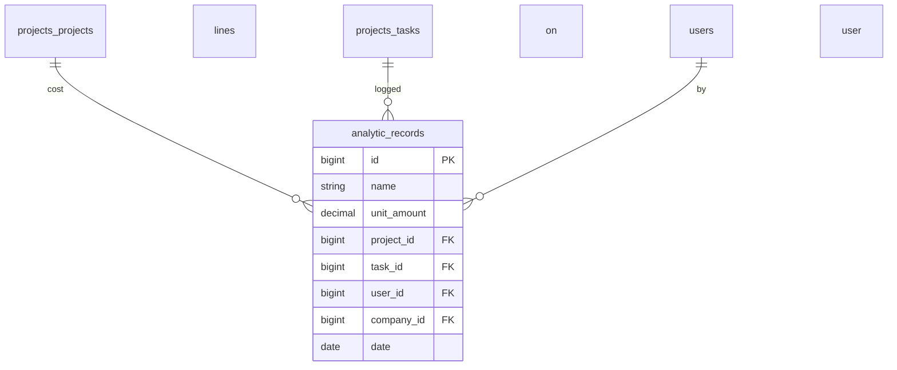

# Analytics — ERD

| | |
|---|---|
| **Plugin** | `analytics` |
| **Namespace** | `Sinno\Analytic` |
| **Tipe** | Core |

## Tabel

| Tabel | Keterangan |
|-------|------------|
| `analytic_records` | Baris biaya/jam (timesheet, cost allocation) |

## Diagram

## Relasi ke Plugin Lain

| FK | Ke |
|----|-----|
| `project_id` | [projects](./projects.md) |
| `task_id` | [projects](./projects.md) |
| `user_id` | [security](./security.md) |

Plugin **timesheets** menggunakan tabel ini via `Sinno\Project\Models\Timesheet`.

---

[← Indeks](./README.md)
