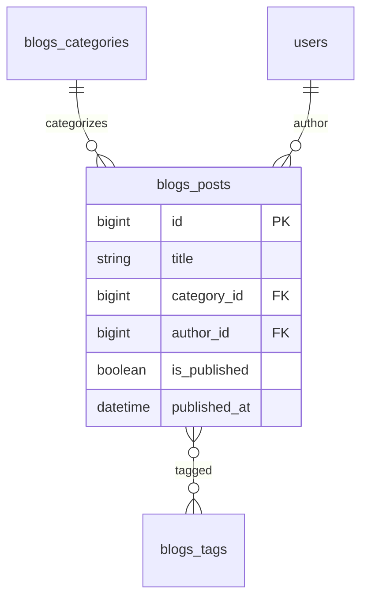

# Blogs — ERD

| | |
|---|---|
| **Plugin** | `blogs` |
| **Namespace** | `Sinno\Blog` |
| **Tipe** | Installable |
| **Install** | `php artisan blogs:install` |
| **Dependensi** | website |

## Tabel

| Tabel | Keterangan |
|-------|------------|
| `blogs_categories` | Kategori artikel |
| `blogs_posts` | Posting blog |
| `blogs_tags` | Tag |
| `blogs_post_tags` | Pivot post ↔ tag |

## Diagram

## Relasi ke Plugin Lain

| Modul | Relasi |
|-------|--------|
| website | Customer panel display |
| security | `author_id` → users |

---

[← Indeks](./README.md)
