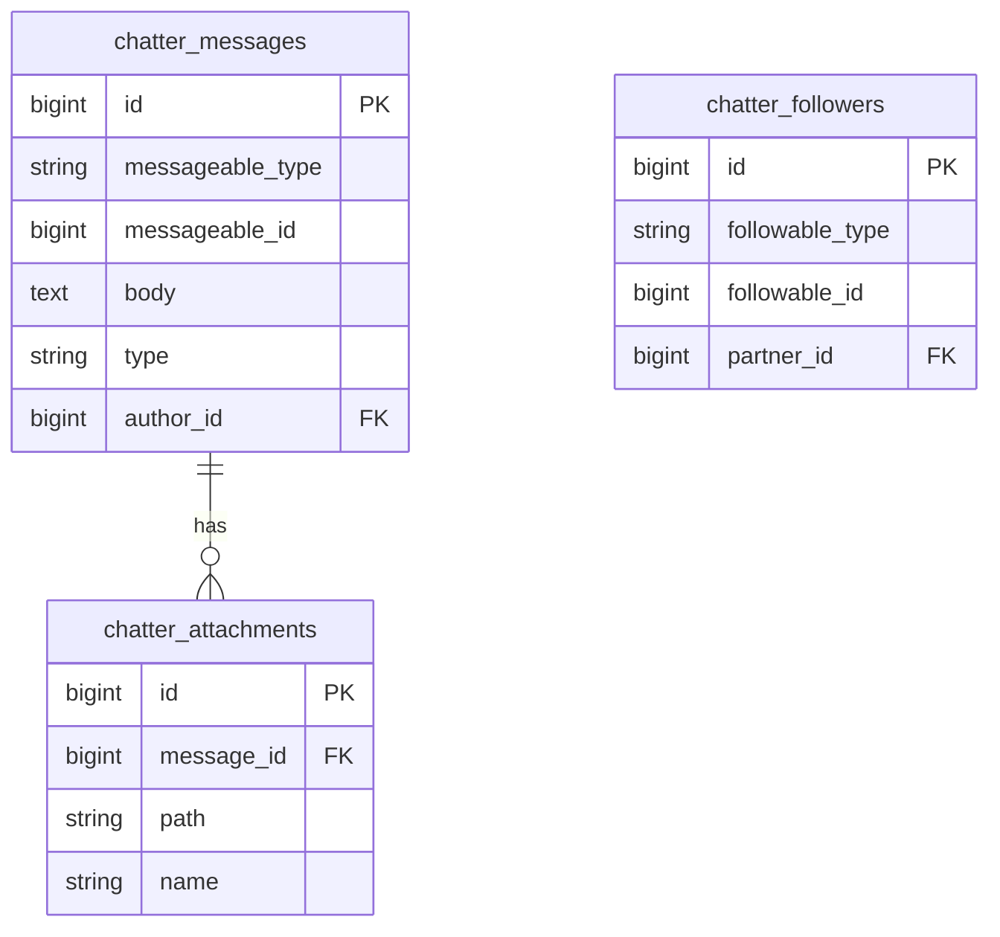

# Chatter — ERD

| | |
|---|---|
| **Plugin** | `chatter` |
| **Namespace** | `Sinno\Chatter` |
| **Tipe** | Core |
| **Trait** | `HasChatter`, `HasLogActivity` |

## Tabel

| Tabel | Keterangan |
|-------|------------|
| `chatter_messages` | Komentar/log pada record |
| `chatter_attachments` | Lampiran pesan |
| `chatter_followers` | Follower record |

## Diagram

## Polymorphic Targets (contoh)

`sales_orders`, `accounts_account_moves`, `projects_tasks`, `employees_employees`, `inventories_operations`

---

[← Indeks](./README.md)
