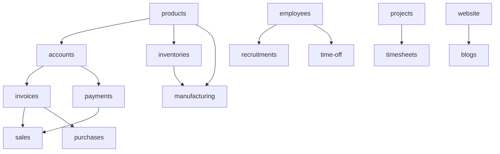

# Cross-Plugin — Relasi Database

Relasi foreign key dan dependensi instalasi antar modul.

---

## Dependency Graph (Install Order)

## FK Lintas Modul (Utama)

| Dari Tabel | Kolom FK | Ke Tabel | Modul |
|------------|----------|----------|-------|
| `sales_orders` | `partner_id` | `partners_partners` | sales → partners |
| `sales_orders` | `company_id` | `companies` | sales → support |
| `sales_orders` | `warehouse_id` | `inventories_warehouses` | sales → inventories |
| `sales_orders` | `procurement_group_id` | `inventories_procurement_groups` | sales → inventories |
| `sales_order_lines` | `product_id` | `products_products` | sales → products |
| `inventories_operations` | `sale_order_id` | `sales_orders` | inventories → sales |
| `inventories_moves` | `sale_order_line_id` | `sales_order_lines` | inventories → sales |
| `purchases_orders` | `partner_id` | `partners_partners` | purchases → partners |
| `purchases_order_lines` | `product_id` | `products_products` | purchases → products |
| `accounts_account_moves` | `partner_id` | `partners_partners` | accounts → partners |
| `accounts_account_moves` | `journal_id` | `accounts_journals` | accounts |
| `manufacturing_orders` | `product_id` | `products_products` | manufacturing → products |
| `employees_employees` | `department_id` | `employees_departments` | employees |
| `employees_employees` | `partner_id` | `partners_partners` | employees → partners |
| `recruitments_applicants` | `job_id` | `employees_job_positions` | recruitments → employees |
| `time_off_leaves` | `employee_id` | `employees_employees` | time-off → employees |
| `projects_projects` | `partner_id` | `partners_partners` | projects → partners |
| `analytic_records` | `project_id`, `task_id` | projects | analytics/projects |
| `users` | `company_id` | `companies` | security → support |

## Pivot Lintas Modul

| Pivot | Menghubungkan |
|-------|---------------|
| `sales_order_invoices` | `sales_orders` ↔ `accounts_account_moves` |
| `purchases_order_account_moves` | `purchases_orders` ↔ `accounts_account_moves` |
| `accounts_accounts_move_payment` | moves ↔ payments |
| `plugin_dependencies` | `plugins` ↔ `plugins` |

## Polymorphic (Multi-Plugin)

| Tabel | Polymorphic | Dipakai oleh |
|-------|-------------|--------------|
| `chatter_messages` | `messageable` | Order, Task, Employee, Move, ... |
| `chatter_followers` | `followable` | Semua model `HasChatter` |
| `custom_fields` | `customizable` | Model dengan `HasCustomFields` |
| `analytic_records` | — | Projects, Timesheets (cost lines) |

---

[← Indeks ERD](./README.md)
