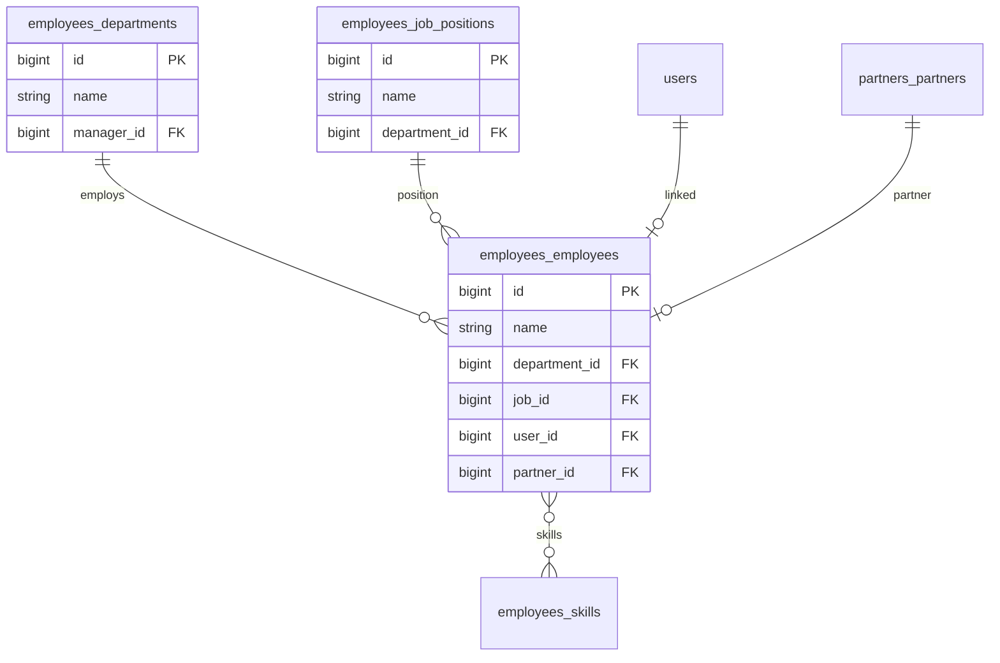

# Employees — ERD

| | |
|---|---|
| **Plugin** | `employees` |
| **Namespace** | `Sinno\Employee` |
| **Tipe** | Installable |
| **Install** | `php artisan employees:install` |

## Tabel

| Tabel | Keterangan |
|-------|------------|
| `employees_departments` | Departemen |
| `employees_job_positions` | Jabatan |
| `employees_employees` | Karyawan |
| `employees_categories` | Kategori karyawan |
| `employees_employee_categories` | Pivot |
| `employees_work_locations` | Lokasi kerja |
| `employees_employment_types` | Tipe employment |
| `employees_departure_reasons` | Alasan keluar |
| `employees_calendars` | Kalender kerja |
| `employees_calendar_attendances` | Jam kerja |
| `employees_skill_types` | Tipe skill |
| `employees_skill_levels` | Level skill |
| `employees_skills` | Skill |
| `employees_employee_skills` | Pivot karyawan ↔ skill |
| `employees_employee_resume_line_types` | Tipe resume |
| `employees_employee_resumes` | Resume/CV lines |
| `job_position_skills` | Skill per jabatan |

## Diagram

> **Tidak ada tabel payroll/gaji.**

## Relasi ke Plugin Lain

| Modul | FK |
|-------|-----|
| recruitments | `job_id` on applicants |
| time-off | `employee_id` on leaves |
| security | `user_id` |

---

[← Indeks](./README.md)
