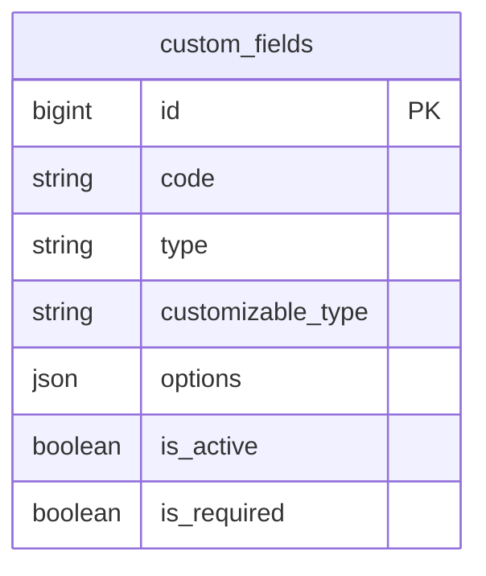

# Fields — ERD

| | |
|---|---|
| **Plugin** | `fields` |
| **Namespace** | `Sinno\Field` |
| **Tipe** | Core |
| **Trait** | `Sinno\Field\Traits\HasCustomFields` |

## Tabel

| Tabel | Keterangan |
|-------|------------|
| `custom_fields` | Definisi field dinamis per model type |

## Diagram

## Relasi

Polymorphic — nilai disimpan pada model yang menggunakan trait `HasCustomFields` (Employee, Order, Move, dll.).

---

[← Indeks](./README.md)
