# Inventories — ERD

| | |
|---|---|
| **Plugin** | `inventories` |
| **Namespace** | `Sinno\Inventory` |
| **Tipe** | Installable |
| **Install** | `php artisan inventories:install` |
| **Dependensi** | products |
| **Manager** | `InventoryManager` |

## Tabel (35+)

### Warehouse & Locations

| Tabel | Keterangan |
|-------|------------|
| `inventories_warehouses` | Gudang |
| `inventories_locations` | Lokasi (internal, customer, supplier) |
| `inventories_warehouse_resupplies` | Resupply antar gudang |

### Routing & Rules

| Tabel | Keterangan |
|-------|------------|
| `inventories_routes` | Rute stok |
| `inventories_rules` | Aturan pull/push/buy |
| `inventories_route_warehouses` | Gudang per route |
| `inventories_category_routes` | Route per kategori |
| `inventories_product_routes` | Route per produk |
| `inventories_route_packagings` | Packaging route |
| `inventories_route_moves` | Move di route |
| `inventories_putaway_rules` | Aturan putaway |
| `inventories_putaway_rule_package_types` | Putaway package types |

### Operations & Moves

| Tabel | Keterangan |
|-------|------------|
| `inventories_operation_types` | Tipe operasi (delivery, receipt, internal) |
| `inventories_operations` | Transfer / picking |
| `inventories_moves` | Stock move |
| `inventories_move_lines` | Detail move (serial/lot) |
| `inventories_move_destinations` | Destinasi move |
| `inventories_procurement_groups` | Grup procurement |
| `inventories_product_quantities` | On-hand stock |
| `inventories_product_quantity_relocations` | Relokasi qty |

### Lots, Packages, Scrap

| Tabel | Keterangan |
|-------|------------|
| `inventories_lots` | Lot/serial |
| `inventories_packages` | Package |
| `inventories_package_types` | Tipe package |
| `inventories_package_levels` | Level package |
| `inventories_package_destinations` | Destinasi package |
| `inventories_scraps` | Scrap |
| `inventories_scrap_tags` | Tag scrap |
| `inventories_tags` | Tag operasi |
| `inventories_storage_categories` | Storage category |
| `inventories_storage_category_capacities` | Kapasitas |
| `inventories_order_points` | Reorder rules |

## Diagram (inti)

```mermaid
erDiagram
    inventories_warehouses ||--|{ inventories_locations : contains
    inventories_locations ||--o{ inventories_locations : parent
    inventories_routes ||--|{ inventories_rules : rules
    inventories_operations {
        bigint id PK
        string state
        bigint sale_order_id FK
        bigint procurement_group_id FK
    }
    inventories_operations ||--|{ inventories_moves : moves
    inventories_moves {
        bigint id PK
        string state
        bigint product_id FK
        bigint sale_order_line_id FK
    }
    inventories_product_quantities {
        bigint product_id FK
        bigint location_id FK
        decimal quantity
    }
    sales_orders ||--o{ inventories_operations : deliveries
    sales_order_lines ||--o{ inventories_moves : fulfills
```

## Relasi ke Plugin Lain

| Modul | FK |
|-------|-----|
| sales | `sale_order_id`, `sale_order_line_id` |
| purchases | `purchases_order_operations`, `purchases_order_line_moves` |
| manufacturing | `inventory_operations` on MO |
| products | `product_id` on moves |

---

[← Indeks](./README.md)
