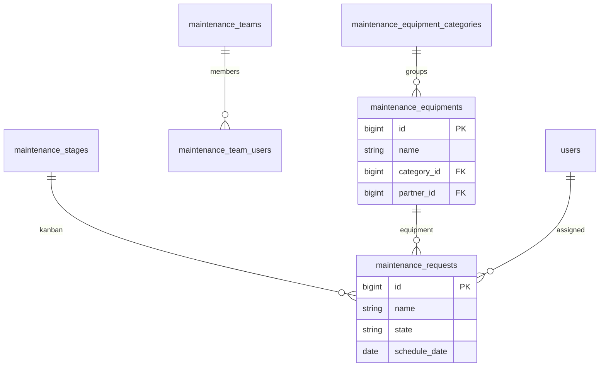

# Maintenance — ERD

| | |
|---|---|
| **Plugin** | `maintenance` |
| **Namespace** | `Sinno\Maintenance` |
| **Tipe** | Installable |
| **Install** | `php artisan maintenance:install` |

## Tabel

| Tabel | Keterangan |
|-------|------------|
| `maintenance_equipment_categories` | Kategori equipment |
| `maintenance_equipments` | Aset/equipment |
| `maintenance_stages` | Tahap kanban request |
| `maintenance_teams` | Tim maintenance |
| `maintenance_team_users` | Anggota tim |
| `maintenance_requests` | Permintaan maintenance |

## Diagram

## Relasi ke Plugin Lain

| Modul | Relasi |
|-------|--------|
| partners | `partner_id` on equipment (vendor) |
| full-calendar | Widget menampilkan `schedule_date` |

---

[← Indeks](./README.md)
