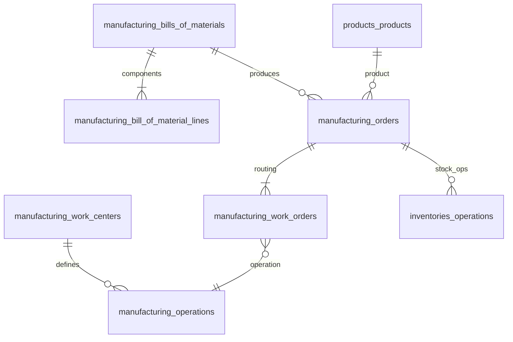

# Manufacturing — ERD

| | |
|---|---|
| **Plugin** | `manufacturing` |
| **Namespace** | `Sinno\Manufacturing` |
| **Tipe** | Installable |
| **Install** | `php artisan manufacturing:install` |
| **Dependensi** | products, inventories |
| **Manager** | `ManufacturingManager` |

## Tabel (30+)

### BOM & Orders

| Tabel | Keterangan |
|-------|------------|
| `manufacturing_bills_of_materials` | BOM header |
| `manufacturing_bill_of_material_lines` | Komponen BOM |
| `manufacturing_bill_of_material_byproducts` | By-product |
| `manufacturing_bill_of_material_line_attribute_values` | Attr values |
| `manufacturing_bill_of_material_byproduct_attribute_values` | Attr byproduct |
| `manufacturing_orders` | Manufacturing Order |
| `manufacturing_order_backorders` | Backorder |
| `manufacturing_order_backorder_lines` | Backorder lines |
| `manufacturing_order_backorder_order` | Pivot |
| `manufacturing_order_splits` | Split MO |
| `manufacturing_order_split_lines` | Split lines |
| `manufacturing_order_split_batches` | Split batches |
| `manufacturing_unbuild_orders` | Unbuild |
| `manufacturing_batch_productions` | Batch production |

### Work Centers & Routing

| Tabel | Keterangan |
|-------|------------|
| `manufacturing_work_centers` | Work center |
| `manufacturing_operations` | Operasi routing |
| `manufacturing_operation_dependencies` | Dependency |
| `manufacturing_operation_attribute_values` | Attr |
| `manufacturing_work_orders` | Work order |
| `manufacturing_work_order_dependencies` | WO deps |
| `manufacturing_work_center_tags` | Tags |
| `manufacturing_work_center_tag` | Pivot |
| `manufacturing_work_center_capacities` | Kapasitas |
| `manufacturing_work_center_alternatives` | Alternatif |
| `manufacturing_work_center_productivity_logs` | Log |
| `manufacturing_work_center_productivity_losses` | Loss |
| `manufacturing_work_center_loss_types` | Loss types |

### Warnings & Labels

| Tabel | Keterangan |
|-------|------------|
| `manufacturing_consumption_warnings` | Warning konsumsi |
| `manufacturing_consumption_warning_lines` | Lines |
| `manufacturing_consumption_warning_order` | Pivot MO |
| `manufacturing_order_label_types` | Label types |

## Diagram

## Relasi ke Plugin Lain

| Modul | Relasi |
|-------|--------|
| inventories | Raw material & finished goods moves |
| products | `product_id`, BOM components |

---

[← Indeks](./README.md)
