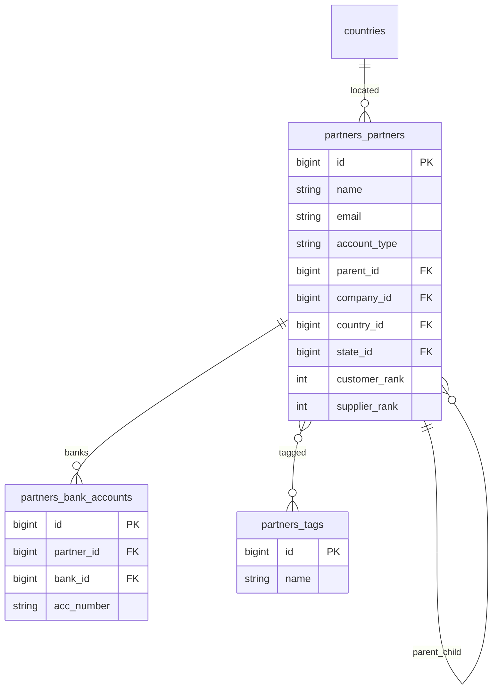

# Partners — ERD

| | |
|---|---|
| **Plugin** | `partners` |
| **Namespace** | `Sinno\Partner` |
| **Tipe** | Core |
| **Install** | Core (selalu aktif) |

## Tabel

| Tabel | Keterangan |
|-------|------------|
| `partners_partners` | Customer, vendor, contact (hierarki parent/child) |
| `partners_titles` | Gelar (Mr, Mrs, ...) |
| `partners_industries` | Industri |
| `partners_tags` | Tag partner |
| `partners_partner_tag` | Pivot partner ↔ tag |
| `partners_bank_accounts` | Rekening bank partner |

## Diagram

## Relasi ke Plugin Lain

| Modul | FK |
|-------|-----|
| sales | `sales_orders.partner_id` |
| purchases | `purchases_orders.partner_id` |
| accounts | `accounts_account_moves.partner_id` |
| employees | `employees_employees.partner_id` |
| projects | `projects_projects.partner_id` |
| security | `users.partner_id` |

---

[← Indeks](./README.md)
