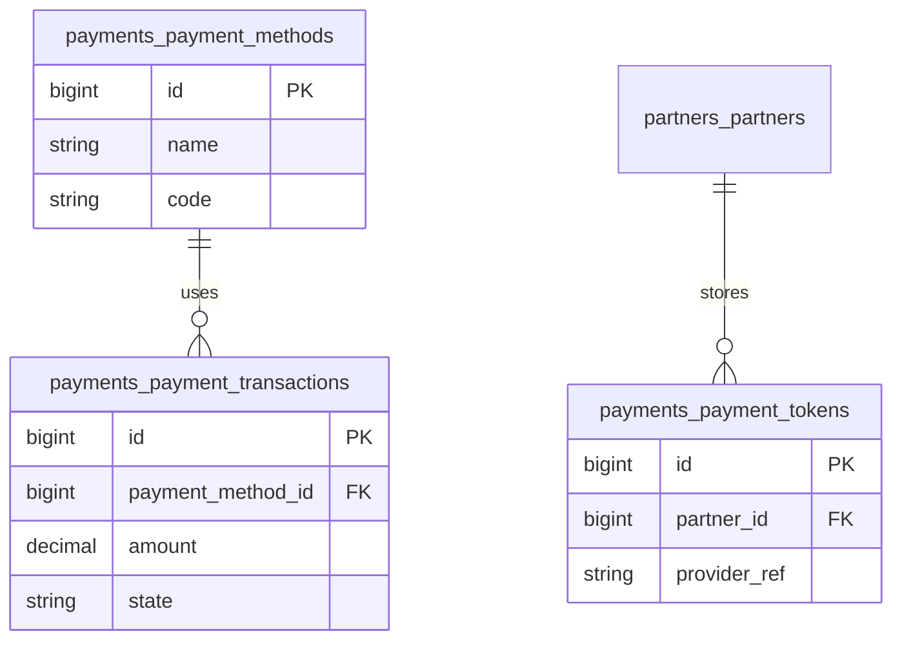

# Payments — ERD

| | |
|---|---|
| **Plugin** | `payments` |
| **Namespace** | `Sinno\Payment` |
| **Tipe** | Installable |
| **Install** | `php artisan payments:install` |
| **Dependensi** | accounts |

## Tabel

| Tabel | Keterangan |
|-------|------------|
| `payments_payment_methods` | Metode pembayaran gateway |
| `payments_payment_tokens` | Token kartu tersimpan |
| `payments_payment_transactions` | Transaksi pembayaran |

> Pembayaran invoice di jurnal menggunakan `accounts_account_payments` (lihat [accounts](./accounts.md)).

## Diagram

---

[← Indeks](./README.md)
