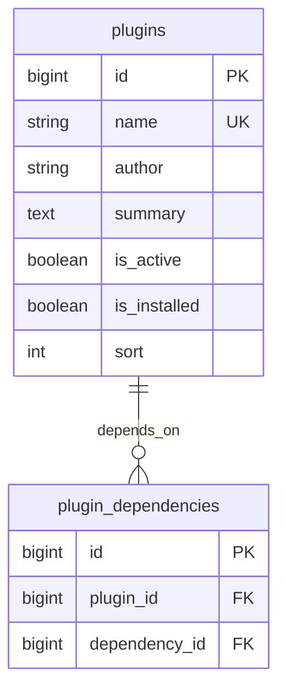

# Plugin Manager — ERD

| | |
|---|---|
| **Plugin** | `plugin-manager` |
| **Namespace** | `Sinno\PluginManager` |
| **Tipe** | Core |
| **Model utama** | `Sinno\PluginManager\Models\Plugin` |

## Tabel

| Tabel | Keterangan |
|-------|------------|
| `plugins` | Metadata & status instalasi setiap modul |
| `plugin_dependencies` | Pivot dependensi antar plugin |

## Diagram

## Relasi ke Plugin Lain

Tidak ada FK ke tabel bisnis — hanya metadata plugin.

---

[← Indeks](./README.md)
