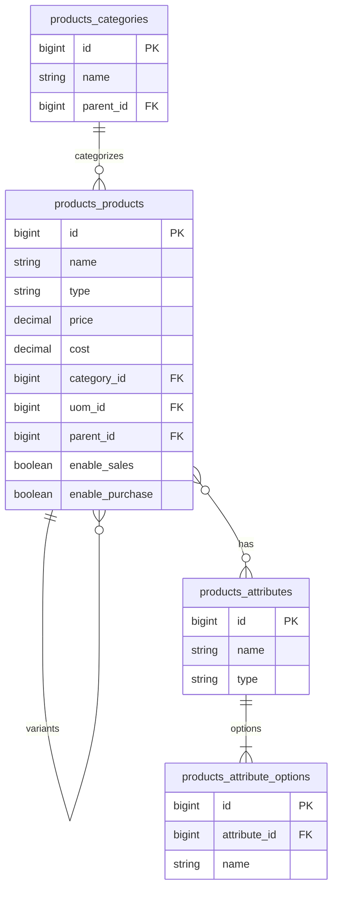

# Products — ERD

| | |
|---|---|
| **Plugin** | `products` |
| **Namespace** | `Sinno\Product` |
| **Tipe** | Installable |
| **Install** | `php artisan products:install` |

## Tabel

| Tabel | Keterangan |
|-------|------------|
| `products_categories` | Kategori produk |
| `products_products` | Produk (goods/service, variants) |
| `products_tags` | Tag |
| `products_product_tag` | Pivot |
| `products_attributes` | Atribut (size, color) |
| `products_attribute_options` | Opsi atribut |
| `products_product_attributes` | Pivot produk ↔ atribut |
| `products_product_attribute_values` | Nilai atribut per produk |
| `products_packagings` | Kemasan |
| `products_price_rules` | Aturan harga |
| `products_price_rule_items` | Item aturan harga |
| `products_product_suppliers` | Supplier per produk |
| `products_product_price_lists` | Daftar harga |
| `products_product_combinations` | Kombinasi variant |

## Diagram

## Relasi ke Plugin Lain

| Modul | FK |
|-------|-----|
| sales | `sales_order_lines.product_id` |
| purchases | `purchases_order_lines.product_id` |
| inventories | `inventories_moves.product_id` |
| accounts | `accounts_product_taxes` |
| manufacturing | `manufacturing_orders.product_id` |

---

[← Indeks](./README.md)
