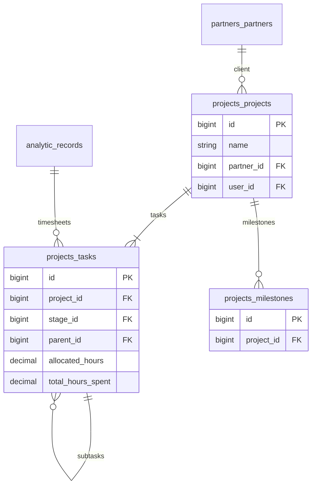

# Projects — ERD

| | |
|---|---|
| **Plugin** | `projects` |
| **Namespace** | `Sinno\Project` |
| **Tipe** | Installable |
| **Install** | `php artisan projects:install` |

## Tabel

| Tabel | Keterangan |
|-------|------------|
| `projects_projects` | Proyek |
| `projects_project_stages` | Tahap proyek |
| `projects_milestones` | Milestone |
| `projects_tags` | Tag |
| `projects_project_tag` | Pivot proyek ↔ tag |
| `projects_user_project_favorites` | Favorit user |
| `projects_tasks` | Task |
| `projects_task_stages` | Tahap task (kanban) |
| `projects_task_users` | Assignee |
| `projects_task_tag` | Pivot task ↔ tag |

## Diagram

## Relasi ke Plugin Lain

| Modul | Relasi |
|-------|--------|
| analytics | `analytic_records` (timesheets) |
| timesheets | UI over analytic_records |
| partners | `partner_id` |

---

[← Indeks](./README.md)
