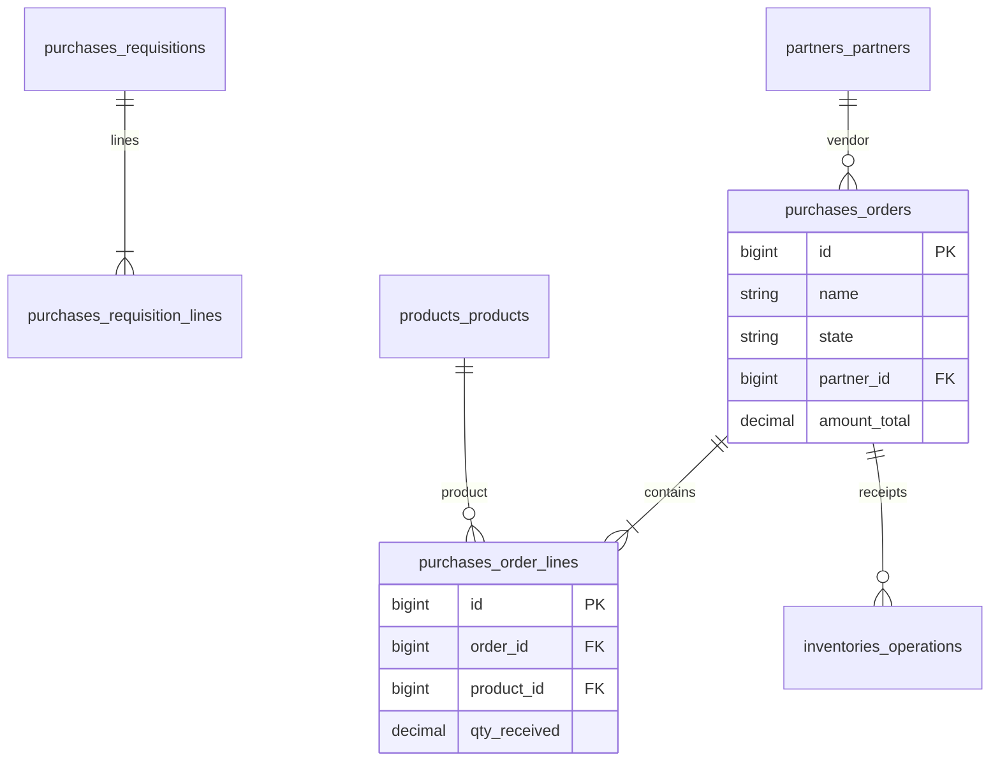

# Purchases — ERD

| | |
|---|---|
| **Plugin** | `purchases` |
| **Namespace** | `Sinno\Purchase` |
| **Tipe** | Installable |
| **Install** | `php artisan purchases:install` |
| **Dependensi** | invoices |
| **Manager** | `PurchaseOrder` |

## Tabel

| Tabel | Keterangan |
|-------|------------|
| `purchases_orders` | Purchase Order |
| `purchases_order_lines` | Baris PO |
| `purchases_order_line_taxes` | Pajak per line |
| `purchases_order_groups` | Grup PO |
| `purchases_requisitions` | RFQ / Requisition |
| `purchases_requisition_lines` | Baris requisition |
| `purchases_order_account_moves` | Pivot PO ↔ vendor bill |
| `purchases_order_operations` | Pivot PO ↔ receipt operation |
| `purchases_order_line_moves` | Pivot line ↔ inventory move |

## Diagram

## Relasi ke Plugin Lain

| Modul | Relasi |
|-------|--------|
| inventories | Receipt operations & moves |
| accounts | Vendor bills via pivot |

---

[← Indeks](./README.md)
