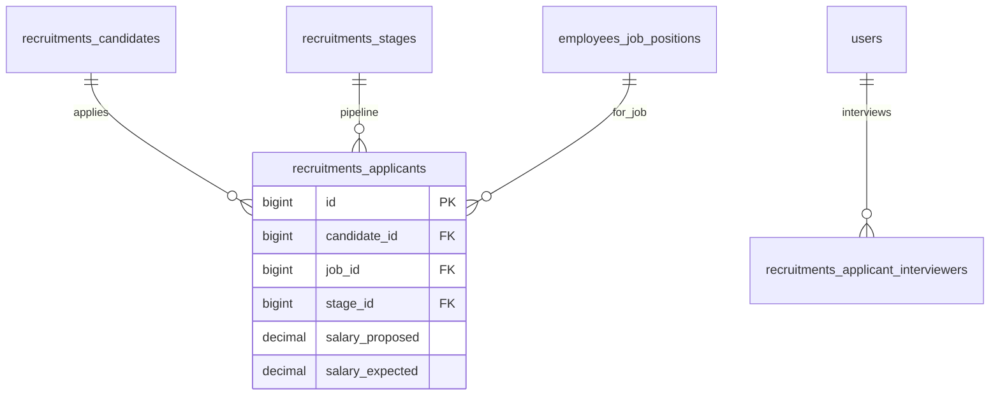

# Recruitments — ERD

| | |
|---|---|
| **Plugin** | `recruitments` |
| **Namespace** | `Sinno\Recruitment` |
| **Tipe** | Installable |
| **Install** | `php artisan recruitments:install` |
| **Dependensi** | employees |

## Tabel

| Tabel | Keterangan |
|-------|------------|
| `recruitments_stages` | Tahapan pipeline |
| `recruitments_stages_jobs` | Stage ↔ job |
| `recruitments_degrees` | Gelar pendidikan |
| `recruitments_refuse_reasons` | Alasan ditolak |
| `recruitments_applicant_categories` | Kategori applicant |
| `recruitments_candidates` | Kandidat |
| `recruitments_candidate_applicant_categories` | Pivot |
| `recruitments_candidate_skills` | Skill kandidat |
| `recruitments_applicants` | Lamaran |
| `recruitments_applicant_interviewers` | Interviewer |
| `recruitments_applicant_applicant_categories` | Pivot |
| `recruitments_job_position_interviewers` | Interviewer jabatan |

## Diagram

## Relasi ke Plugin Lain

| Modul | Relasi |
|-------|--------|
| employees | `employees_job_positions` — hire creates `employees_employees` |

---

[← Indeks](./README.md)
