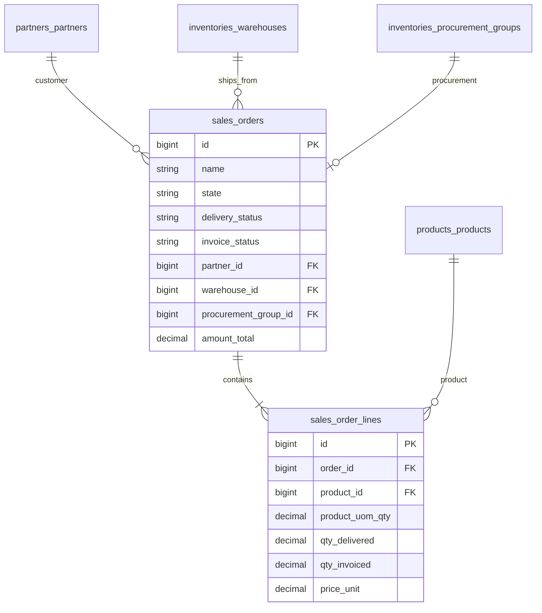

# Sales — ERD

| | |
|---|---|
| **Plugin** | `sales` |
| **Namespace** | `Sinno\Sale` |
| **Tipe** | Installable |
| **Install** | `php artisan sales:install` |
| **Dependensi** | invoices, payments |
| **Manager** | `SaleManager` |

## Tabel

| Tabel | Keterangan |
|-------|------------|
| `sales_orders` | Quotation / Sales Order |
| `sales_order_lines` | Baris order |
| `sales_order_line_taxes` | Pajak per line |
| `sales_tags` | Tag |
| `sales_order_tags` | Pivot order ↔ tag |
| `sales_teams` | Tim penjualan |
| `sales_team_members` | Anggota tim |
| `sales_order_templates` | Template quotation |
| `sales_order_template_products` | Produk di template |
| `sales_order_options` | Opsi konfigurasi |
| `sales_order_invoices` | Pivot SO ↔ account move |
| `sales_order_line_invoices` | Pivot line ↔ move line |
| `sales_advance_payment_invoices` | Down payment |
| `sales_advance_payment_invoice_order_sales` | Pivot advance |

## Diagram

## Relasi ke Plugin Lain

| Modul | Relasi |
|-------|--------|
| inventories | `sale_order_id` on operations; procurement on confirm |
| accounts | pivot invoices |
| partners | `partner_id`, `partner_shipping_id` |

---

[← Indeks](./README.md) · [Business Flow](../BUSINESS-FLOWS.md#1-sales-order--konfirmasi-ke-delivery)
