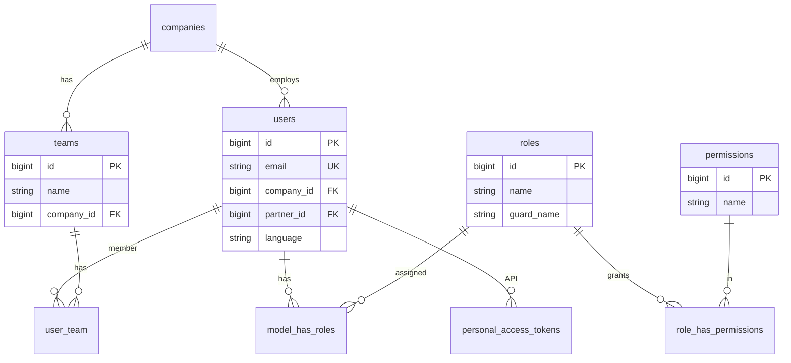

# Security — ERD

| | |
|---|---|
| **Plugin** | `security` |
| **Namespace** | `Sinno\Security` |
| **Tipe** | Core |
| **Guard** | `web` (admin users) |

## Tabel Plugin

| Tabel | Keterangan |
|-------|------------|
| `users` | Admin users (auth produksi) |
| `teams` | Tim internal |
| `user_team` | Pivot user ↔ team |
| `user_invitations` | Undangan user baru |

## Tabel Spatie Permission (shared)

| Tabel | Keterangan |
|-------|------------|
| `roles` | Peran RBAC |
| `permissions` | Izin granular |
| `model_has_roles` | User ↔ Role |
| `model_has_permissions` | User ↔ Permission |
| `role_has_permissions` | Role ↔ Permission |

## Tabel Sanctum

| Tabel | Keterangan |
|-------|------------|
| `personal_access_tokens` | API Bearer tokens |

## Diagram

## Relasi ke Plugin Lain

| FK | Ke |
|----|-----|
| `users.company_id` | `companies` (support) |
| `users.partner_id` | `partners_partners` (opsional) |

---

[← Indeks](./README.md)
