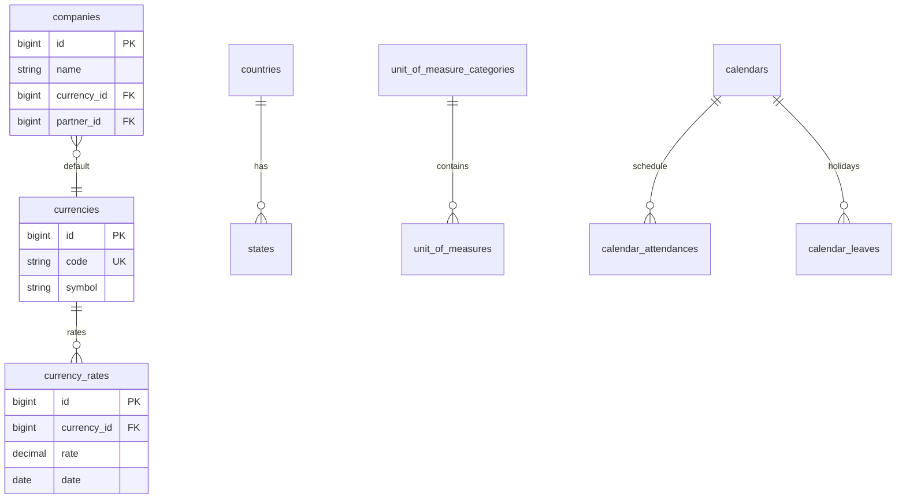

# Support — ERD

| | |
|---|---|
| **Plugin** | `support` |
| **Namespace** | `Sinno\Support` |
| **Tipe** | Core |

## Tabel

| Tabel | Keterangan |
|-------|------------|
| `companies` | Multi-company |
| `user_allowed_companies` | User ↔ companies |
| `currencies` | Mata uang |
| `currency_rates` | Kurs harian |
| `countries` | Negara |
| `states` | Provinsi |
| `unit_of_measure_categories` | Kategori UOM |
| `unit_of_measures` | Satuan ukur |
| `banks` | Bank referensi |
| `activity_plans` | Rencana aktivitas |
| `activity_plan_templates` | Template aktivitas |
| `activity_types` | Tipe aktivitas |
| `activity_type_suggestions` | Saran tipe |
| `calendars` | Kalender kerja |
| `calendar_attendances` | Jam kerja |
| `calendar_leaves` | Hari libur kalender |
| `utm_campaigns` | UTM campaign |
| `utm_mediums` | UTM medium |
| `utm_sources` | UTM source |
| `utm_stages` | UTM stage |
| `email_logs` | Log email |

> Catatan: `plugin_dependencies` ada di migrasi support tetapi dimiliki plugin-manager.

## Diagram

## Relasi ke Plugin Lain

Hampir semua modul bisnis memiliki `company_id` → `companies`.

---

[← Indeks](./README.md)
