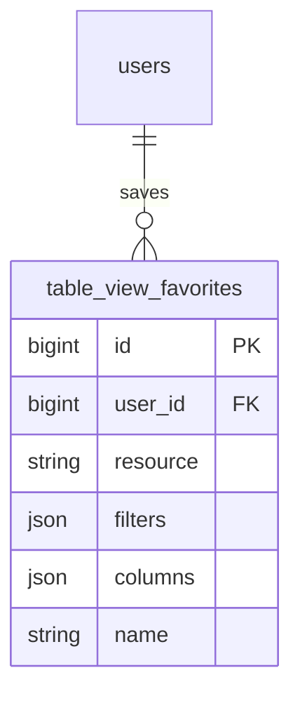

# Table Views — ERD

| | |
|---|---|
| **Plugin** | `table-views` |
| **Namespace** | `Sinno\TableViews` |
| **Tipe** | Core |

## Tabel

| Tabel | Keterangan |
|-------|------------|
| `table_view_favorites` | Filter & kolom tersimpan per user per resource |

## Diagram

---

[← Indeks](./README.md)
