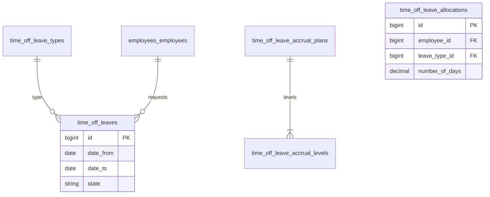

# Time-off — ERD

| | |
|---|---|
| **Plugin** | `time-off` |
| **Namespace** | `Sinno\TimeOff` |
| **Tipe** | Installable |
| **Install** | `php artisan time-off:install` |
| **Dependensi** | employees |

## Tabel

| Tabel | Keterangan |
|-------|------------|
| `time_off_leave_types` | Tipe cuti |
| `time_off_leaves` | Permintaan cuti |
| `time_off_user_leave_types` | Allocasi per user |
| `time_off_leave_mandatory_days` | Hari wajib libur |
| `time_off_leave_accrual_plans` | Rencana akrual |
| `time_off_leave_accrual_levels` | Level akrual |
| `time_off_leave_allocations` | Alokasi hari cuti |

## Diagram

## Relasi ke Plugin Lain

| Modul | Relasi |
|-------|--------|
| employees | `employee_id`, work calendars |
| support | `calendar_leaves` integration |

---

[← Indeks](./README.md)
