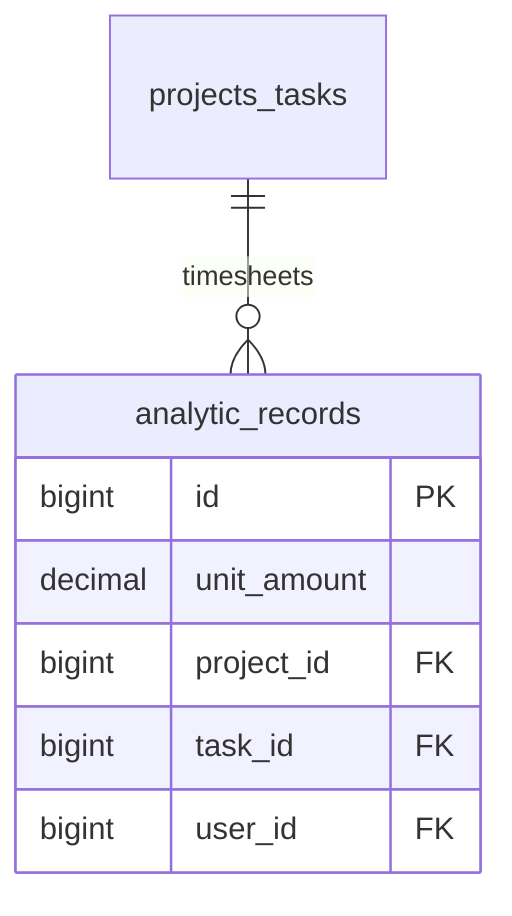

# Timesheets — ERD

| | |
|---|---|
| **Plugin** | `timesheets` |
| **Namespace** | `Sinno\Timesheet` |
| **Tipe** | Installable |
| **Install** | `php artisan timesheets:install` |
| **Dependensi** | projects |

## Tabel

Plugin **timesheets** tidak memiliki migrasi sendiri. Menggunakan:

| Tabel | Model | Plugin asal |
|-------|-------|-------------|
| `analytic_records` | `Sinno\Timesheet\Models\Timesheet` extends `Sinno\Project\Models\Timesheet` | analytics / projects |

## Diagram

Lihat [analytics.md](./analytics.md) dan [projects.md](./projects.md).

## Relasi ke Plugin Lain

| Modul | Relasi |
|-------|--------|
| projects | Parent task/project; auto-update `total_hours_spent` |

---

[← Indeks](./README.md)
