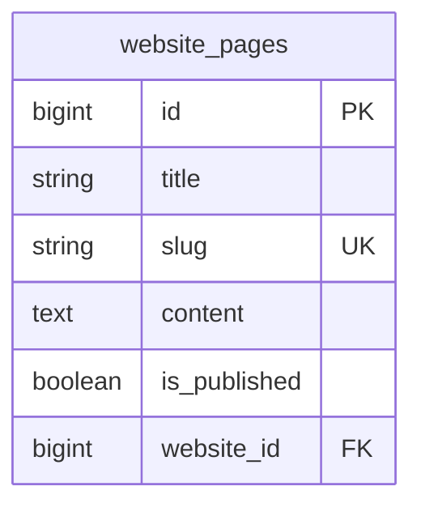

# Website — ERD

| | |
|---|---|
| **Plugin** | `website` |
| **Namespace** | `Sinno\Website` |
| **Tipe** | Installable |
| **Install** | `php artisan website:install` |

## Tabel

| Tabel | Keterangan |
|-------|------------|
| `website_pages` | Halaman CMS customer portal |

## Diagram

## Relasi ke Plugin Lain

| Modul | Relasi |
|-------|--------|
| security | Customer guard — `Website\Models\Partner` |
| blogs | Posts published on website |

## Panel

Mendaftarkan routes & pages di **customer** panel (`id: customer`).

---

[← Indeks](./README.md)
